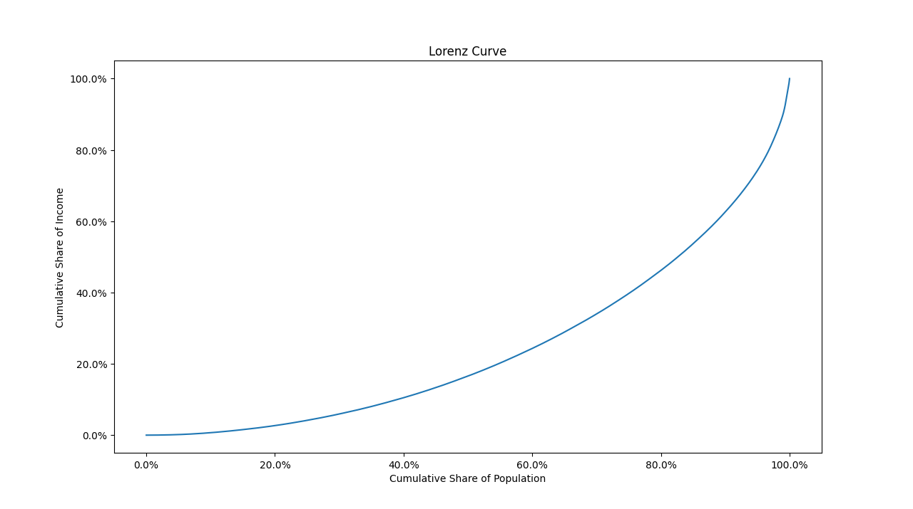
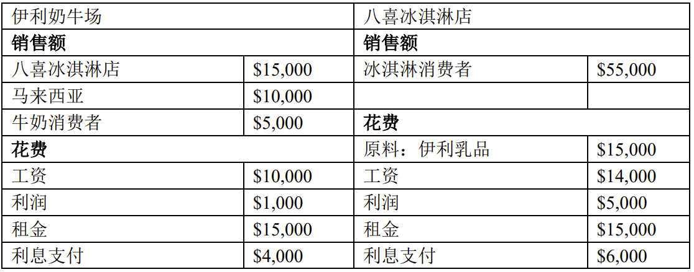
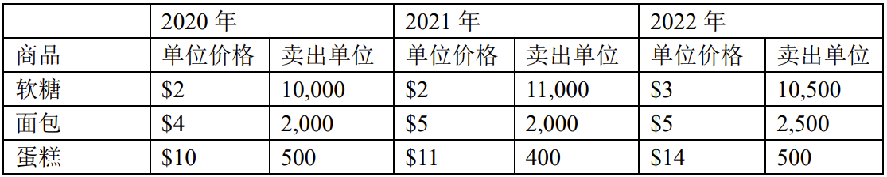

# 经济学原理第一次作业

<center><div style='height:2mm;'></div><div style="font-size:10pt;">EmptyBlue 2100013116 信息科学技术学院</div></center>
<center><span style="font-size:9pt;line-height:9mm"><i>Peking University</i></span>
</center>


1. **请使用美国 2000 年人口普查的公用微观数据样本（见“data_pums_2000.csv”文档） 绘制洛伦兹曲线，并计算基尼系数。**

   1. **请使用 Excel、Python、R、Stata 或 Matlab 完成该题，详细介绍你的操作过程，并提供任何用来实现计算或生成图片的代码。**

      

      经过求和计算可以估计出这组数据的洛伦兹系数(Lorenz Coefficient)的上下界：
      $$
      0.506968 <= Gini\ Index <= 0.506979
      $$
      以下是python代码，操作过程见注释

      ```python
      import os
      import numpy as np
      import matplotlib.pyplot as plt
      from matplotlib import ticker
      
      
      current_path = os.path.dirname(__file__)
      with open(current_path+'./data_pums_2000.csv', 'r') as f:
          info = f.readlines()
          info.pop(0)
      
          # 处理收入数据
          tot_income = 0.
          for i in range(len(info)):
              _, info[i] = info[i].split(',')
              info[i] = int(info[i])
              tot_income += info[i]
          info.sort()
      
          # 计算累积收入份额和累积人口数量百分比
          tot_tmp = 0
          x_axis = list(range(1, len(info)+1))
          for i in range(len(info)):
              tot_tmp += info[i]
              info[i] = tot_tmp/tot_income
              x_axis[i] /= len(info)
      
          # 由于统计人数较多，可以求和近似计算洛伦兹曲线下方面积,可以同时计算洛伦兹系数的上下界
          upper_bound = 1.
          lower_bound = 1.
          dx = x_axis[1]-x_axis[0]
          for i in range(len(info)-1):
              upper_bound -= 2*info[i]*dx
          for i in range(1, len(info)):
              lower_bound -= 2*info[i]*dx
          print('%.6f' % lower_bound, '<= Gini Index <=', '%.6f' % upper_bound)
      
          # 将横纵坐标格式化为百分比格式
          plt.gca().xaxis.set_major_formatter(ticker.PercentFormatter(xmax=1, decimals=1))
          plt.gca().yaxis.set_major_formatter(ticker.PercentFormatter(xmax=1, decimals=1))
      
          # 使用matplot绘图
          plt.title('Lorenz Curve')
          plt.ylabel('Cumulative Share of Income')
          plt.xlabel('Cumulative Share of Population')
          plt.plot(x_axis, info)
          plt.show()
      
      ```

      

   2. **请比较你计算出的数字与任何官方来源的美国 2000 年基尼系数的数据，简要谈谈异同与原因。**

      根据美国人口普查局发布的2000年美国总体情况的报告[^1],美国2000年的基尼系数为0.462（世界银行的数据是0.401[^2]）。

      我根据公用微观数据样本（Public Use Microdata Sample，简称 PUMS）所计算出的基尼系数与官方的数据相同之处在于基尼系数都大于0.4，这说明2000年的美国收入分配较为不平等。

      我计算出的基尼系数比这些官方的数据都偏大，可能原因有：

      1. PUMS 的样本量不足以代表全国人口普查数，可能存在抽样误差或偏差
      2. PUMS 的数据相比于官方计算，可能没有考虑到一些可以平衡收入分配的因素，例如税收、转移支付、福利等
      3. PUMS 的数据可能与官方的收入统计范围方法不同，例如是否包括非现金收入、资产收益；统计个人收入还是家庭收入等
      4. PUMS 的数据可能没有按照与官方测算时相同的时间段或频率测量收入或财富，例如只考虑了年度收入，没有考虑长期收入，忽略了收入在人的一生中的波动性

      

   3. **基于你的计算，你认为中国 2003 年（可以在国家统计局查找）的不平等程度更高还是美国 2000 年的不平等程度更高？支持你的结论的理由是什么？有什么因素可能会导致你的结论受到经济学家的质疑？**

      根据国家统计局的数据，中国2003年的基尼系数是0.479。因此如果根据我所计算的数据，是美国2000年的不平等程度比中国2003年的不平等程度高；如果按照美国人口普查局的数据，是美国2000年的不平等程度比中国2003年的不平等程度低。

      我的结论都是基于基尼系数这一个参考数据得出的。

      虽然基尼系数是衡量社会不平等程度的一个广泛使用的重要指标，但是它不能完全反映一个国家的经济状况，因此不能直接根据基尼系数判断社会的不平等水平孰高孰低。可能的问题包含两部分：

      1. 基尼系数的计算方式本身在不同国家有所区别。比如收入统计时间是否相同，是季度收入、年度收入还是长期收入
      2. 社会的不平等水平也不止与基尼系数有关。比如基尼系数只考虑了收入水平而没有考虑财富的分配，但是往往财富分配比收入分配更加不平等；良好的社会福利和公共服务可以降低社会的不平等程度；国家的人口结构、经济结构、消费水平、税制也会影响社会的不平等程度

      

2. **某北京程序员 2020 年税前年收入 50 万，个人养老金缴费 3 万，个人失业险 1 万， 个人房基金 5 万，个人职业年金缴费 2 万，离婚，无房也不打算买房，租房，独自养育 一名 2016 年出生的女儿并负担其教育费用，其父母均已过古稀之年，作为独生子女的他是唯一赡养人。这一年，他生了一场大病，医保自付部分达 5 万元。基于这些信息， 回答以下问题。**

   1. **这位程序员 2020 年的平均税率是多少？**
      $$
      Y=50-6-3-1-5-2=33
      $$

      $$
      T=33*25\%-3.192=5.058
      $$

      $$
      t_A=\frac{T}{Y}=15.33\%
      $$

      

   2. **这位程序员 2020 年的边际税率是多少？**

      边际税率只用考虑增加单位收入所增加的税额百分比，因此边际税率 $ t_M=25\% $

      

   **提示 1：中国居民综合所得税规则**

   | **应纳税个人所得额** | **税率（%）** | **速算扣除额** |
   | -------------------- | ------------- | -------------- |
   | **不超过 3.6 万元**  | **3**         | **0元**        |
   | **3.6-14.4 万元**    | **10**        | **2520 元**    |
   | **14.4-30 万元**     | **20**        | **16920 元**   |
   | **30-42 万元**       | **25**        | **31920 元**   |
   | **42-66 万元**       | **30**        | **52920 元**   |
   | **66-96 万元**       | **35**        | **85920 元**   |
   | **96 万元以上**      | **45**        | **181920 元**  |

   **提示 2：下面是一些可以用得上的公式。** 

   **（1）应纳个人所得税=应纳税个人所得额×适用税率−速算扣除额** 

   **（2）应纳税个人所得额=年收入额−起征点−专项扣除、专项附加扣除以及依法确定的其它扣除** 

   **（3）起征点=60000**

   **提示 3：** 

   **（1）专项扣除包含养老保险、失业保险、医疗保险、住房公积金** 

   **（2）北京专项附加扣除条件及标准：http://bj.bendibao.com/news/201914/256634.shtm** 

   **（3）依法确定的其它扣除包括职业年金等**

   

3. **请将下列情况进行分类，指出它们是否属于中国 GDP 的哪一个（可以用G、C、I、NX 来表示）支出法组成部分，以及它们短期如何影响 GDP（增加、减少、无影响）。**

   | **情况**                                                     | **GDP** | **对GDP的影响**      |
   | ------------------------------------------------------------ | ------- | -------------------- |
   | **政府雇佣工人修桥**                                         | G       | 增加                 |
   | **一个马来西亚企业决定将中国供应商换成马来西亚供应商**       | NX      | 减少                 |
   | **好利来面包店购买了一个烤箱**                               | I       | 增加                 |
   | **消费者因为担心接下来的经济危机，所以开始存钱**             | 不属于  | 减少                 |
   | **一个北大学生决定不住宿舍了，搬到校外老社区，每个季度还要交 1.5 万元房租** | C       | 增加                 |
   | **一个退休老人收到了他的养老金**                             | 不属于  | 无影响               |
   | **一个服装制造商买了更多的棉布**                             | 不属于  | 增加（生产更多产品） |
   | **一个北京的手游公司将其呼叫中心外包给新加坡的某公司**       | NX      | 减少                 |

   

4. **使用下表的信息回答问题。假设中国某区域的经济中只有两个企业：伊利奶牛场和 八喜冰淇淋店。**

   

   1. **请使用支出法（又称“使用法”）计算该区域的 GDP，展示具体计算步骤。**
      $$
      \begin{aligned}
      Y&=G+C+I+NX\\
      &=0+(5000+55000)+0+10000\\
      &=70000
      \end{aligned}
      $$
      
   2. **请使用生产法（又称“增值法”）计算该区域的 GDP，展示具体计算步骤。**
      $$
      \begin{aligned}
      Y=&\pi_{伊利}+\pi_{八喜}\\
      =&R_{伊利}-C_{伊利}+R_{八喜}-C_{八喜}\\
      =&(15000+10000+5000)-0+55000-15000\\
      =&70000
      \end{aligned}
      $$
      生产法计算GDP时只需要扣除中间投入，即用于生产过程中的原材料、能源、半成品等
   
   3. **请使用收入法（又称“分配法”、“要素支付法”、“要素成本法”等）计算该区域的 GDP，展示具体计算步骤。**
      $$
      \begin{aligned}
      Y=&R+T_F+\sigma_F+\pi_F\\
      =&(10000+14000+15000+15000+4000+6000)+0+0+(1000+5000)\\
      =&70000
      \end{aligned}
      $$
      
   4. **以上结果有何异同？为什么？**
   
      以上结果完全相同。GDP是指一定时期内一国或区域内所有生产的最终产品和服务的市场价值，这三种计算GDP的方法都是用来统计一个经济体在一段时间内的生产活动的成果的，如果计算方式无误，理论上不同方式应该计算得到相同的劳动成果。
   
      支出法是通过衡量社会总支出来计算GDP的，包括政府支出、家庭消费、企业投资、净出口；生产法是通过衡量社会各个产业的增加值之和来计算GDP的；收入法是通过衡量总收入加总利润得到的。这三者相同是因为社会生产的总价值应该成为社会的总收入，最终成为社会的总支出。
   
4. **考虑一个甜心经济只生产三种产品：软糖、面包和蛋糕。在接下来的计算中，必要时 请保留 2 位小数。请展示具体的计算步骤。**

   ****

   1. **请计算 2020、2021、2022 这三年的名义 GDP。**
      $$
      \begin{aligned}
      Y_{2020,Nominal}=&2\times10000+4\times2000+10\times500=33000\\
      Y_{2021,Nominal}=&2\times11000+5\times2000+11\times400=36400\\
      Y_{2022,Nominal}=&3\times10500+5\times2500+14\times500=51000\\
      \end{aligned}
      $$
      
2. **请使用 2020 年作为基期，计算实际 GDP。**
      $$
      \begin{aligned}
      Y_{2020,Real_{2020}}=&2\times10000+4\times2000+10\times500=33000\\
      Y_{2021,Real_{2020}}=&2\times11000+4\times2000+10\times400=34000\\
      Y_{2022,Real_{2020}}=&2\times10500+4\times2500+10\times500=36000\\
      \end{aligned}
      $$
      
   3. **请使用 2021 年作为基期，计算实际 GDP。**
   $$
      \begin{aligned}
      Y_{2020,Real_{2021}}=&2\times10000+5\times2000+11\times500=35500\\
      Y_{2021,Real_{2021}}=&2\times11000+5\times2000+11\times400=36400\\
      Y_{2022,Real_{2021}}=&2\times10500+5\times2500+11\times500=39000\\
      \end{aligned}
      $$
      
   4. **使用（b）的结果，计算 GDP 从 2020 到 2022 年的增长率。然后用（c）的结果， 再计算该增长率。两个增长率一样吗？为什么？**
      $$
   Growth\ Rate_{2021_{base\ period=2020}}=\frac{34000-33000}{33000}=3.03\%\\
      Growth\ Rate_{2022_{base\ period=2020}}=\frac{36000-34000}{34000}=5.88\%\\
      Growth\ Rate_{2021_{base\ period=2021}}=\frac{36400-35500}{35500}=2.54\%\\
      Growth\ Rate_{2022_{base\ period=2021}}=\frac{39000-36400}{36400}=7.14\%\\
      $$
      不一样。
   
      $\frac{P_0Q_t-P_0Q_{t-1}}{P_0Q_{t-1}}$与$\frac{P_1Q_t-P_1Q_{t-1}}{P_1Q_{t-1}}$由于商品篮子的多样性，$P_iQt$实际上是一个求和，$P_i$无法被从分子分母上消去，因此GDP增长率会随基期改变而改变
   
   
   
5. **基于（a）和（b）的结果，计算 GDP 平减指数。然后，计算价格从 2020 到 2022 年的变化率。**
      $$
   \begin{aligned}
      GDP\ deflator_{2020,base\ period=2020}=&100\\
      GDP\ deflator_{2021,base\ period=2020}=&107.06\\
      GDP\ deflator_{2022,base\ period=2020}=&141.67\\
      \end{aligned}
      $$
   
      $$
      \begin{aligned}
   Increase\ Rate\ of\ GDP\ deflator_{2021,base\ period=2020}=&7.06\%\\
      Increase\ Rate\ of\ GDP\ deflator_{2022,base\ period=2020}=&32.33\%\\
      \end{aligned}
      $$
   
      
   
6. **基于（a）和（c）的结果，计算 GDP 平减指数。然后，计算价格从 2020 到 2022 年的变化率。**
      $$
   \begin{aligned}
      GDP\ deflator_{2020,base\ period=2021}=&92.96\\
      GDP\ deflator_{2021,base\ period=2021}=&100\\
      GDP\ deflator_{2022,base\ period=2021}=&130.77\\
      \end{aligned}
      $$
   
      $$
      \begin{aligned}
   Increase\ Rate\ of\ GDP\ deflator_{2021,base\ period=2021}=&7.57\%\\
      Increase\ Rate\ of\ GDP\ deflator_{2022,base\ period=2021}=&30.77\%\\
      \end{aligned}
      $$
   
      
   
7. **请使用 2020 年的商品篮子，并用 2020 年作为基期，计算每一年的 CPI，然后计算价格从 2020 到 2022 年的变化率。**
      $$
   \begin{aligned}
      CPI_{2020,base\ period=2020}=&100\\
      CPI_{2021,base\ period=2020}=&\frac{35500}{33000}\times100=107.58\\
      CPI_{2022,base\ period=2020}=&\frac{47000}{33000}\times100=142.42\\
      \end{aligned}
      $$
   
      $$
      \begin{aligned}
   Inflation\ Rate\ by\ CPI_{2021,base\ period=2020}=&7.58\%\\
      Inflation\ Rate\ by\ CPI_{2022,base\ period=2020}=&32.39\%\\
      \end{aligned}
      $$
   
      
   
8. **请使用 2020 年的商品篮子，并用 2021 年作为基期，计算每一年的 CPI，然后计算 价格从 2020 到 2022 年的变化率。**
      $$
   \begin{aligned}
      CPI_{2020,base\ period=2021}=&92.96\\
      CPI_{2021,base\ period=2021}=&100\\
      CPI_{2022,base\ period=2021}=&132.39\\
      \end{aligned}
      $$
   
      $$
      \begin{aligned}
   Inflation\ Rate\ by\ CPI_{2021,base\ period=2021}=&7.58\%\\
      Inflation\ Rate\ by\ CPI_{2022,base\ period=2021}=&32.39\%\\
      \end{aligned}
      $$
   
      
   
9. **请比较和描述（e）、（f）、（g）、（h）的异同，并解释原因**
   
   对于同一种经济指标：
   
   以2020和2021年作为基期时，GDP平减指数与其增长率均存在不同
   
   以2020和2021年作为基期时，CPI存在不同，但是通货膨胀率相同
   
   对于同一时期作为基期：
   
   GDP平减指数与CPI没有显著关系，但是CPI偏大
   
   GDP平减指数增长率与通货膨胀率没有显著关系，但是通货膨胀率偏大
   
   原因是GDP平减指数增长率是随基期改变有所变化的，通过CPI计算得出的通货膨胀率是不随基期改变而变化的。这是因为计算GDP时，如果基期改变，价格不变、篮子改变，从而篮子价格改变；但是计算CPI时，如果基期改变，价格不变、篮子不变，从而篮子价格不变，计算CPI时除以基期不影响篮子价格的增长率。


[^1]: https://www.census.gov/library/publications/2003/dec/phc-2.html
[^2]:https://fred.stlouisfed.org/series/SIPOVGINIUSA