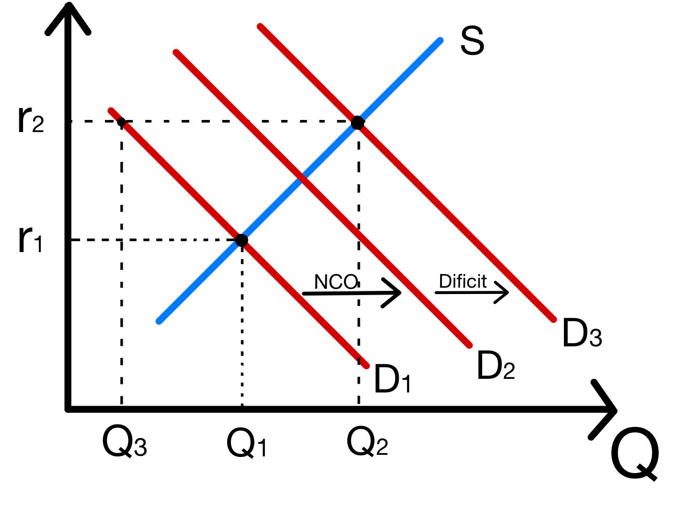
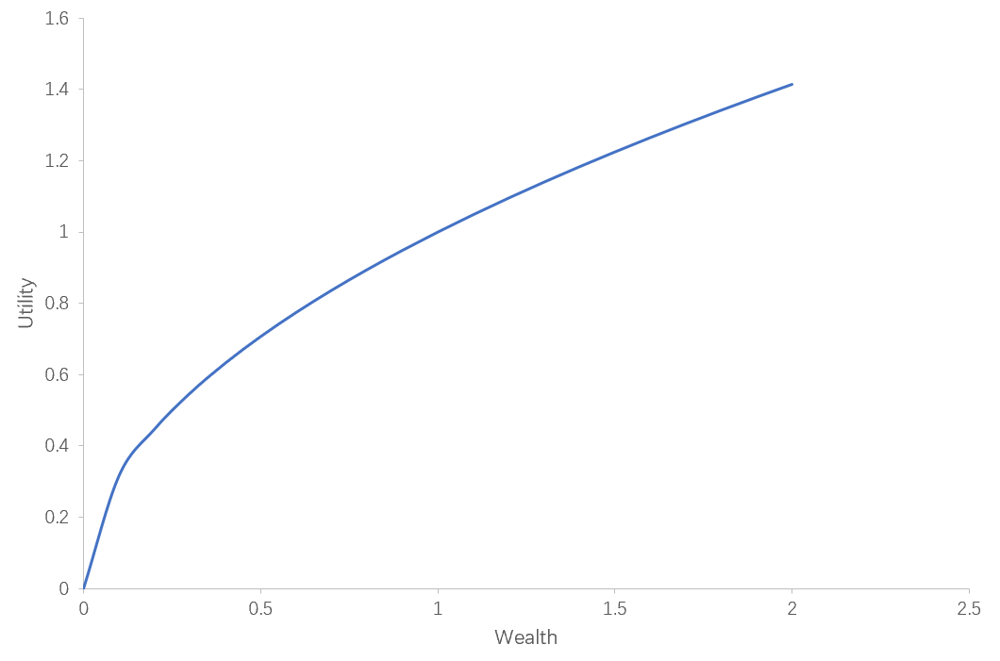

# 经济学原理第三次作业

梁昱桐 2100013116 信息科学技术学院

<i>Peking University</i>

1. **考虑某国的可贷资金市场。起初，该国政府收支平衡。你被告知需求曲线是线性的，且当真实利率是 1%时对可贷资金的需求是\$5,300，当真实利率是5%时对可贷资金的需求是\$3,300。你又被告知可贷资金的供给也是线性的，且10%、2.5%的真实利率下的供给分别是\$1,500 和$0。假设该国起初闭关锁国。** 

   **（1）基于上述信息，请写出可贷资金供给量 $Q_s$ 关于真实利率 $r$ 的方程。** 
   $$
   Q_s=200r-500
   $$
   

   **（2）基于上述信息，请写出可贷资金需求量 $Q_d$ 关于真实利率 $r$ 的方程。** 
   $$
   Q_d=-500r+5800
   $$
   

   **（3）基于上述信息，均衡利率和可贷资金量是多少？**

   $$
   \begin{cases}
   Q_s=200r-500\\
   Q_d=-500r+5800\\
   Q_s=Q_d\\
   \end{cases}
   \Rightarrow
   \begin{cases}
   r^*=9\%\\
   Q_s^*=Q_d^*=$1300
   \end{cases}
   $$
   
   **情景 1： 从初始状态出发。假设政府增加了 \$3,400 的支出，并多征收 \$2,000 的税。请回答下面的问题，并展示中间步骤。** 
   $$
   Dificit_1=3400-2000=$1400
   $$
   
   $$
   \begin{aligned}
   \begin{cases}
   Q_s&=200r-500\\
   Q_d&=-500r+5800\\
   Q_{d_{total}}=Q_d+Dificit_1&=-500r+7200\\
   Q_s=Q_{d_{total}}\\
   \end{cases}
   \end{aligned}
   \begin{aligned}
   \ \Rightarrow
   \begin{cases}
   r^*&=11\%\\
   Q_s^*=Q_{d_{total}}^*&=\$1700\\
   Q_d^*&=\$300
   \end{cases}
   \end{aligned}
   $$
   
   
   
   **（4）什么是：** 
   
   ​	**a) 新的均衡利率？** 
   $$
   r^*=11\%
   $$
   
   
   ​	**b) 新的均衡可贷资金？** 
   $$
   Q^*=$1700
   $$
   
   
   ​	**c) 新的均衡私人储蓄？** 
   $$
   S^*=Q_s^*=$1700
   $$
   
   
   ​	**d) 新的均衡私人投资？** 
   $$
   I_{Private}^*=Q^*_d=$300
   $$
   
   
   **（5）新的均衡私人投资相对于初始均衡水平的变化是多少？**
   $$
   \Delta_{I_{Private}^*}=300-1300=-$1000
   $$
   
   

   
   **情景 2： 从初始状态出发。假设政府增加了 \$2,000 的支出，并多征收 \$3,400 的税。请回答下面的 问题，并展示中间步骤。** 
   

   $$
   Dificit_2=-3400+2000=-$1400
   $$
   
   $$
   \begin{aligned}
   \begin{cases}
   Q_s&=200r-500\\
   Q_d&=-500r+5800\\
   Q_{d_{total}}=Q_d+Dificit_2&=-500r+4400\\
   Q_s=Q_{d_{total}}\\
   \end{cases}
   \end{aligned}
   \begin{aligned}
   \ \Rightarrow
   \begin{cases}
   r^*&=7\%\\
   Q_s^*=Q_{d_{total}}^*&=\$900\\
   Q_d^*&=\$2300
   \end{cases}
   \end{aligned}
   $$
   
   
   
   **（6）什么是：** 
   
   ​	**a) 新的均衡利率？** 
   $$
   r^*=7\%
   $$
   
   
   ​	**b) 新的均衡可贷资金？** 
   $$
   Q^*=$900
   $$
   
   
   ​	**c) 新的均衡私人储蓄？** 
   $$
   S^*=Q_s^*=$900
   $$
   
   
   ​	**d) 新的均衡私人投资？** 
   $$
   I_{Private}^*=Q^*_d=$2300
   $$
   
   
   **（7）新的均衡私人投资相对于初始均衡水平的变化是多少？**
   $$
   \Delta_{I_{Private}^*}=2300-1300=$1000
   $$
   
   
   **情景 3： 从初始状态出发。假设该国改革开放了，并导致 $1,050 的贸易顺差。请回答下面的问题， 并展示中间步骤。** 
   $$
   NX=$1050
   $$
   
   $$
   \begin{aligned}
   \begin{cases}
   Q_s&=200r-500\\
   Q_d&=-500r+5800\\
   Q_{d_{total}}=Q_d+NX&=-500r+6850\\
   Q_s=Q_{d_{total}}\\
   \end{cases}
   \end{aligned}
   \begin{aligned}
   \ \Rightarrow
   \begin{cases}
   r^*&=10.5\%\\
   Q_s^*=Q_{d_{total}}^*&=\$1600\\
   Q_d^*&=\$550
   \end{cases}
   \end{aligned}
   $$
   
   
   
   **（8）什么是：** 
   
   ​	**a) 新的均衡利率？** 
   $$
   r^*=10.5\%
   $$
   
   
   ​	**b) 新的均衡可贷资金？** 
   $$
   Q^*=$1600
   $$
   
   
   ​	**c) 新的均衡私人储蓄？** 
   $$
   S^*=Q_s^*=$1600
   $$
   
   
   ​	**d) 新的均衡私人投资？** 
   $$
   I_{Private}^*=Q^*_d=$550
   $$
   
   
   **（9）新的均衡私人投资相对于初始均衡水平的变化是多少？**
   $$
   \Delta_{I_{Private}^*}=550-1300=-$750
   $$
   
2. **假设某国的可贷资金市场处于均衡状态，并且净出口为零，政府收支平衡。请详细分析下列情况的新市场均衡。** 

   **（1）保持其它条件不变，如果该国出现贸易逆差，同时失去一个重要国外公司提供的资金，你认为均衡利率、可贷资金和私人投资会怎么变？请组织语言回答此题，并提供图像模型以支持你的分析。确保你的图标注清晰。** 

   情况一：贸易逆差大于国外公司提供的资金

   

   产生贸易逆差 $NCI$ 的时候，相当于国外资本在国内投资，该国得到净资本流入 $NCI$ ，即图中的 $S_1$ 向右移动至 $S_2$ 

   失去国外公司提供的资金 $M$ 可以看作该国的可贷资金市场上的资金减少，即图中的 $S_2$ 向左移动至 $S_3$ 

   由于 $NX>M$ ， $S_3$ 在 $S_1$ 的右侧

   由图可知：

   * 均衡利率由 $r_1$ 变为 $r_2$ ，均衡利率降低
   * 均衡可贷资金由 $Q_1$ 变为 $Q_2$ ，均衡可贷资金增加
   * 私人投资由 $Q_1$ 变为 $Q_3$ ，私人投资减少，私人投资被挤出

   

   情况二：贸易逆差小于国外公司提供的资金

   

   产生贸易逆差 $NCI$ 的时候，相当于国外资本在国内投资，该国得到净资本流入 $NCI$ ，即图中的 $S_1$ 向右移动至 $S_2$ 

   失去国外公司提供的资金 $M$ 可以看作该国的可贷资金市场上的资金减少，即图中的 $S_2$ 向左移动至 $S_3$ 

   由于 $NX<M$ ， $S_3$ 在 $S_1$ 的左侧

   由图可知：

   * 均衡利率由 $r_1$ 变为 $r_2$ ，均衡利率提高
   * 均衡可贷资金由 $Q_1$ 变为 $Q_2$ ，均衡可贷资金减少
   * 私人投资由 $Q_1$ 变为 $Q_3$ ，私人投资增加

   

   情况三：贸易逆差等于国外公司提供的资金

   $NX$ 与 $M$ 互相抵消，所有经济学参量均不变

   

   **（2）保持其它条件不变，如果该国出现贸易顺差，同时提高预算赤字，请问均衡利率、 可贷资金、私人投资、私人储蓄和消费支出如何变？请组织语言回答此题，并提供图像模型以支持你的分析。确保你的图标注清晰。**

   

   产生贸易顺差 $NCO$ 的时候，相当于国内资本在国外投资，该国有净资本流出 $NCO$ ，使得资金需求增加，即图中的 $D_1$ 向右移动至 $D_2$ 

   原有的预算赤字为 0 ，现在提高预算赤字，相当于政府需求增加，使得资金需求增加，即图中的 $D_2$ 向右移动至 $D_3$  

   由图可知：

   * 均衡利率由 $r_1$ 变为 $r_2$ ，均衡利率提高
   * 均衡可贷资金由 $Q_1$ 变为 $Q_2$ ，均衡可贷资金增加
   * 私人投资由 $Q_1$ 变为 $Q_3$ ，私人投资减少，私人投资被挤出
   * 私人储蓄由 $Q_1$ 变为 $Q_2$ ，私人储蓄增加
   * 如果考虑个人可支配收入不变，那么个人储蓄增加 $Q_2-Q_1$ 说明消费等大小减少

   

3. **有三位同学，各自存了 1000 元，并都遇到一些投资机会，允许他们投资不超过 2000 元。 这三位学生各自遇到的投资项目的收益率如下： 小明 5% 小王 8% 小美 20%** 

   **（1）若不允许借贷，这三位同学一年后的资产将分别达到多少？** 

   小明：
   $$
   1000\times(1+5\%)=1050
   $$
   小王：
   $$
   1000\times(1+8\%)=1080
   $$
   小美：
   $$
   1000\times(1+20\%)=1200
   $$

   

   **（2）假设这三位同学所在的大学开放了一个可贷资金市场，什么将决定其中谁是借出方，谁是借入方？** 

   市场的真实利率。

   当可贷资金市场的真实利率大于个人投资项目的收益率时，个人没有借入的激励，但是有借出从而获得更高利息的激励；当可贷资金市场的真实利率小于个人投资项目的收益率时，个人没有借出的激励，但是有借入从而提高自己投资收益的激励；当可贷资金市场的真实利率等于个人投资项目的收益率时，个人不借出也不借入。

   **（3）当真实利率是 7% 时，可贷资金供给和需求分别是多少？如果是 10% 呢？** 

   认为三人均没有可贷资金市场的利率定价权，利率由市场决定。

   真实利率为 7% ：

   小明全部借出，小王和小美尽可能多地借入。三人的可贷资金供给为 1000元，需求为 2000元。

   真实利率为 10% ：

   小明和小王全部借出，小美尽可能多地借入。三人的可贷资金供给为 2000元，需求为 1000元。

   **（4）当真实利率是多少时，可贷资金市场可以达到均衡？** 

   认为该可贷资金市场的利率只由三人间的借入借出决定。

   设真实利率为 $r$

   $r<8\%$ ：

   小王和小美想尽可能多地借入。可贷资金需求至少为 2000元，供给需求不可能相等，市场不能均衡。

   $r=8\%$ ：

   小明全部借出，小美尽可能多借入，小王不借入借出。可贷资金供给为 1000元，可贷资金需求为 1000元，供给需求相等，市场均衡。

   $r>8\%$ ：

   小明和小王想全部借出。可贷资金供给至少为 2000元，供给需求不可能相等，市场不能均衡。

   综上，当且仅当真实利率为 $8\%$ 的时候市场均衡。

   **（5）在均衡利率下，当投资项目支付利润、贷款也被偿还时，每位同学一年后的资产将达到多少？然后对比（1）的结果，谁从可贷资金市场中获利——借出方还是借入方？有谁的状况变糟糕了吗？**

   小明：
   $$
   1000\times(1+8\%)=1080
   $$
   小王：
   $$
   1000\times(1+8\%)=1080
   $$
   小美：
   $$
   2000\times(1+20\%)-1000\times(1+8\%)=1320
   $$

   相比于（1）问，借出与借入方都获利了，每个人都没有变糟糕。

   

4. **一个公司有一个投资项目，需要今年支付 1 千万元，可以在 4 年后回报 1.5 千万元。** 

   **（1）如果利率是 11% ，这个公司应该进行该项目投资吗？ 10% 呢？ 9% 呢？ 8% 呢？** 

   进行项目投资的条件是：4年后的回报在当期的贴现大于需要支付的钱
   $$
   \begin{aligned}
   1&<\frac{1.5}{(1+r)^4}\\
   (1+r)^4&<1.5\\
   r&<\left( \frac{3}{2}\right)^{\frac{1}{4}}-1\\
   r&<10.67\%
   \end{aligned}
   $$

   综上，利率是 11% 时不投资，利率小于 10.67% 时投资

   **（2）你能计算出该公司在投与不投之间无差异的真实利率吗？（这就是所谓的内部收益率，或 IRR）**

   根据（1）问计算，投与不投之间无差异的真实利率为 10.67%

5. **小李的效用函数可以写成 $𝑈 = 𝑊^{0.5}$ ，其中 $W$ 是财富（单位是元）， $U$ 是由该财富引致的效用。在一个竞赛节目中，主持人给小李提供了两个选项：（A）确定拿走 4 百万元，或（B） 赌一把——40%的机率拿走 9 百万元，60%的概率值拿走 1 百万元。** 

   **（1）请画出小李的效用函数曲线，并解释小李是否是风险厌恶的。** 

   

   这是一个上凸函数，因此小李是风险厌恶的。

   **（2）选项 A 还是 B 给小李的期望奖金更高？** 
   $$
   E_A=400
   $$
   
   $$
   \begin{aligned}
   E_B&=900\times40\%+100\times60\%\\
   &=420
   \end{aligned}
   $$
   
   $E_A<E_B$ 因此选项 B 的期望奖金更高。
   
   **（3）选项 A 还是 B 给小李的期望效用更高？** 
   
   就是求随机变量 $U(X)$ 的期望
   $$
   E_{U(A)}=20
   $$
   
   $$
   \begin{aligned}
   E_{U(B)}&=U(900)\times40\%+U(100)\times60\%\\
   &=18
   \end{aligned}
   $$
   
   $E_{U(A)}>E_{U(B)}$ 因此选项 A 的期望效用更高。
   
   **（4）根据你的分析，小李会选择 A 还是 B ？**
   
   小李会选择 A 
   
   因为做决策依赖于效用最大化而不是期望奖金最大化。
