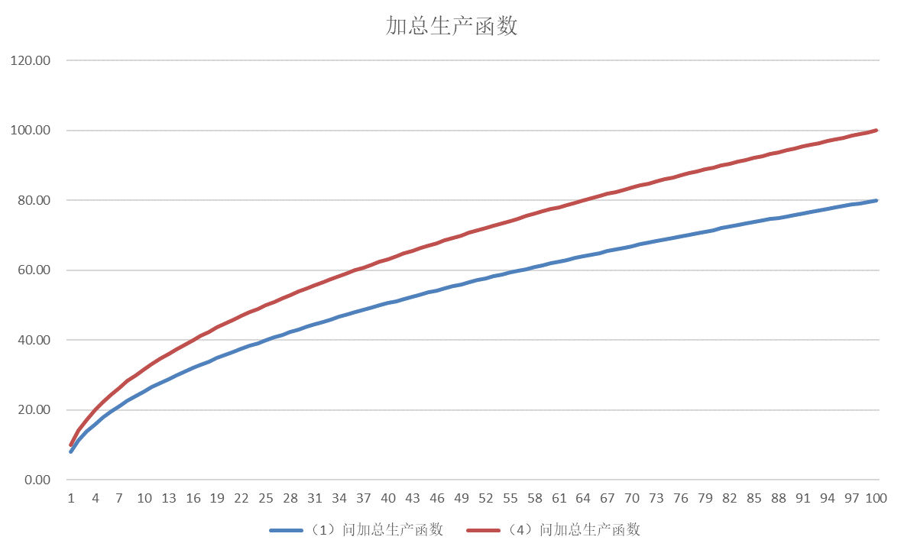
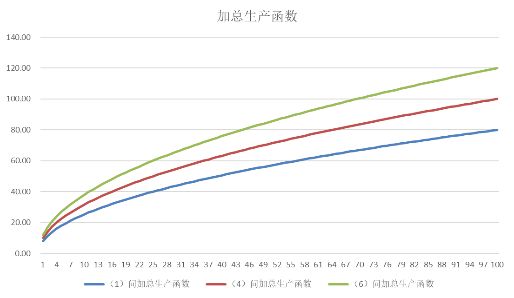
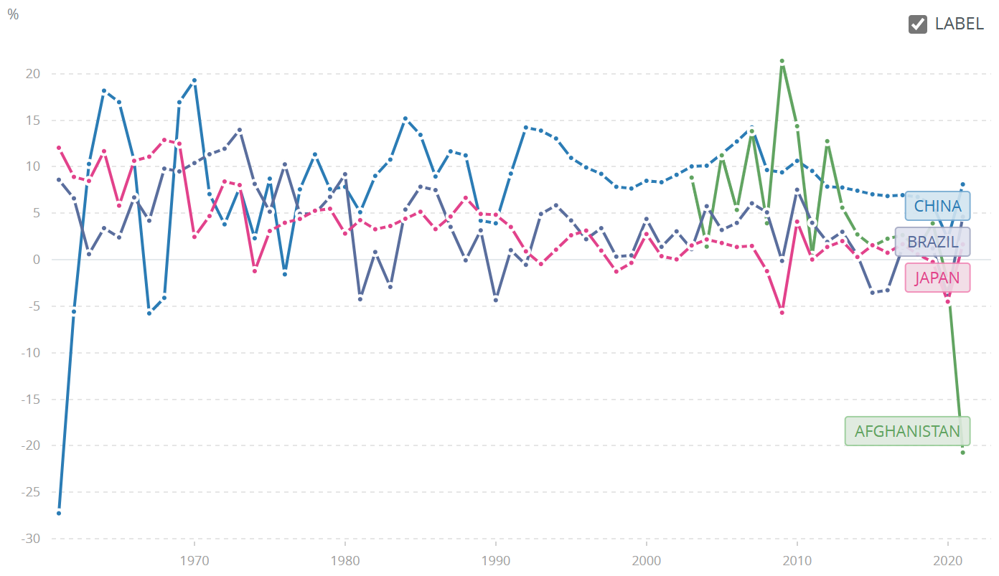
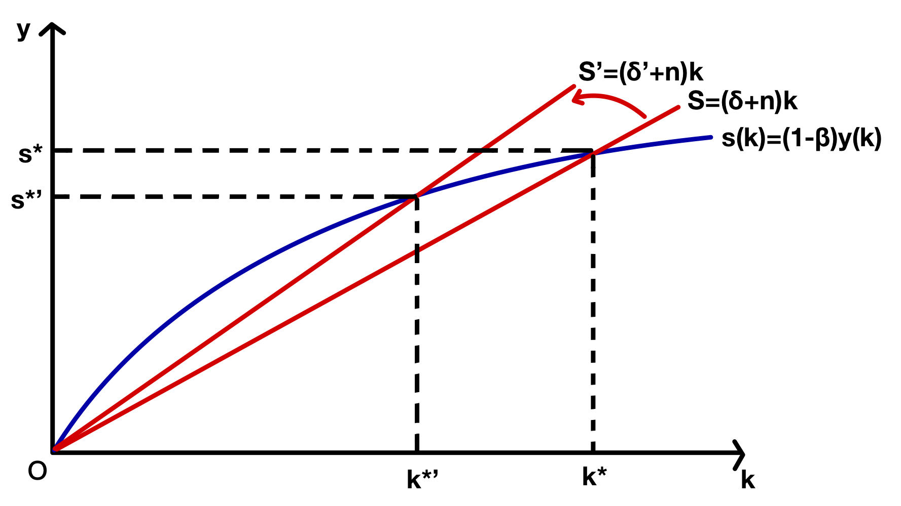

# 经济学原理第二次作业

EmptyBlue 2100013116 信息科学技术学院

<i>Peking University</i>

1. **考虑海淀区某一时期的加总生产函数： $Y=AK^\frac{1}{2}L^\frac{1}{2}$ ， 其中，𝑌是真实 GDP（单位是亿元），𝐾是资本存量（单位是亿元），𝐿是劳动投入（单位是万人），$𝐴 = 2$是海淀区的科技水平。假定海淀区只投入资本和劳动进行生产。起初，资本存量等于 16。请基于这些信息，回答以下问题（请使用 Excel、Python、R、Stata 或 Matlab 作为辅助工具）：**

   

   **基础模型：** 

   **（1）假设𝐴、𝐾保持不变，劳动投入不断增加，请将下表扩充（比如展示第 1-10 和 90- 100 行）并填写完整，保留两位小数。**

   | **L**   | **K**  | **Y** | **MPL** | **$\frac{Y}{L}$** |
   | ------- | ------ | ----- | ------- | ----------------- |
   | **0**   | **16** | 0.00  | NaN     | NaN               |
   | **1**   | 16     | 8.00  | 8.00    | 8.00              |
   | **2**   | 16     | 11.31 | 3.31    | 5.66              |
   | **3**   | 16     | 13.86 | 2.54    | 4.62              |
   | **4**   | 16     | 16.00 | 2.14    | 4.00              |
   | **5**   | 16     | 17.89 | 1.89    | 3.58              |
   | **6**   | 16     | 19.60 | 1.71    | 3.27              |
   | **7**   | 16     | 21.17 | 1.57    | 3.02              |
   | **8**   | 16     | 22.63 | 1.46    | 2.83              |
   | **9**   | 16     | 24.00 | 1.37    | 2.67              |
   | **10**  | 16     | 25.30 | 1.30    | 2.53              |
   | **...** |        |       |         |                   |
   | **90**  | 16     | 75.89 | 0.42    | 0.84              |
   | **91**  | 16     | 76.32 | 0.42    | 0.84              |
   | **92**  | 16     | 76.73 | 0.42    | 0.83              |
   | **93**  | 16     | 77.15 | 0.42    | 0.83              |
   | **94**  | 16     | 77.56 | 0.41    | 0.83              |
   | **95**  | 16     | 77.97 | 0.41    | 0.82              |
   | **96**  | 16     | 78.38 | 0.41    | 0.82              |
   | **97**  | 16     | 78.79 | 0.41    | 0.81              |
   | **98**  | 16     | 79.20 | 0.41    | 0.81              |
   | **99**  | 16     | 79.60 | 0.40    | 0.80              |
   | **100** | 16     | 80.00 | 0.40    | 0.80              |

   **（2）请用语言描述边际劳动产品 (MPL) 和劳动生产率 $\frac{Y}{L}$ 随着 $L$ 的变化趋势，并解释这个趋势背后的直观（intuition）是什么。**

   L增加时，边际劳动产品 (MPL) 和劳动生产率 $\frac{Y}{L}$ 均减小。

   边际劳动产品 (MPL) 和劳动生产率 $\frac{Y}{L}$ 随L增加而减小的intuition：这个生产函数是边际劳动报酬递减的，也就是说L变大的时候，每单位的L生产的新产品减少。边际劳动报酬递减可能是因为：在K与A一定的时候，每个单位L能使用的K减少，这使得这单位L造成的产出增加没有K更多的时候那么多。

   

   **资本存量变动：** 

   **（3）假设小米通讯技术有限公司等诸多企业决定在海淀区增加投资。因此，海淀区的资本存量上升到了 25。假定科技水平暂时没有因为投资的增加而发生变化。请你用语言描述生产函数曲线会有什么变化。 **

   生产函数曲线向上伸展，函数值变为原来的 $\frac54$ 倍。

   **（4）将（3）中的情况作为初始条件，用（1）的逻辑请将下表扩充（比如展示第 1-10 和 90-100 行）并填写完整，保留两位小数。**

   | **L**   | **K**  | **Y**  | **MPL** | **$\frac{Y}{L}$** |
   | ------- | ------ | ------ | ------- | ----------------- |
   | **0**   | **25** | 0.00   | NaN     | NaN               |
   | **1**   | 25     | 10.00  | 10.00   | 10.00             |
   | **2**   | 25     | 14.14  | 4.14    | 7.07              |
   | **3**   | 25     | 17.32  | 3.18    | 5.77              |
   | **4**   | 25     | 20.00  | 2.68    | 5.00              |
   | **5**   | 25     | 22.36  | 2.36    | 4.47              |
   | **6**   | 25     | 24.49  | 2.13    | 4.08              |
   | **7**   | 25     | 26.46  | 1.96    | 3.78              |
   | **8**   | 25     | 28.28  | 1.83    | 3.54              |
   | **9**   | 25     | 30.00  | 1.72    | 3.33              |
   | **10**  | 25     | 31.62  | 1.62    | 3.16              |
   | **...** |        |        |         |                   |
   | **90**  | 25     | 94.87  | 0.53    | 1.05              |
   | **91**  | 25     | 95.39  | 0.53    | 1.05              |
   | **92**  | 25     | 95.92  | 0.52    | 1.04              |
   | **93**  | 25     | 96.44  | 0.52    | 1.04              |
   | **94**  | 25     | 96.95  | 0.52    | 1.03              |
   | **95**  | 25     | 97.47  | 0.51    | 1.03              |
   | **96**  | 25     | 97.98  | 0.51    | 1.02              |
   | **97**  | 25     | 98.49  | 0.51    | 1.02              |
   | **98**  | 25     | 98.99  | 0.51    | 1.01              |
   | **99**  | 25     | 99.50  | 0.50    | 1.01              |
   | **100** | 25     | 100.00 | 0.50    | 1.00              |

   **（5）请用电脑将（1）和（4）的加总生产函数曲线绘制在同一张图中，横轴是 L，纵轴是 Y。这幅图能体现你在（3）中的描述吗？**

   

   可以体现。

   显然第四问的红色曲线在第一问的蓝色曲线之上，且按一定比例放大。

   

   **科技水平变动：** 

   **（6）假设小米通讯技术有限公司等诸多企业决定不增加海淀区的实物投资了，而是将 AI 和机器学习等领域的最新技术引入到海淀区的各	项业务中。这些技术将海淀区的 𝐴 从 2 提升到了 3。假设资本存量回到了 16 并维持不变。请将（1）、（4）和本题的加总生产函数曲线绘制在一起，并描述科技进步对生产函数曲线的影响。**

   

   绿色曲线比红色曲线更高，科技进步可以抵消资本存量下降造成的影响，使生产函数向上伸展。科技进步导致人们可以提高消费降低储蓄来提高生活质量。

   

2. **根据世界银行的数据（https://data.worldbank.org/indicator/NY.GDP.MKTP.KD.ZG），回答下列问题： **

   **（1）2021 年中国、日本、阿富汗和巴西的真实 GDP 增长率分别是多少？** 

   

   中国： $8.1\%$

   日本： $1.7\%$

   阿富汗： $-20.7\%$

   巴西： $4.6\%$

   **（2）假如这四个国家的人口增长率都为 0，我们可以运用 70 规则在哪些国家？根据 70 规则，假如维持增长速度不变，多少年后这些国家的真实 GDP 可以增长到原来的 8 倍？ （请保留一位小数）** 

   这四个国家中中国、日本、巴西适用，而阿富汗的 GDP 增长率绝对值太大，不能使用。
   $$
   \begin{aligned}
   (1+x)^n&=8\\
   n&=\frac{3ln2}{ln(1+x)}\\
   n&\approx\frac{2.1}{x}\\
   \end{aligned}
   $$

   $$
   \begin{aligned}
   n_{China}&=25.9\\
   n_{Japan}&=123.5\\
   n_{Brazil}&=45.7
   \end{aligned}
   $$

   

   **（3）已知 2021 年中国的人均 GDP 是 12,556.3 美元，摩洛哥是 3,795.4 美元。如果中国的真实 GDP 增长率下降到 5%，在没有人口增长的情况下，大约多少年后摩洛哥的人均 GDP 最接近中国的一半？（请使用摩洛哥 2021 年的真实 GDP 增长率和 70 规则计算， 过程保留两位小数，最终结果保留 0 位小数）** 

   根据世界银行的数据，摩洛哥 2021 年的真实 GDP 增长率为 7.9% 。
   $$
   \begin{aligned}
   12556.3\times(1+5\%)^n&=2\times3795.4\times(1+7.9\%)^n\\
   (\frac{1+7.9\%}{1+5\%})^n&=0.83\times2\\
   (1+\frac{2.9\%}{1+5\%})^n&=(1-0.17)\times2\\
   \frac{0.029}{1.05}n&=ln(1-0.17)+ln2\approx0.7-0.17=0.53\\
   n&=19.19\approx19
   \end{aligned}
   $$
   

   **（4）请使用 Excel、Python、R、Stata 或 Matlab 验证你在（3）中的结论，并试图解释为什么 70 规则在这个计算中能够表现良好。（换句话说，可以解释 70 规则在什么情况下会导致较大的误差。）**

   使用计算机精确计算得
   $$
   \begin{aligned}
   12556.3\times(1+5\%)^n&=2\times3795.4\times(1+7.9\%)^n\\
   n&=log_{\frac{1+7.9\%}{1+5\%}}\frac{12556.3}{2\times3795.4}=18.47\approx18
   \end{aligned}
   $$
   这与使用 70 规则近似计算的结果相差不大。

   70规则的原理是使用 0.7 来近似 $ln2$ 。

   70规则的适用条件是在 $x\approx0$ 时有 $ln(1+x)\approx x$  ，因此只有当GDP增长率接近 0 的时候可以用 70 规则。这里中国与摩洛哥的 GDP 增长率均接近 0 ，因此可以使用 70 规则，计算结果误差不大。

   

3. **请根据上课所学的有关索罗增长模型的知识，简要回答如下问题：** 

   **（1）在一个科技水平不变的模型中，什么参数影响稳态（steady-state）的人均产出？** 

   考虑一个存在人口增长的索罗增长模型
   $$
   \begin{aligned}
   \begin{cases}
   \dot{k}=(1-\beta)y-(\delta+n)k\\
   y=Ak^{\alpha}\\
   \dot{k}=0
   \end{cases}
   \Rightarrow
   k^*=\left(\frac{\delta+n}{A(1-\beta)}\right)^{\frac{1}{\alpha-1}}
   \end{aligned}
   $$
   因此稳态的人均产出与折旧率 $\delta$ ，人口增长率 $n$ ，消费率 $\beta$ ，柯布-道格拉斯生产函数常数 $\alpha$ 有关。

   **（2）请简要解释人均产出、储蓄和投资的关系。** 

   人均产出 $y=\frac{Y}{n}$ ，考虑一个没有技术进步的索罗模型，也有 $y=k^{\alpha}$ ，其中 $k$ 为资本密度，即人均资本量。

   储蓄与投资在简化的经济体中相等。

   根据 GDP 以支出法核算的相关知识：
   $$
   Y=G+C+I+NX
   $$
   $Y$ 除了可以表示产出之外，也可以表示一国的总收入。对于一个家庭来说，家庭收入可以用于消费、储蓄或缴税，因此有：
   $$
   Y=C+S+T
   $$
   两个 $Y$ 相等，那么有：
   $$
   (G-T)+NX+I=S
   $$
   考虑一个简化的经济体，财政赤字 $G-T$ 与贸易顺差 $NX$ 均较小，那么有：
   $$
   I=S
   $$
   也就是说在这个简化的经济体中总投资等于总储蓄。

   因此 $i=s$

   一般认为人均储蓄占人均收入的一定比例，从而 $(1-\beta)y=i=s$

   **（3）假设人均折旧低于人均储蓄，在人口不增长的情况下，请逐一解释这些变量如何随着时间变化：人均资本存量、人均产出、人均储蓄、人均消费。** 

   人口增长率为 0 时，考虑资本密度累积方程： 
   $$
   \dot{k}=(1-\beta)y-\delta k
   $$
   其中 $(1-\beta)y$ 为人均储蓄， $\delta k$ 为人均折旧。

   由题设，人均折旧低于人均储蓄，那么此时 $\dot{k}$ 为正，说明资本密度 $k$ 上升。

   根据柯布-道格拉斯生产函数：
   $$
   y=k^{\alpha}
   $$
   如果资本密度 $k$ 上升，那么人均收入（产出） $y$ 也上升，人均储蓄 $(1-\beta)y$ 上升。

   由于我们认为人均消费占人均收入成一个固定比例 $\beta$ ，那么人均消费 $\beta y$ 上升。

   综上：人均资本存量 $k$ 、人均产出 $y$ 、人均储蓄 $(1-\beta)y$ 、人均消费 $\beta y$ 均上升。

   **（4）假设一个经济系统处于稳态，人口增长率为正，没有折旧，然后储蓄率突然下降了。请解释这一情况如何影响人均产出、总产出、人均产出增长率、总产出增长率。** 

   考虑一个存在人口增长但是不存在折旧的索罗增长模型
   $$
   \begin{aligned}
   \begin{cases}
   \dot{k}=(1-\beta)y-nk\\
   y=Ak^{\alpha}\\
   \dot{k}=0
   \end{cases}
   \Rightarrow
   k^*=\left(\frac{n}{A(1-\beta)}\right)^{\frac{1}{\alpha-1}}
   \end{aligned}
   $$
   只考虑储蓄率下降对经济系统稳态时经济学参数的影响。

   $1-\beta$ 下降，其余常数不变，那么 $k^*$ 下降，从而人均产出 $y$ 也下降。

   人均产出增长率与资本密度 $k$ 增长率相同，在均衡时为 0 ，因此人均产出增长率 $\frac{\dot{y}}{y}=0$ 

   考虑总产出 $Y$ ：
   $$
   \begin{aligned}
   Y&=Ny\\
   \frac{\dot{Y}}{Y}&=\frac{\dot{N}}{N}+\frac{\dot{y}}{y}\\
   \frac{\dot{Y}}{Y}&=n
   \end{aligned}
   $$
   因此总产出增长率为人口增长率 $n$ ，这与储蓄率没有关系。

   综上：人均产出 $y$ 下降、总产出 $Y$ 上升、人均产出增长率 $\frac{\dot{y}}{y}$ 为 0 不变、总产出增长率 $\frac{\dot{Y}}{Y}$ 为 $n$ 不变

   **（5）请用图像模型描绘并用语言解释折旧率上升的影响。在你的图像模型中，请标注清楚所有的曲线和均衡。**

   考虑资本密度累积方程： 
   $$
   \dot{k}=(1-\beta)y-(\delta+n) k
   $$
   折旧率上升后：

$$
   \dot{k}=(1-\beta)y-(\delta^{'}+n) k
$$
   

   画出人均投资与人均OS曲线，两者之差为资本密度变化率。

   可以看出折旧率上升后， $OS$ 线逆时针旋转成为 $OS^{'}$ 线，此时人均资本投资小于人均资本折旧，人均资本将减小直到新的稳态。在新的稳态下资本密度下降，人均资本下降。

4. **让我们来核算总产出增长 $\frac{\Delta Y}{Y}$ 的贡献因素：** 

   **（1）假设某国资本分走 $\frac23$ 的国内收入，劳动者分走 $\frac13$ 的国内收入，男性留守在家做家务， 女性在工厂工作。假如有一些男性开始在外面干活，使得劳动力提升了 5% ，全要素生产率𝐴有什么变化？总产出会有什么变化？劳动生产率 $\frac{Y}{L}$ 会有什么变化？** 

   根据柯布-道格拉斯生产函数：
   $$
   Y=AK^{\alpha}L^{1-\alpha}
   $$
   

   根据资本分走 $\frac23$ 的国内收入，劳动者分走 $\frac13$ 的国内收入：

   
   $$
   Y=AK^{\frac{2}{3}}L^{\frac{1}{3}}
   $$
   

   求增长率：
   $$
   \begin{aligned}
   \frac{\Delta Y}{Y}&=\frac{\Delta A}{A}+\frac{2}{3}\frac{\Delta K}{K}+\frac{1}{3}\frac{\Delta L}{L}
   \end{aligned}
   $$
   显然 $\frac{\Delta A}{A}$ 与  $\frac{\Delta L}{L}$ 无关，没有技术进步则 $\frac{\Delta A}{A}=0$  

   如果 $\frac{\Delta L}{L}=5\%$ ，则 $\frac{\Delta Y}{Y}=5\%$ 

   不妨设 $\frac{Y}{L}=\kappa$ ，那么有：
   $$
   \begin{aligned}
   \frac{\Delta \kappa}{\kappa}&=\frac{\Delta Y}{Y}-\frac{\Delta L}{L}\\
   &=5\%-5\%\\
   &=0
   \end{aligned}
   $$
    综上：全要素生产率 𝐴 不变，总产出 $Y$ 增长 5%，劳动生产率 $\frac{Y}{L}$ 不变。 

   

   **（2）在（1）的大背景下，假设更多男性开始在外面干活，使得：第一年资本存量是 6， 劳动投入是 3，产出是 12；第二年资本存量是 7，劳动投入是 4，产出是 14。全要素生产率在这两年间发生了什么变化?**

   根据：
   $$
   \begin{aligned}
   \frac{\Delta Y}{Y}&=\frac{\Delta A}{A}+\frac{2}{3}\frac{\Delta K}{K}+\frac{1}{3}\frac{\Delta L}{L}
   \end{aligned}
   $$
   代入：
   $$
   \begin{aligned}
   \frac{14-12}{12}&=\frac{\Delta A}{A}+\frac{2}{3}\frac{7-6}{6}+\frac{1}{3}\frac{4-3}{3}\\
   \frac{\Delta A}{A}&=-\frac{1}{18}
   \end{aligned}
   $$
   从而全要素生产率减少 $\frac{1}{18}$ 

   

   **（3）如果我们将索罗增长模型中生产函数𝐴理解为劳动效率，并令 $𝐴 = 𝐸^{1−𝛼}$ 。现在，再假设劳动分走 $\frac23$ 的国内收入，剩余的分给资本。再假设技术进步率 $𝑔 = \frac{\Delta 𝐸}{E} = 1.8\%$ ，人口增长率 $𝑛 = 1.8\%$ 。请问，你能试着核算资本、劳动与全要素生产率对总产出的贡献分别是多少吗？（不考虑折旧）**

   根据索罗增长模型，生产函数为 $𝑌 = 𝐴𝐾^𝛼 𝐿^{1−𝛼}$ ，其中 $𝑌$ 是总产出， $𝐴$ 是劳动效率， $𝐾$ 是资本存量， $𝐿$ 是劳动人口， $\alpha$ 是资本的产出弹性

   由于劳动分走 $\frac23$ 的国内收入，所以 $\alpha = \frac13$ 

   将 $\alpha = \frac13$ 和 $𝐴 = 𝐸^{1−𝛼}$ 代入生产函数，得到 $𝑌 = 𝐸^{\frac23} 𝐾^{\frac13} 𝐿^{\frac23}$ 

   对生产函数两边取对数，并求导，得到 $\frac{\Delta Y}{Y} = \frac{2}{3} \frac{\Delta E}{E} + \frac{1}{3} \frac{\Delta K}{K} + \frac{2}{3} \frac{\Delta L}{L}$ 

   根据题目中给出的技术进步率和人口增长率，可以得到 $\frac{\Delta E}{E} = g = 0.018$ ， $\frac{\Delta L}{L} = n = 0.018$ 。将这两个值代入上式，得到 $\frac{\Delta Y}{Y}  = \frac{1}{3} \frac{\Delta K}{K}+0.024$ 。

   在稳态下有 $\frac{\Delta K}{K} = n + g=0.036$ ，将这个值代入上式，得到稳态下的总产出增长率为 $\frac{\Delta Y}{Y}=0.036$

   然后计算资本、劳动与全要素生产率对总产出的贡献:
   $$
   \lambda_A=\frac{\frac{2}{3} \frac{\Delta E}{E}}{\frac{\Delta Y}{Y}}=\frac13\\
   \lambda_A=\frac{\frac{1}{3} \frac{\Delta K}{K}}{\frac{\Delta Y}{Y}}=\frac13\\
   \lambda_A=\frac{\frac{2}{3} \frac{\Delta L}{L}}{\frac{\Delta Y}{Y}}=\frac13\\
   $$
   
   
   
5. **让我们来考虑一个简单的两部门的内生增长模型：经济中有制造业企业和研究型大学。 企业生产用于消费或实物投资的产品和服务，而大学生产知识——知识可以自由地在这两个部门间穿梭，就像重力一般。假设企业的生产函数是 $𝑌 = 𝐾^\alpha [(1−𝑢)𝐿𝐸]^{1-\alpha}$ ，大学的生产函数是 $𝛥𝐸 = 𝑢𝐸$ ，而资本积累方程是 $𝐼 = (1 − \beta )𝑌 − \delta 𝐾$ 。** 

   **（1）我们把 $𝐿𝐸$（劳动和知识的乘积）称为效率劳动，请问你能将单位效率劳动的产出 $𝑦 = \frac{𝑌}{LE}$ 表达为单位效率劳动的资本水平 $𝑘 = \frac{𝐾}{LE}$ 吗？** 
   $$
   \begin{aligned}
   𝑌 &= K^\alpha [(1−u)LE]^{1-\alpha}\\
   \frac{𝑌}{LE}&=\left(\frac{K}{LE}\right)^{\alpha}(1-u)^{1-\alpha}\\
   y&=k^\alpha(1-u)^{1-\alpha}
   \end{aligned}
   $$
   
   
   
   **（2）在这样一个经济中，资本水平扩张（维持单位效率劳动的资本水平不变）的投资是多少？（提示：用类似于索罗增长模型的逻辑去猜测。）** 
   
   首先推导效率劳动累积方程：
   $$
   \begin{aligned}
   k&=\frac{𝐾}{LE}\\
   \frac{\dot{k}}{k}&=\frac{\dot{K}}{K}-\frac{\dot{L}}{L}-\frac{\dot{E}}{E}\\
   \frac{\dot{k}}{k}&=\frac{(1−\beta)𝑌−\delta K}{K}-n-u\\
   \dot{k}&=(1-\beta)y-(\delta+n+u)k
   \end{aligned}
   $$
   若要维持单位效率劳动的资本水平不变，那么需要 $k$ 的变化率为 0 ,即：
   $$
   (1-\beta)y=(\delta+n+u)k
   $$
   
   因此资本水平扩张的投资为：
   $$
   I=(\delta+n+u)K
   $$
   
   
   **（3）将（2）中投资与𝑘的关系作为 OS 线，写出稳态均衡需要满足的关系式，然后给出稳态单位效率劳动的资本水平 $𝑘_𝑒$ 的解析式。** 
   
   稳态均衡需要满足：
   $$
   \dot{k}=0
   $$
   
   
   利用（1）、（2）问等式消去 $y$ 有：
   $$
   \begin{aligned}
   \begin{cases}
   0=\dot{k}=(1-\beta)y-(\delta+n+u)k\\
   y=k^\alpha(1-u)^{1-\alpha}
   \end{cases}
   \Rightarrow
   k_e=(1-u)\left(\frac{\delta+n+u}{1-\beta}\right)^{\frac{1}{\alpha-1}}
   \end{aligned}
   $$
   
   **（4）基于（3），你认为政府打算提升𝑢的决定一定是好事吗？为什么？（提示：要回答这个问题，需要考虑人均产出 $\frac{Y}{L}$ 和人均消费 $\frac{C}{L}$ ，注意分母没有𝐸。**
   
   是好事。
   
   约定人均的 $x$ 为 $\tilde{x}$
   
   由于 $\tilde{C}=\beta\tilde{Y}$ ，因此只需考虑 $u$ 对 $\tilde{K}=(1-\beta)\tilde{Y}$ 的影响即可
   
   由于 $\tilde{K}=Ek$ ，那么根据（3）问，稳态时 $k$ 为一个常数，则 $\frac{\dot{\tilde{K}}}{\tilde{K}}=\frac{\dot{E}}{E}+\frac{\dot{k}}{k}=u$ ，从而 $\frac{\dot{\tilde{Y}}}{\tilde{Y}}=\frac{1}{1-\beta}\frac{\dot{\tilde{K}}}{\tilde{K}}=\frac{u}{1-\beta}$ 、  $\frac{\dot{\tilde{C}}}{\tilde{C}}=\frac{\beta}{1-\beta}\frac{\dot{\tilde{K}}}{\tilde{K}}=\frac{\beta u}{1-\beta}$  ，因此 $u$ 越高人们的人均产出与人均消费更高，生活更好。
   
   推导人均劳动累积方程（对这个题没啥用，推着玩的）：	
   $$
   \begin{aligned}
   \tilde{K}&=\frac{𝐾}{L}\\
   \frac{\dot{\tilde{K}}}{\tilde{K}}&=\frac{\dot{K}}{K}-\frac{\dot{L}}{L}\\
   \frac{\dot{\tilde{K}}}{\tilde{K}}&=\frac{(1−\beta)𝑌−\delta K}{K}-n\\
   \dot{\tilde{K}}&=(1-\beta)\tilde{Y}-(\delta+n)\tilde{K}\\
   \dot{\tilde{K}}&=(1-\beta)\tilde{K}^\alpha[(1-u)E]^{1-\alpha}-(\delta+n)\tilde{K}\\
   \end{aligned}
   $$