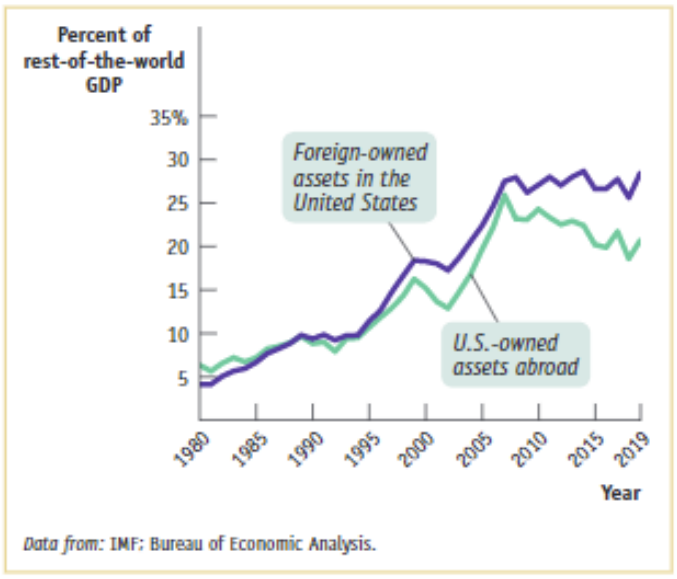

# **经济学原理第五次作业**

梁昱桐 2100013116 信息科学技术学院

<i>Peking University</i>

## **第 1 题**

**下图展示的是在美国的“外资资产”和在美国之外的美国资产分别占世界（除美国外） 总 GDP 的百分比。可以看出，两者从 1980 年到 2019 年都增多了 5 倍左右。请尝试着站在美国的视角回答下列问题。**

1. **随着美国在外资产占其它国家总 GDP 比重的上升，你认为该图反映美国在此期间经历了净资本外流吗？**

   没有经历。外国在美资产占美国 GDP 的比重一直高于美国在外资产占其它国家总 GDP 的比重，而且两者的差距在扩大，说明美国的资本是净流入的

2. **这个图可以说明 2019 年世界经济的连结比 1980 年更紧密吗？**

   可以说明。从图中可以看出美国和其它国家之间的资产交换都有显著增长，说明双方的经济联系更加密切

## **第 2 题**

**在下列情形中，假设所涉及的两个国家是世界上唯一进行国际贸易的国家。若给定通货膨胀和名义汇率的变化，请判断哪个国家的产品和服务会变得比原来更有吸引力（更具国际竞争力）了？** 

以下均以中国为本国，汇率为单位外币兑本币汇率

1. **中国通货膨胀 10%，日本通货膨胀 5%，而人民币兑日元的名义汇率保持不变。**

    $\frac{\Delta RER}{RER}=0+5\%-10\%=-5\%$

   真实汇率降低，中国商品国际竞争力降低，日本商品国际竞争力提高

2. **中国通货膨胀 3%，墨西哥通货膨胀 8%，而人民币的比索价格从 2 下降到 1.6。** 

    $\frac{\Delta RER}{RER}=\frac{\frac{1}{1.6}-\frac{1}{2}}{\frac{1}{2}}+8\%-3\%=30\%$

   真实汇率提高，中国商品国际竞争力提高，墨西哥商品国际竞争力降低

3. **中国通货膨胀 5%，欧元区通货膨胀 3%，而欧元的人民币价格从 8 下降到 7。** 

    $\frac{\Delta RER}{RER}=\frac{7-8}{8}+3\%-5\%=-14.5\%$

   真实汇率降低，中国商品国际竞争力降低，欧元区商品国际竞争力提高

4. **中国通货膨胀 8%，美国通货膨胀 4%，而美元的人民币价格从 6 上升到 7.5。**

    $\frac{\Delta RER}{RER}=\frac{7.5-6}{6}+4\%-8\%=21\%$

   真实汇率提高，中国商品国际竞争力提高，美国商品国际竞争力降低

## **第 3 题**

**假设某国统计局公布了某年的如下信息：** 

**自主税收 T = 50 百万美元**

**G = 70 百万美元**

**X = 60 百万美元**

**M = 20 百万美元**

**自主投资 I = 100 百万美元**

**假设支付转移（TR）为 0，且家庭消费（C）和税后收入（Y-T）的关系如下：**

| **Y-T/百万美元** | **C/百万美元** |
| ---------------- | -------------- |
| **100**          | **30**         |
| **150**          | **70**         |
| **200**          | **110**        |
| **250**          | **150**        |

**请使用凯恩斯的模型来回答如下问题：** 

1. **该经济体该年的边际消费倾向（MPC）是多少？自主消费又是多少？** 	
   $$
   \begin{aligned}
   MPC=&\frac{\Delta C}{\Delta (Y-T)}\\
   =&0.8
   \end{aligned}
   $$
   
   $$
   C_0=30-MPC\times100=-50
   $$
   
   

2. **请计算该经济体该年的均衡 GDP，记为 Y。绘制一张图像模型，表示均衡 GDP。 在该图中，请将 Y 作为横轴，总花费（aggregate expenditure）即 AE 作为纵轴。** 
   $$
   \begin{aligned}
   AE_{planned}&=C+I_{planned}+G+NX\\
   &=(C_0+MPC\times (Y-T))+I_{planned}+G+NX\\
   &=-50+0.8\times(Y-50)+100+70+60-20\\
   &=0.8\times Y+120
   \end{aligned}
   $$

​		均衡条件：

$$
\begin{aligned}
   AE_{planned}&=Y\\
   0.8\times Y+120&=Y\\
   Y^*&=600
   \end{aligned}
$$

3. **请计算出该经济体该年均衡的私人储蓄水平，并通过计算来展示可贷资金市场也处于均衡。** 

   私人储蓄：
   $$
   \begin{aligned}
   Y&=C+S+T\\
   S_{private}&=Y^d-C\\
   &=Y^d-C_0-MPC\times Y^d\\
   &=-C_0+(1-MPC)\times Y^d\\
   &=50+(1-0.8)\times (600-50)\\
   &=160
   \end{aligned}
   $$
   公共储蓄：
   $$
   \begin{aligned}
   S_{public}&=T-G\\
   &=50-70\\
   &=-20
   \end{aligned}
   $$
   

   总投资：
   $$
   \begin{aligned}
   Y&=C+I+G+NX\\
   I+NX&=Y-C-G\\
   &=600-(-50+0.8\times (600-50))-70\\
   &=140
   \end{aligned}
   $$
    $S_{private}+S_{public}=I+NX$ ，从而可贷资金市场处于平衡

4. **假设使得该经济体充分就业的产出水平是$800,000,000。为了刺激经济，使得 GDP 达到就业充分的水平，政府需要再保持税收不变的情况下增加多少支出呢？** 

   这要求 $AE_{planned}$ 曲线上移 40，从而政府需要增加 40 百万美元的支出

5. **如果政府不通过增加支出而是通过减税来实现（4）的目标，应该减多少税？** 
   $$
   \begin{aligned}
   AE_{planned}&=C+I_{planned}+G+NX\\
   &=(C_0+MPC\times Y^d)+I_{planned}+G+NX\\
   &=(C_0+MPC\times (Y-T))+I_{planned}+G+NX\\
   &=-50+0.8\times(Y-T)+100+70+60-20\\
   &=0.8Y+160-0.8T
   \end{aligned}
   $$
   代入点 $(800,800)$ ，得到 $T=0$ ，从而应该减税 50 百万美元

6. **由于贸易争端，该国的出口、进口额均降至 0。政府如果想将经济恢复至（4）的 水平，并且只通过减税的方式，应该怎么做？** 
   $$
   \begin{aligned}
   AE_{planned}&=C+I_{planned}+G\\
   &=(C_0+MPC\times Y^d)+I_{planned}+G\\
   &=(C_0+MPC\times (Y-T))+I_{planned}+G\\
   &=-50+0.8\times(Y-T)+100+70\\
   &=0.8Y+120-0.8T
   \end{aligned}
   $$
   代入点 $(800,800)$ ，得到 $T=-50$ ，从而应该减税 50 百万美元，同时进行 50 百万美元的转移支付

7. **请继续（6）的情形，但此时政府希望同时提高支出和税收，使得财政赤字维持在原先的水平。请问，政府支出和税收应该增加多少？**
   $$
   \begin{aligned}
   AE_{planned}&=C+I_{planned}+G\\
   &=(C_0+MPC\times Y^d)+I_{planned}+G\\
   &=(C_0+MPC\times (Y-T))+I_{planned}+G\\
   &=-50+0.8\times(Y-T)+100+G\\
   &=0.8Y+50-0.8T+G
   \end{aligned}
   $$
   代入点 $(800,800)$ ，并且满足财政赤字不变：
   $$
   \begin{cases}
   \begin{aligned}
   G-0.8T&=110\\
   G-T&=20
   \end{aligned}
   \end{cases}
   $$
   解得：
   $$
   \begin{cases}
   \begin{aligned}
   G&=470\\
   T&=450
   \end{aligned}
   \end{cases}
   $$
   从而政府支出与税收都应该增加 400 百万美元 

## **第 4 题**

**假设某国经济学家搜集或估计了该国某年的如下信息：**

**法定准备金率 RRR = 0.1** 

**货币需求函数 Md = 30,000 - 50,000r** 

**投资函数 I = 700 - 2,000r** 

**总花费 AE = C + G + I + NX** 

**消费函数 C = 3,600 + 0.2(Y-T) - 100P** 

**政府支出 G = 450** 

**净出口 NX = X-M = -350** 

**自主税收 T = 100** 

**支付转移 TR = 0** 

**总需求 AD = AE = Y = C + G + I + NX** 

**长期总供给 $LRAS = Y^{fe} = 4,000$** 

**短期总供给 SRAS = Y = 600P - 1,875** **请根据如上信息，回答如下问题：**

1. **若均衡的投资水平是 620，那么均衡的利率是多少？** 

   根据投资函数：$r^*=4\%$

2. **若货币市场出清，货币供给水平是多少？** 

   $M^s=M^d=30000-50000\times 4\%=28000$

3. **基于上面的回答，写出 AD 的表达式。** 
   $$
   \begin{aligned}
   Y&=C+G+I+NX\\
   &=3600+0.2(Y-100)-100P+450+620-350\\
   &=0.2Y+4300-100P
   \end{aligned}
   $$
   从而 $AD:\ Y=5375-125P$

4. **在短期，均衡的真实 GDP 和物价水平（P）是多少？请展示计算过程，并用图像模型来表示该短期均衡。请在你的图形中包括 LRAS 线，将 P 作为纵轴，Y 为横轴。** 
   $$
   \begin{cases}
   \begin{aligned}
   Y&=-125P+5375\\
   Y&=600P - 1875
   \end{aligned}
   \end{cases}
   $$
   解得短期均衡：
   $$
   \begin{cases}
   \begin{aligned}
   P^*&=10\\
   Y^*&=4125
   \end{aligned}
   \end{cases}
   $$
   

   

5. **在长期，假设政府不干预市场，均衡的 Y 和 P 是多少？试比较（4）中的短期均衡 Y 和本题的长期均衡 Y，短期的失业率与自然失业率相比如何？** 
   $$
   \begin{cases}
   \begin{aligned}
   Y&=-125P+5375\\
   Y&=4000
   \end{aligned}
   \end{cases}
   $$
   解得长期均衡：
   $$
   \begin{cases}
   \begin{aligned}
   P^*&=11\\
   Y^*&=4000
   \end{aligned}
   \end{cases}
   $$
   （4）中的短期均衡产出大于（5）中的长期均衡产出，（4）中的短期失业率小于（5）中的自然失业率

6. **假设该经济正处于短期均衡，而政府当前的目标是给经济“降温”。如果政府使用财政政策，应该减少多少政府支出以实现失业率回归“自然”？**
   $$
   \begin{aligned}
   Y&=C+G+I+NX\\
   &=3600+0.2(Y-100)-100P+G+620-350\\
   &=0.2Y+3850-100P+G
   \end{aligned}
   $$
   $\Rightarrow AD:\ Y=4812.5-125P+1.25G$

   想要AD曲线过 $(4000,\frac{235}{24})$ ，那么 $G=\frac{1975}{6}\approx 329.17$

   因此政府应该减少 120.83 的政府支出