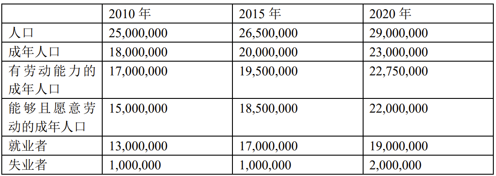
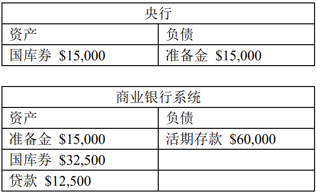
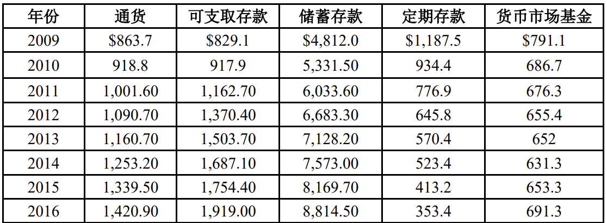
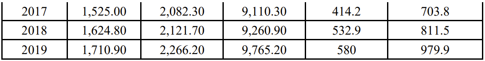

# 经济学原理第四次作业

EmptyBlue 2100013116 信息科学技术学院

<i>Peking University</i>

1. **对于下列每一个中国受访者，请将其归为就业者（E）、失业者（U）或非劳动力（NLF）：**

   | **情景**                                                     | **E、U还是NLF？** |
   | :----------------------------------------------------------- | ----------------- |
   | **一个 20 岁的大三学生在一家正规的咨询公司实习，并签订了为期半年的劳动合同，每周到岗 20 小时，按月支付薪酬** | E                 |
   | **一个 45 岁的单身父亲在一家咖啡店兼职打工，但他希望找到一份全职工作** | E                 |
   | **一个 15 岁的初中毕业生因为没有考上高中，正在积极地寻找工作** | 均不是            |
   | **一个 22 岁的光荣的现役军人全身心地投入每天的工作中**       | NLF               |
   | **一个正常年龄毕业的大学毕业生刚刚毕业，但在过去两周内还在不断找工作** | U                 |
   | **一个亲戚在过去 4 周内既没有刷招聘广告也没有投简历，每当有人问他到底在干什么，他总是反问道：“你听说过姜太公钓鱼的故事吗？”** | NLF               |
   | **一位 30 岁的女士上周刚辞去北京的工作，明天就要参加上海某金融机构的面试** | U                 |
   | **一位 25 岁的年轻小伙 2 个月前失去工作，然后搬回去和父母居住，这段时间他除了睡觉、吃饭就是在分析股市，因为他有一笔钱在手上，并试图成为职业炒股家来实现财富自由** | NLF               |
   | **一个 40 岁的身体健壮的服刑犯人根据《监狱法》第六十九条参与缝纫工作，并因为表现良好，根据第七十二条，获得每月 500 元的报酬** | NLF               |

2. **在一个快速崛起的国家中，我们观测到了如下数据。请根据表格，回答下列问题：**

   ****

   1. **请定义劳动力人口，并计算每一个有数据年份的劳动力人口**

      劳动力人口=就业者+失业者

      |            |   2010年   | 2015年     | 2020年     |
      | ---------- | :--------: | ---------- | ---------- |
      | 劳动力人口 | 14,000,000 | 18,000,000 | 21,000,000 |

      

   2. **请定义丧志工人和准待业工人，并计算每一个有数据年份的丧志工人加上准待业工人的总数**

      丧志工人 = 想工作但是放弃找工作的人

      准待业工人 = 过去（12个月）找工作但最近（4周） 没有找工作的人

      丧志工人 + 准待业工人 = 能够且愿意劳动的成年人口 - 劳动力人口

      |                       | 2010年    | 2015年  | 2020年    |
      | --------------------- | --------- | ------- | --------- |
      | 丧志工人 + 准待业工人 | 1,000,000 | 500,000 | 1,000,000 |

      

   3. **请计算各年的劳动参与率，并保留小数点后 2 位**

      劳动参与率 = $\frac{劳动力}{成人人口}$

      |            | 2010年 | 2015年 | 2020年 |
      | ---------- | ------ | ------ | ------ |
      | 劳动参与率 | 77.78% | 90.00% | 91.30% |

      

   4. **请计算各年的失业率，并保留小数点后 2 位。**

      失业率 = $\frac{失业人口}{劳动力}$

      |        | 2010年 | 2015年 | 2020年 |
      | ------ | ------ | ------ | ------ |
      | 失业率 | 7.14%  | 5.56%  | 9.52%  |

      

3. **T 型账户是一份简化的资产负债表。下面是某个经济体中的央行和商业银行系统的 T 型账户。假设在这个经济体中没有人持有现金，而所有交易都通过借记卡或支票完成。再假设商业银行都不持有超额准备金，并且能够根据最新的货币政策立即调整自己的资产负债情况。请用这些信息回答下列问题：**

   ****

   1. **基于以上信息，该经济体的法定准备金率是多少？**
      $$
      法定准备金率=\frac{法定准备金}{活期存款}=\frac{15000}{60000}=25\%
      $$
      
   2. **假设央行在公开市场操作中购买了名义价值为$5,000 的国库券（Treasury Bills，又称 T-bills）。请将此货币政策对 T 型账户的瞬时影响（即商业银行系统还没有继续调整准备金时的影响）展现在新的表格上（需要展现一定的计算过程）。**
   
      央行：
   
      | 资产           | 负债           |
      | -------------- | -------------- |
      | 国库券 $20,000 | 准备金 $20,000 |
   
      商业银行系统：
   
      | 资产           | 负债             |
      | -------------- | ---------------- |
      | 准备金 $20,000 | 活期存款 $60,000 |
      | 国库券 $27,500 |                  |
      | 贷款 $12,500   |                  |
   
      
   
   3. **在（b）的公开市场操作之后的瞬间，商业银行系统产生了超额准备金还是不足额准备金？请计算超额量或不足额量。**
      $$
      60000\times25\%-20000=-5000
      $$
      超额准备金，超额量为$5000
   
   4. **基于（c）的 T 型账户，请制作新的 T 型账户以展示商业银行系统调整的过程，并体现一定的计算步骤。** 
      $$
      \Delta D=\frac{\Delta X}{R}=\frac{5,000}{25\%}=$20,000
      $$
      
   
      央行：
   
      | 资产           | 负债           |
      | -------------- | -------------- |
      | 国库券 $20,000 | 准备金 $20,000 |
   
      商业银行系统：
   
      | 资产           | 负债             |
      | -------------- | ---------------- |
      | 准备金 $20,000 | 活期存款 $80,000 |
      | 国库券 $27,500 |                  |
      | 贷款 $32,500   |                  |
   
      
   
   5. **在（d）的结果下，真实利率在短期和长期会如何变化？名义利率呢？为什么？**
   
      短期：真实利率与名义利率均下降，因为货币供给增加
   
      长期：真实利率恢复到原始水平，名义利率上升因为扩展的财政政策导致的通货膨胀率增加
   
4. **下表是 2009 至 2019 年每年 12 月圣路易斯联邦储备银行公布的 M1、M2 的各组成部分 （单位是 10 亿美元）。请根据表格回答如下问题。**

   ****

   ****

   1. **请你制作一个新的表格，计算 M1、M2（单位均是 10 亿美元）、通货占 M1 比重和通货占 M2 比重。** 

      | 年份 | 通货   | 可支取存款 | 储蓄存款 | 定期存款 | 货币市场基金 |   M1   |   M2    | 通货占 M1 比重 | 通货占 M2 比重 |
      | :--: | ------ | :--------: | :------: | :------: | :----------: | :----: | :-----: | :------------: | :------------: |
      | 2009 | 863.7  |   829.1    | 4,812.0  | 1,187.5  |    791.1     | 1692.8 | 8483.4  |     51.0%      |     10.2%      |
      | 2010 | 918.8  |   917.9    | 5,331.5  |  934.4   |    686.7     | 1836.7 | 8789.3  |     50.0%      |     10.5%      |
      | 2011 | 1001.6 |   1162.7   | 6,033.6  |  776.9   |    676.3     | 2164.3 | 9650.8  |     46.3%      |     10.4%      |
      | 2012 | 1090.7 |   1370.4   | 6,683.3  |  645.8   |    655.4     | 2461.1 | 10445.6 |     44.3%      |     10.4%      |
      | 2013 | 1160.7 |   1503.7   | 7,128.2  |  570.4   |     652      | 2664.4 |  11015  |     43.6%      |     10.5%      |
      | 2014 | 1253.2 |   1687.1   |  7,573   |  523.4   |    631.3     | 2940.3 |  11667  |     42.6%      |     10.7%      |
      | 2015 | 1339.5 |   1754.4   | 8,169.7  |  413.2   |    653.3     | 3094.9 | 12327.9 |     43.2%      |     10.8%      |
      | 2016 | 1420.9 |    1919    | 8,814.5  |  353.4   |    691.3     | 3340.7 | 13199.9 |     42.5%      |     10.8%      |
      | 2017 | 1525   |   2082.3   | 9,110.3  |  414.2   |    703.8     | 3607.3 | 13935.6 |     42.3%      |     10.9%      |
      | 2018 | 1624.8 |   2121.7   | 9,260.9  |  532.9   |    811.5     | 3746.5 | 14473.8 |     43.4%      |     11.2%      |
      | 2019 | 1710.9 |    2266    | 9,765.2  |   580    |    979.9     | 3976.9 |  15302  |     43.0%      |     11.2%      |
      
   2. **你从（a）中的新表格中发现了什么规律？这个趋势可能是由什么导致的？**

      从新表格中可以发现以下规律：

      1. M1 和 M2 逐年增长，说明美国的货币供应量扩张

      2. M2 的增长速度高于 M1 的增长速度，说明美国的储蓄存款、定期存款和货币市场基金的增长速度高于流通中的货币和可支取存款的增长速度。

         这说明市场对经济的预期较悲观，放水很多但消费和投资跟不上，钱都堆在金融体系内而不愿意进入实体经济

      3. 通货占 M1 比重和通货占 M2 比重都呈现逐年下降的趋势，说明美国的流通中的货币在总货币供应量中的比重在不断减小

      这些趋势可能是由以下因素导致的：

      1. 货币供应量扩张：

         美国经济在 2009 年至 2019 年期间经历了一段较长的复苏和扩张，需要更多的货币来支持经济活动和交易

         美国联邦储备系统在 2008 年至 2014 年期间实施了量化宽松政策，通过购买大量的国债和其他金融资产来增加货币供应量和降低利率

      2. M2 的增长速度高于 M1 的增长速度：美国公众对储蓄存款、定期存款和货币市场基金等较为安全和稳定的金融产品有较高的需求，尤其是在经历了 2008 年金融危机之后

      3. 通货占比下降：美国公众对流通中的货币有较低的需求，因为现代社会有更多的电子支付方式，如信用卡、借记卡、网络支付等，可以减少对现金的依赖

5. **下面各项分别是 M1、M2 还是都不是？为什么？**

   1. **北大校园卡里的 100 元余额**

      都不是。因为这100元已经花出去了，不是货币供应量。

   2. **你存钱罐里的 50 个 1 元硬币**

      都不是。因为存钱罐中的硬币不在流通中，不是通货

   3. **你定期存款中的 2000 元余额**

      不是M1，是M2。因为定期存款既不是通货也不是可随时支付的存款。

   4. **你活期存款中的 500 元余额**

      是M1和M2。因为活期存款是可随时支付的货币。

   5. **你股票账户里的 100 股中国银行股票，价值大约 3600 元**

      都不是。因为股票不是货币。

   6. **你支付宝“花呗”中的 3000 元信用额度**

      都不是。因为花呗额度不是货币。

6. **国会研究处（Congressional Research Service）是直属于美国国会的智库，目的是为国会提供重要问题的研究和分析，每年预算超过 1 亿美元。相较于其它智库和学者，CRS 的报告更具官方性和权威性，因而它也成为国会议员在立法过程中在相关问题上直接参考的资料来源。CRS 的一份报告指出，北朝鲜制造并使大约 45 万张一百美元的假钞票在市场上流通。请尝试回答下列问题。**

   1. **为什么北朝鲜制作假的美元钞票是美国纳税人的损失？**

      1. 制造假美元导致美元通货膨胀，纳税人手中的美元价值降低，这是美国纳税人的损失
      2. 假美元会增加美国政府和金融机构检测和防范假币的成本，以及追查和惩罚假币犯罪的费用。这些成本和费用最终都会由美国纳税人来承担

   2. **2016 年 12 月，美国国库券的利率为 0.87%。在这个利率水平下，美国纳税人每年损失了多少？**
      $$
      4500\times0.87\%=39.15
      $$
      如果美国政府没有被北朝鲜占用 4500 万美元的债务，而是用这笔钱发行国库券，那么美国纳税人每年可以获得约 39.15 万美元的利息收入。

7. **自 2007 年以来，美联储的资产中国库券的比重在下降。请访问 www.federalreserve.gov （美联储官网），并在网页的顶部找到“Data”下的“Factors Affecting Reserve Balances  - H.4.1”，选择 2023 年 4 月 20 日的数据公布。**

   1. **在“Condition Statement of Federal Reserve Banks”下，找到“Reserve Bank Credit” 的栏目。请问，储备银行信贷总额的每日数值的均值是多少？其中，美国国债（U.S.  Treasury securities）的均值是多少？短期国库券占储备银行信贷总额的比例是多少？**
   
      储备银行信贷总额的每日数值的均值：8,570,989百万美元
   
      美国国债的均值：5,274,250百万美元
   
      短期国库券：280,966百万美元
   
      短期国库券占储备银行信贷总额的比例：3.28%
   
   2. **美联储的资产在 2007 年 1 月 25 日主要由美国国债组成。根据数据（可以自行在网站上检验），美国国债份额在前一周的均值达 93%以上。现如今，2023 年 4 月 20 日， 美联储的资产负债表回到当时的“正常”水平了吗**
   
      没有回到当时的正常水平
   
      美联储的资产总额：8,657,767百万美元
   
      美国国债：5,265,070百万美元
   
      美国国债在总资产中比例：60.81%