# 第六讲 失业

## 宏观中的失业

### 宏观与微观中的失业有何区别？

微观中的失业：如果失业仅仅是微观中价格定高了的问题， 那么为何不降一下工资让大家就业？失业在微观层面上不能解决。

1936年凯恩斯的《就业、利息与货币通论》首先讨论的就是就业问题

宏观中的失业：大萧条时期工资降了，（事实：1925-1933年英国降低7%，1929-1933年美国降低28%），但是物价降得更猛，有效需求不足，企业不愿意雇佣。

### 为什么要现在讨论宏观中的失业？

已经学习了经济增长、金融市场，还没有讲货币政策

失业是一个承上启下的内容：

1. 是一个重要的真实（real）经济变量
2. 没有经济增长，会产生失业
3. 货币政策过于宽松和紧缩都会导致失业率上升

## 失业的基本类型（重点）

### 人口分类

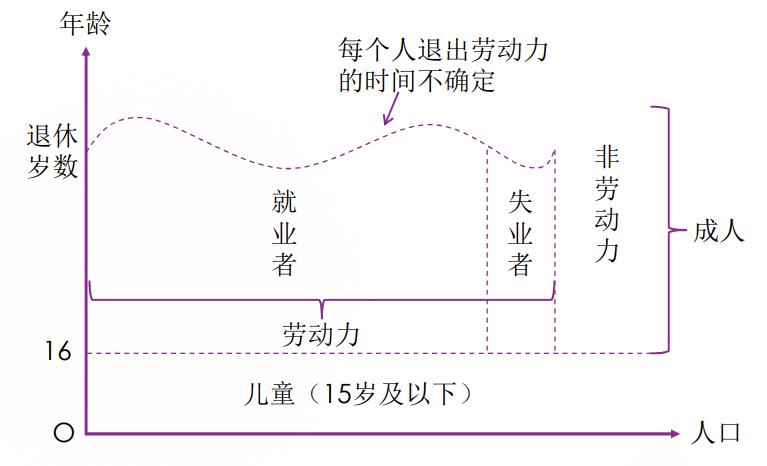

成人的分类：

1. 劳动力——就业（Employed）：有工作的人，无论全职还是兼职，无论有没有报酬，也无论是否临时请假
2. 劳动力——失业（Unemployed）：没有工作的人，但能工作且四周内在找工作
3. 非劳动力（Inactive）：即所谓的“闲人”， 包括以收租、在家炒股等方式为生的人，还包括全日制学生、退休人员

我国的人口组成：

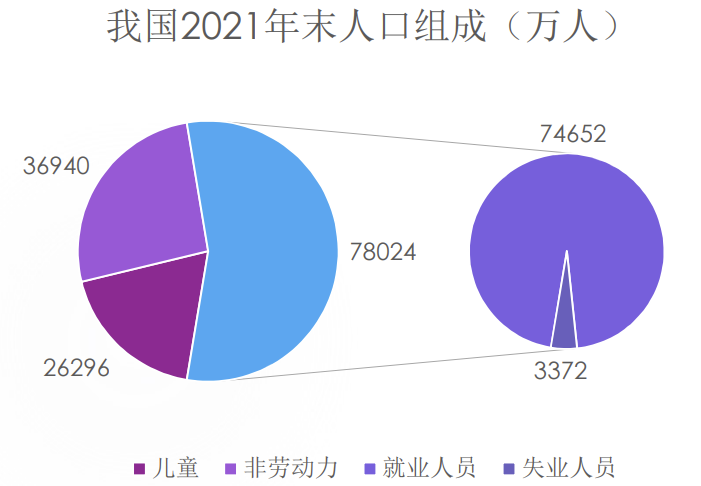

### 作为存量的失业率

定义：在某一个时点失业人数占劳动力人数的比重

相关概念：劳动参与率

### 作为流量的失业率

成人人口在三种“状态”（Employed、Unemployed、Inactive）下切换，总共有六种组合：

EU率：EU人口/初始为E的人口 × 100%
EI率：EI人口/初始为E的人口 × 100%
UE率：UE人口/初始为U的人口 × 100%
UI率：UI人口/初始为U的人口 × 100%
IE率：IE人口/初始为I的人口 × 100%
IU率：IU人口/初始为I的人口 × 100%

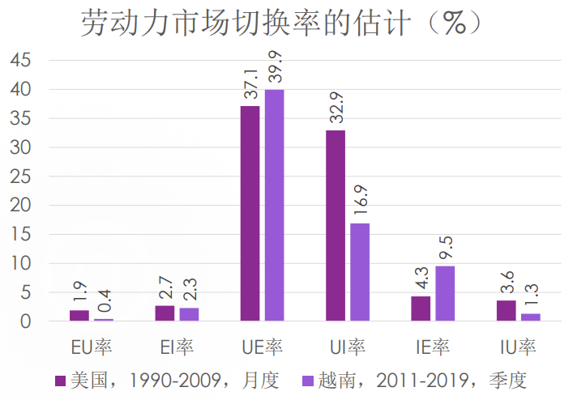

UI代表着失业者变为非劳动力，也叫做“Discouraged”

约10%的非劳动力在短期内会转为劳动力

这些估算说明：

1. 就业者和非劳动力相对“稳定”，变化率不大
2. 失业者相对“不稳定”——切换概率较大（容易发生变化）

### 自愿、非自愿失业

自愿失业：不愿意接受市场均衡工资——古典经济学家

非自愿失业：愿意接受当前的工资，但求职人数仍然超过岗位数——凯恩斯主义者

失业的实例：

1. 传统的、完全竞争的劳动力市场：

   

2. 凯恩斯主义，“有效需求”不足和工资粘性导致物价比工资降得快，减少雇佣比工资下降快：

   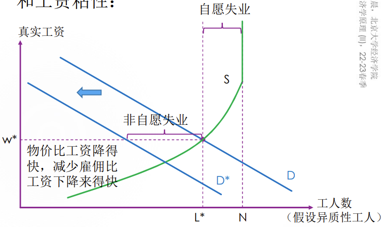

3. 最低工资法

   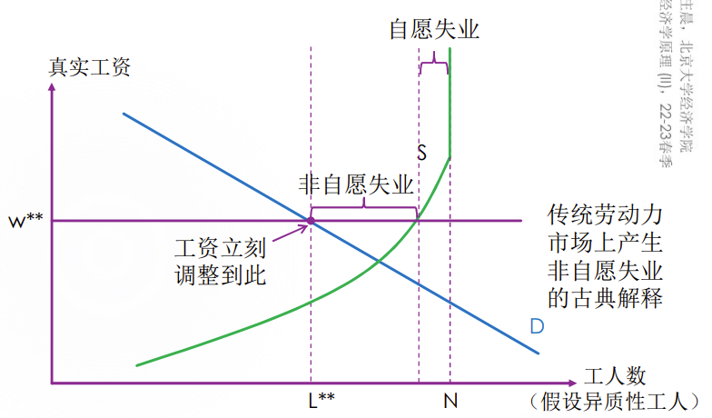

4. 有部分工人在某一个工资水平上对是否工作无差异

   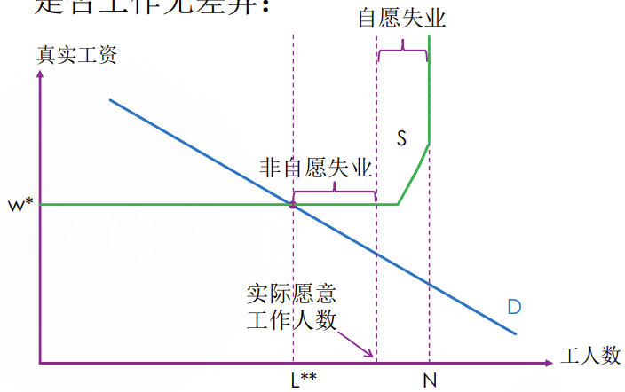

5. 第二讲讨论“效率工资”时，已经提到了由NSC条件导致的非自愿失业

   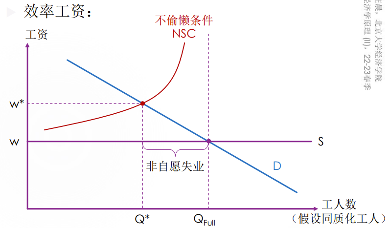

6. 第二讲提到的工会实际上也可以通过一个 “虚高”的（卖方垄断的）供给曲线导致非自愿失业

   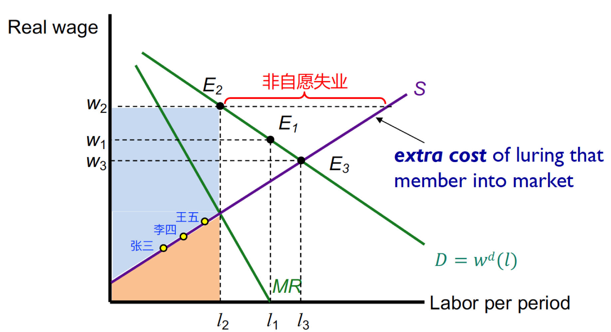

7. 歧视也可以导致非自愿失业：若金发工人的服务不被任何消费者接受，则无论金发工人是否愿意接受更低工资，雇主都不会雇佣他们

### 长期失业中的结构性失业

1. 结构性失业（structural unemployment）：由于经济结构、体制等变动，导致劳动力在技能、经验、主观意愿等方面的供给结构与需求不一致导致的失业

2. 特点

   1. 往往是非自愿失业

   2. 通常导致地区、产业之间持续的不均衡

   3. 例子：

      从高耗能、高污染产业向新能源产业转型的过程中，势必会关停一些企业与项目，也会创造一批岗位。此时，既有失业又有职位空缺，但失业者不都胜任当前岗位

      高耗能、高污染产业中，低端需求（工资低的职位需求）减少但是工资不变

3. 岗位创造与岗位毁灭

   岗位创造（job creations）和岗位毁灭 （job destructions）往往同时发生， 但职工流动发生得更频繁。

   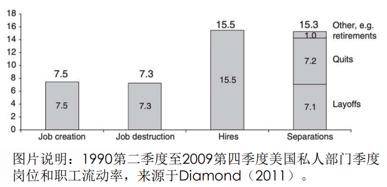

   这说明职工流动的原因不仅仅是岗位的变化，也可能是类似自愿的摩擦性失业。

### 长期失业中的摩擦性失业

1. 定义：摩擦性失业（frictional unemployment）是由找工作所需时间所导致的失业
2. 自愿摩擦性失业：“为了得而舍去”
   1. 往往发生在工作切换的过程中，并且一般是短暂的
   2. 也可能有人“待价而沽”
3. 非自愿摩擦性失业
   1. 通常是由信息获取成本导致，即信息交流不完全导致劳动力市场缺乏流动性

### 长期失业

1. 长期失业：包括结构性失业与摩擦性失业

2. 长期失业率（natural rate of unemployment）的存量公式：

   

3. 相关的概念：非加速通货膨胀失业率或NAIRU（Non-Accelerating-Inflation Rate of  Unemployment），与之后的菲利普斯曲线有关

4. 长期失业率不等于长期失业者（如失业超过半年）占劳动力的比重，长期失业也包括短期失业者。“长期”是指导致失业的原因或现象是长期的、常见的、自然的

5. 曼昆指出：“在任何时候所见到的大多数失业者往往是长期失业者（从短期来看，大部分失业都是长期的），但大多数失业却是短期的（从长期来看，大部分失业都是短期的）”

   1. 从短期来看，被剩下的失业者大多是没有很快找到下一家的失业者，这说明了长期失业与周期性失业相比的主导地位。这是一个存量概念。
   2. 从长期来看，大部分失业者都能很快找到下一家，周期性失业的人员变化较大（UE、UI较大）。这是一个流量概念。
   3. 举一个例子说明：一个经济中每周都有4人登记失业， 其中有3人每周都登记，另外1人一直在换。这样一来，52周下来就出现55个失业登记 （3个长期，52个短期），其中任何时点长期失业者都占多数（存量）；但是考虑这一年的变化，短期失业的登记占大多数（流量）

### 周期性失业

1. 周期性失业（cyclical unemployment） ：实际失业率偏离自然失业率的程度

2. 实际失业 = 自然失业 + 周期性失业

3. 周期性失业与“商业周期”密切相关

4. 经济衰退时（商业周期处于波谷时），EU和EI率上升，UE率下降

   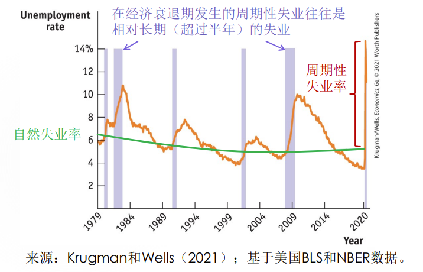

5. 在过去三年中，大学毕业生经历了三种类型的失业：结构性失业、摩擦性失业以及周期性失业。举例说明：

   1. 结构性失业：大学毕业生的专业被淘汰
   2. 摩擦性失业：大学毕业生放弃 return offer
   3. 周期性失业：疫情影响的失业

## 丧志、准待业和未充分就业（重点）

1. 失业率是个完美的指标吗？可能低估或高估实际的失业情况吗？

   不是。可能低估。

2. 三类未被讨论的人：

   1. 丧志工人（discouraged workers）：想工作，但放弃找工作的人——分子分母都低估
   2. 准待业工人（marginally attached workers） ：想工作，但是过去（12个月）找工作但最近（4周） 没有找工作的人——分子分母都低估
   3. 未充分就业工人（underemployed workers） 是指想全职工作但目前兼职工作的人—— 分子低估。实际上有更多的人没有工作。

3. 如果加上这三类人：

   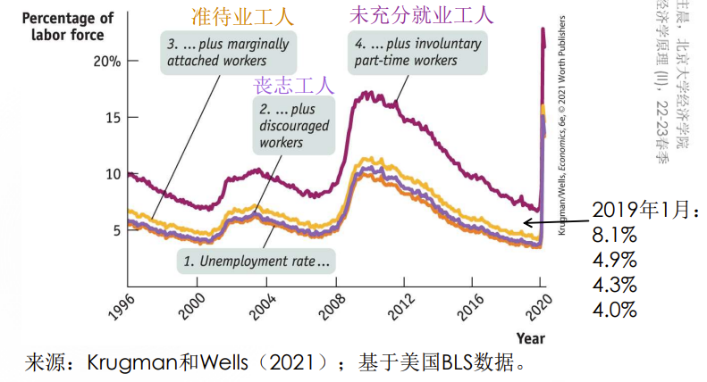

   计算失业率比真实失业率低

## 奥肯定律（重点）

1. 阿瑟·奥肯：耶鲁大学经济系教授，美国战后最有创造性的经济政策制定者之一，他以用简单的事例来阐明复杂的经济问题的要点而闻名于世

   

2. 经验关系（empirical  relationship）：真实GDP的增长率与失业率低变化量负相关

   

   𝑘是完全就业情况下真实GDP的平均增长率。在美国，𝑘大约是3%，而𝑐大约是2。

   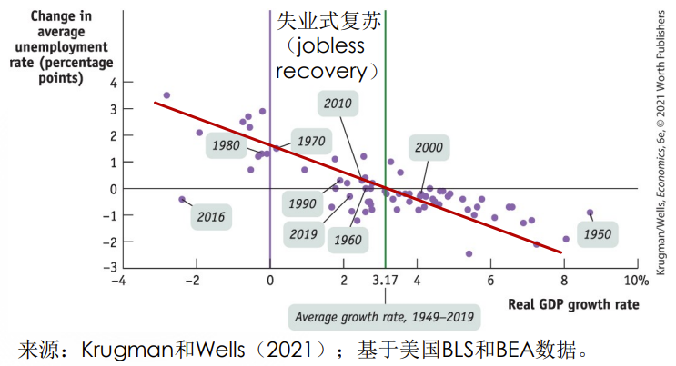

3. 奥肯定律在中国不太明显：

   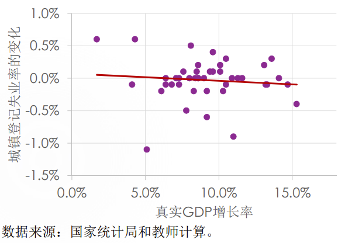

## 摩擦性失业的产生机制（重点，模型逻辑）

### 单边搜寻模型

1. 单边搜寻模型（one-sided search model） 是2010年诺贝尔经济学的得主戴尔·莫滕森（Dale T. Mortensen，1939-2014）于 1970年提出的，他写了一篇题为“A Theory of Wage and  Employment Dynamics”的工作论文，这篇论文为经济学做出了开创性的贡献。

   

2. 简化分析，假设不存在非劳动力，所有成年人要么就业要么失业

3. $\frac{u}{1-u}=\frac sf$ 

   u为失业率，s为退役（下岗）比例，f为找到工作的比例

   在一段时间内失业率不变，那么这段时间内的s和f满足这个式子

   举例说明：

   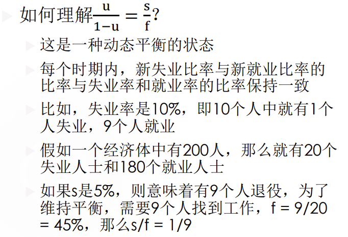

4. 内生化f：$f=\lambda[1-Pr(w\le R)]$

   𝜆是企业发offer的概率， $1-Pr(w\le R)$ 是申请者接受offer的概率，其中𝑤是企业愿意支付的工资，而𝑅是申请者的底价，我们称为“保留工资”（reservation wage）

5. 根据上述两个式子可以得出模型的解：
   $$
   u=\frac{s}{\lambda[1-Pr(w\le R)]+s}
   $$
   这说明失业率与s正相关，与𝜆负相关，与𝑅正相关（R与s负相关，与𝜆正相关，负反馈调节机制）

6. 内生化R：𝑅 = 𝑏 + 待价而沽的期望好处

   R可以理解为接受工作的机会成本，具体有两个方面

   1. 要放弃的失业救助、失业保险福利 （benefits），记为b

   2. 放弃了找到更好的工作的机会

      自动制动/缓冲机制：引入期望好处与s和𝜆的关系：当s提高时， 所有新工作的价值降低，𝑅降低；当𝜆提高时，找到更好工作的概率提高，𝑅提高。这使得u变化更温和

      值得一提的是，失业福利𝑏独立于与s和𝜆， 不存在自动缓冲机制，否则b会逆向选择（正反馈）

### 双边搜寻模型

1. 更现实的设定是企业也在“找”员工， 因此应该将𝜆内生化，产生双边搜寻模型，代表是DMP模型
2. 双边其实不一定更有效率，两个例子：
   1. 征婚帖就是双边搜寻转为单边搜寻的一种努力
   2. 货币:将双边的物物交换转为若干个单边搜寻问题

3. 正是因为双边的低效，人们才向单边转变

## 长期就业政策——减少自然失业的举措（重点）

### 减少摩擦性失业

1. 降低信息获取成本，提高人才流动性

   建设劳动市场中介机构与信息平台，如猎头公司、招聘广告平台、职业介绍所、 失业登记处、再就业培训机构、农民工外出打工职业培训机构等等

2. 与搜寻模型相关联地，对𝑏的设计

   如美国失业保险通常只补偿半年（26周），且补偿标准较低；欧洲自20世纪末以来较高的自然失业率与其慷慨的失业福利制度很难说没有关系

3. 但是摩擦性失业也有其存在必要性：

   假如所有人都被要求立刻接受呈现给自己的第一份工作，那么可能会导致无效的配置，这是在现实的、存在信息摩擦的情况下会出现的情况，因此应该允许人们花一些时间找较好的工作。

   在一个理想国，最适合的工作将会一秒钟出现在每一个人的眼前，那么自然就无需犹豫了，也姐没有摩擦性失业了。

###  减少结构性失业

1. 前面讨论的结构性失业是比较具体的、相对狭义的结构性失业。对于这种结构性失业，政府可以通过就业培训、转岗安置等项目帮助这些失业者再就业。
2. 事实上，最低工资法、效率工资和工会导致（工资高于均衡水平导致）的失业也可以被视为一种广义的结构性失业

