# 第七、八讲 货币制度、货币增长与通货膨胀

## 货币的定义（重点）

### 定义一：作为<u>支付手段</u>被<u>普遍</u>接受的一种<u>商品</u>或符号

对于第一个定义，有三点需要注意：

1. 货币的本质是要求最后能当作结清债务的工具与凭证

   美元上印着一句话：“This note is legal tender for all debs, public and private.” （这张钞票是所有公共与私人债务合法的清偿）——这就是货币这一本质特征的写照

2. 必须要被“普遍接受”

   货币在什么范围内被普遍接受，就在什么范围内流通。现实中美元的“普遍接受”程度则要高得多，但近年其地位也受到一定的威胁。

   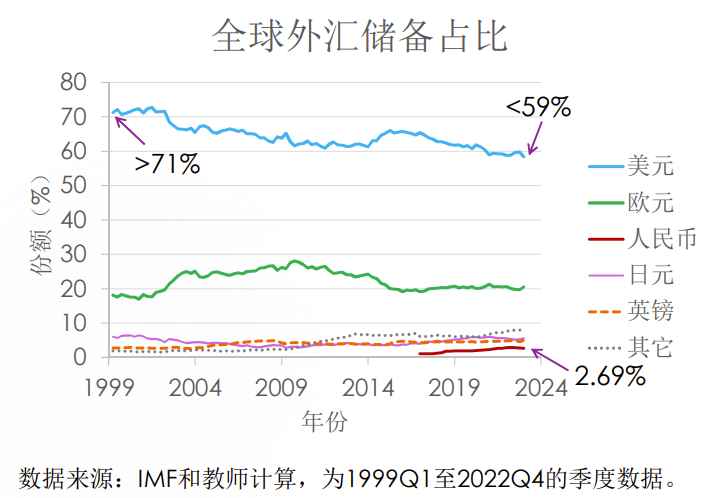

3. 作为被普遍接受的支付手段，货币可以是任何一种商品，也可以是毫无内在价值的一种符号

   1. 商品货币（commodity money）：采取有内在价值的商品形式作为货币

      例如：金银本身

   2. 商品支持货币（commodity-backed money）：可以与某一商品自由兑换的货币

      商品支持货币的一大优势是它能与更少的资源绑定（银行只需要持有一部分金、银来满足兑换需求即可）

   3. 法币（fiat money）：由政府法令所确定的货币，包括纸币与铸币等

      两点优势：其一，不绑定任何实际的资源；其二，可以根据经济的需求随时调整供应量

### 定义二：政府和商业银行通过银行系统对公众发生的<u>债务</u>

1. 存款是商业银行欠公众的债务很好理解

2. 政府发出去的“通货”（纸币和铸币）是政府欠公众的债务：

   通过用国家信用或政府信用担保，政府用法币替代银行的凭证，让原来使用银行凭证交易（对别人支付）的客户改为使用法币交易。

3. 根据这个定义，货币这个定义变得更加狭义，是否是货币与其存在形式有关（主要是通货与活期存款）：

   1. 银行系统中的现金不是货币

      因为银行营业过程使用的现金不是对公众的债务

   2. 政府在银行账户中的现金和存款不是货币

      因为这些是政府的资产而非负债

   3. 信贷不是货币

      因为信贷是企业、个人或者政府欠银行的债务，而不是银行欠别人的债务

   4. 国库券不是货币

      因为必须通过银行系统形成的对公众的债务才是货币。国库券是公开发行的，而不是通过银行系统发生的

### 比特币是货币吗

1. 比特币目前还不算货币，而是一种虚拟货币
2. 不是商品货币，也不是信用货币，但是具有去中心化、世界范围内流通、私密、 总量有上限等特点
3. 美联储委员会前主席艾伦·格林斯潘（Alan  Greenspan，1926-）说：“虚拟货币并不是货币，而是一个泡沫”

### 货币与收入、财富的区别

1. 货币是存量，而收入是流量
2. 货币和财富都是存量，但是：
   1. 财富包括货币财富和非货币财富
   2. 财富往往需要转化为真实价值，而货币往往以名义的形式存在

## 货币的职能（重点）

### 最终支付手段

1. 更轻便，从而大大节省交易成本
2. 信用卡本身不算是货币，因为信用卡不是最终支付手段。但是信用卡可以充当交易媒介

### 交易媒介

1. 将“双边匹配”转为“单边匹配”，将买和卖分开，每次只找一个对象，交易次数从n方次降低为n次
2. 大大提高交易效率

### 计量单位

1. 是交易媒介职能的进一步延伸与发展
2. 大大方便了价格或机会成本的计算，使得产品与服务在更高的维度上进行相互比较

### 价值贮藏手段

1. 能作为最终支付手段的基础
2. 使人们更好地跨期配置资源金
3. 本位制之后，现代货币不再具有“蓄水池”的作用

## 货币的分层（重点）

### 按照流动性将货币分为三类：

1. $M_0$：流通中的钞票与铸币，也叫“通货”（currency），是银行体系之外各单位持有的现金

2. $M_1$：$M_0$ + 活期存款（狭义货币）

   美国的银行账户有checking和saving账户之分，一般个人开支票支付他人是从前者里划走余额，当然两个账户之间可以自由转账，因而2020年5月以后也算$M_1$

3. $M_2$：$M_1$ + 定期存款等准货币（广义货币）

### 我国货币

我国货币供应量期末值（亿元）

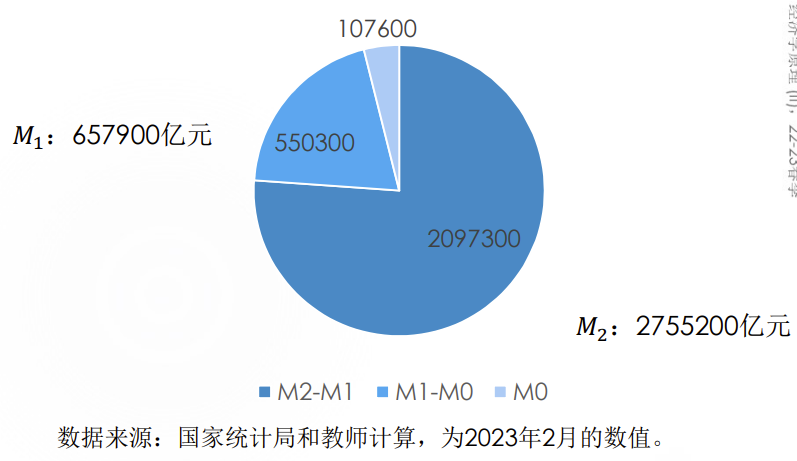

我国历年M1增速和M2增速

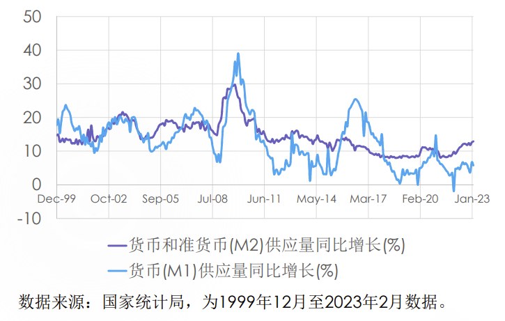

### 货币分类的含义

1. $M_0$：与消费密切相关，数值越高代表百姓手头越宽裕、生活越富足
2. $M_1$：反映经济中的现实购买力，代表家庭和企业资金的松紧，是经济周期先行指标
3. $M_2$：反映现实和潜在的购买力，能够体现社会总需求和未来通货膨胀压力的状况
4. $M_1$ 增速 - $M_2$ 增速（$M_1$ 和 $M_2$ 的剪刀差）：反映市场对经济的预期
   1.  $M_1$ 增速 $>M_2$ 增速（$M_1$ 和 $M_2$ 的剪刀差为正）：市场对经济的预期较乐观，活钱增多， 存款活期化，更多钱将流入实体经济从而增加经济活力
   2.  $M_1$ 增速 $<M_2$ 增速（$M_1$ 和 $M_2$ 的剪刀差为负）：市场对经济的预期较悲观，说明放水很多但消费和投资跟不上，钱都堆在金融体系内而不愿意进入实体经济

## 货币的需求量与供给量（重点）

### 货币的需求量

1. 凯恩斯称货币需求为“流动性偏好”， 因而我们谈论的需求量一般在M1层面，如现金和活期存款（包括支付宝、微信钱包里的额度）

2. 货币需求量：人们想花（用于交易、谨慎与投机）但还没花（如：保持在自己手中）的货币量

   1. 人们放在银行的定期存款不是货币需求量：不想花才存起来
   2. 人们已经花出去的钱不是货币需求量：不再为了购买需要这么多钱了，是商品需求量
   3. 人们借给他人的钱不是货币需求量：是找别人借钱的人的货币需求量

3. 现实中不好观测到货币的需求量，因为有一部分货币需求没有被M1反映出来

   想花但还没花不仅包括人们已经持有的货币，还包括立刻可以减少的消费、立刻可以变现的资产等等。这些立刻可以转变为M1的消费和资产也是货币需求，并且这个需求量可以超过我们显式观测到的所有货币

4. 长期：货币的需求量与物价水平（或币值、**利率**）的关系：

   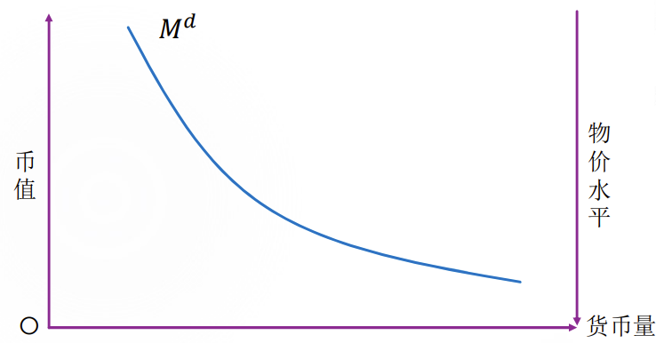  	 	

   货币价值越高，人们愿意持有的货币更少：

   1. 误区：货币值钱就要多持有，这是将持有货币当成财产保值的需要。但是财产保值的任务应该交给其它的金融或非金融资产，这是因为持有货币有机会成本的，货币流动性高，相比其它资产回报率低
   2. 正确思路：持有货币的目的是花钱方便。若货币价值高，不需要持有那么多就能达成交易、谨慎或投机的目的，因此要减少货币持有并增加其它资产

### 影响货币需求的因素

交易、谨慎和投机

短期货币需求：真实利率

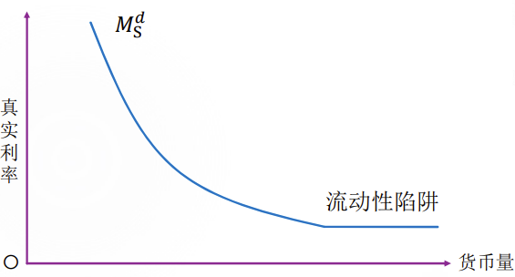

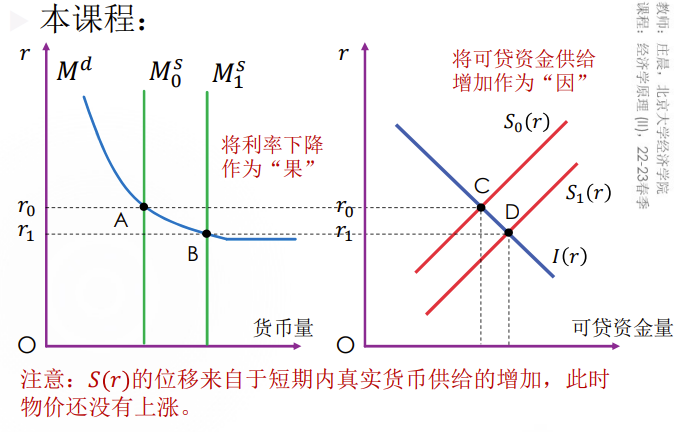

长期货币需求：物价水平

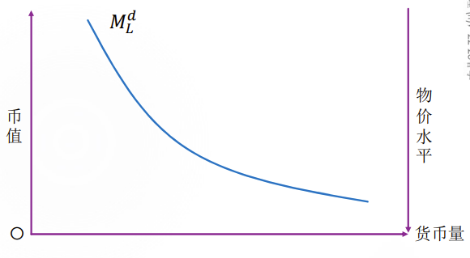

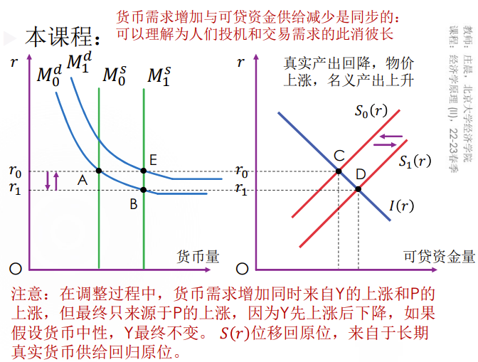

综合的货币需求：名义利率、名义GDP

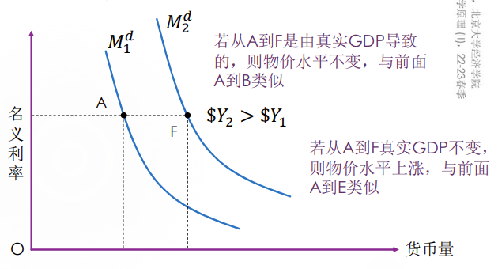

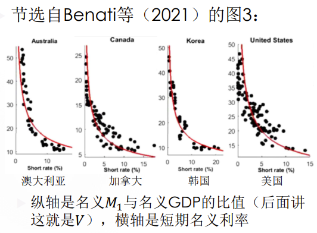

实例：

1. 产品和服务供应量的上升会增加货币需求

   产品和服务供应量的上升会导致交易需求上升，从而增加货币需求

2. 发工资频率增高会降低货币需求

   发工资频率增高会减少为了交易和预防而持有的货币量，因为人们可以更频繁地获得收入

   比如，每月发两万，则“月光族”平均每人每日持有一万；若每半个月发一万，他们平均每人每月持有5000元

3. 支付方式革新（如支付宝）降低货币需求

4. 民众对国家的信心不足降低货币需求

5. 预期通货膨胀升高降低货币需求

### 货币需求与信贷需求的联系与区别

1. 货币需求和信贷需求的联系

   都反映了购买力，贷款可以转化为M1

2. 货币需求和信贷需求的区别

   1. 货币需求是把现在的购买力推迟到不太远的将来再使用的意愿：花过去的钱
   2. 信贷需求是把未来的购买力提前到现在或不太远的将来使用的意愿：花将来的钱
   3. 比如：人们可能会申请上调信用卡额度， 但并不是真的准备花这些

### 货币的供给量

1. 现实中观察到的货币量都是货币的供给量，但货币的供给量不仅限于在M2，还包括央行系统可以创造的新货币量

2. 货币供应量是可控的，往往不受物价水平（或币值）的左右，
   $$
   \overline{M}=\frac{M_0}{P}
   $$
   $M_0$ ：名义货币供给

   $\overline M$ ：实际货币供给（由中央银行决定的外生变量）

### 货币市场的均衡

1. 均衡的货币需求量和供给量：$\overline M$

   

2. 均衡的偏离与回复：依靠物价水平变化来实现

   1. 货币供给不变，但需求增高（体现为需求曲线上移或右移），这里物价有一个粘性，**物价水平暂时不变**

      那么货币需求量就会超过货币供给量，人们感觉钱不够用，因此减少支出以增加货币持有，物价会下降，币值上升，直到物价再次回到均衡水平

   2. 货币“需求”与物价负相关，“需求量” 与物价正相关（考虑需求曲线，$P_0$ 增加货币量增加）；“供给”与物价正相关，“供给量”与物价无关（考虑供给曲线， $P_0$ 增加货币量不变）

### 最优货币量

1. 奥地利学派的米塞斯：不存在 “最优货币量”的问题

   任何数量的货币供给都是最优的， 无论 $\overline M$ 是多少，都能很好地实现交换功能

2. 米尔顿·弗里德曼：“最优货币量” 是一个有意义的问题

   货币供给过多会引发物价上涨（通货膨胀）并带来额外的社会成本（稍后讨论）

## 中央银行制度——以美联储为例

### 央行的目标

1. 维持金融稳定

   降低金融危机发生的概率和发生后的强度，当发生金融危机时尽量“救市”，以减少金融恐慌

2. 维持宏观经济稳定：防止经济过热或过冷

   当经济过热时（人们消费意愿增加，不想持有货币，货币需求曲线向下移动），货币需求不足，通货膨胀压力大（币值有下降的趋势），央行会收紧银根控制通货膨胀（**提高利率使货币需求曲线上移、减少货币供应提高币值**）

   当经济过冷时， 央行会放松银根

### 央行的架构

1. 理事会和主席

   1. 理事会有7名成员，1位主席、1位副主席和5位委员
   2. 目前美联储主席是杰罗姆·鲍威尔（Jerome  H. Powell，1953-），2018-2022年为其第一任期，2022-2026年为第二任期
   3. 理事会由总统任命、参议院批准，每14年 “换血”一轮（2年换1人），每位理事在 理事会里14年，但也有特例：小威廉·迈克、切斯内·马丁（Willian McChesney Martini Jr .）和艾伦·格林斯潘（Alan Greenspan）

2. 地区联邦储备银行

   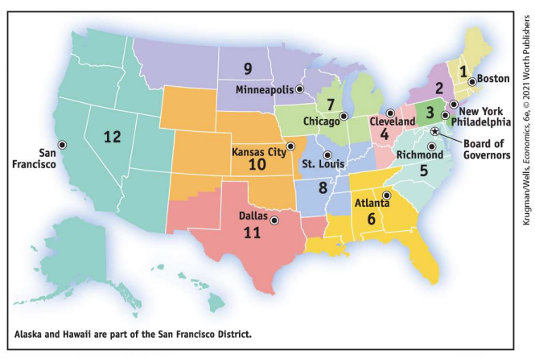

   主要任务：

   1. 为商业银行和其他存款机构提供清算服务

   2. 为商业银行办理准备金业务

      准备金（reserve）：商业银行库存的现金按比例存放在中央银行的存款

      准备金的目的：确保商业银行在遇到突然大量提取银行存款时，有相当充足的清偿能力

   3. 发行现金（钞票）

3. 联邦公开市场委员会（Federal Open Market Committee, FOMC）

   1. FOMC是美联储的主要决策机构与指挥系统
   2. 12名成员：7名理事会成员、1名纽约联邦储备银行总裁和4名其它地区联邦储备银行总裁（从11个地区中选择，每年轮换）
   3. FOMC大概每6周召开一次会议（一年召开8次会议），决定公开市场操作，制定货币政策

4. 美联储发挥影响的渠道

   1. 控制会议日程并主导FOMC会议

   2. 保持与经济学家和其他专家的日常接触

   3. 主席本人是美联储的发言人，其发言本身就是重要的货币政策信号

      伯南克（Ben Shalom Bernanke，1953-）于2022年获得了诺贝尔经济学奖，以表彰他和另外两位经济学家对银行和金融危机的研究

      伯南克是美联储的前任主席，他在2006-2014年期间领导了美联储应对全球金融危机和大衰退的货币政策。他的研究和实践对于理解和防范金融危机有重要的贡献。他也是美联储的发言人，通过公开演讲、新闻发布会、书籍等方式传递了美联储的货币政策信号和观点。因此，伯南克的诺贝尔经济学奖与美联储发挥影响的渠道有密切的关系

   4. 美联储会对全球产生影响

### 美联储与金本位制度

1. 美联储成立于1914年，但其真正地发挥货币政策的制定者与实施者的作用，并积极参与宏观经济的调控，始于20世纪30年代，始于金本位制度的结束
2. 央行的两个“稳定”目标及其实现目标的政策工具表明：央行绝不是被动的、不作为的、任市场自由波动的机构，而是会主动的、积极地调控经济与金融秩序的，央行的救市政策与货币政策都是积极的，但是这就与金本位制下的自由放任的宏观经济政策有本质的对立和差别

### 金本位制下货币供应规则（重点）

​	金本位制的全盛时期是1879-1913年，1879 年美国也开始实施金本位制。以金、银为铸币的金本位制早就存在了， 而这里要讨论的是完全可兑换为金、银的法币制，最早在17世纪的英国出现，并在 18世纪下半叶推广到了日、德等国

金本位制下，政府货币管理的三条规则：

1. 黄金与流动中纸币的比价固定

   这个比价是黄金的纸币价格，又称“铸币价格”（mint price），比如，20世纪初美国政府规定一盎司黄金的美元价格为20.67， 英国政府规定为4.24英镑，同时政府不仅要固定铸币价格，还要承诺兑换

2. 铸币价格与黄金市场上的买卖价要相等

   这是“无套利”（no arbitrage）条件，也是 “套利”的结果

3. 铸币（制金币、融化金币）活动法定化

   不得让任何个人私自从事这项工作，这样可以保证铸币价和黄金市场上的金价之间维持一致性

​	在这三条规则下，流通中需要多少货币的问题就不必考虑了。因为只要铸币价与市场金价一致，且政府自由兑换黄金，则流通中需要多少纸币，人们自然会来兑换，且其目的并非投机

### 金本位制下币值与物价（重点）

黄金的供给、需求与币值图像：

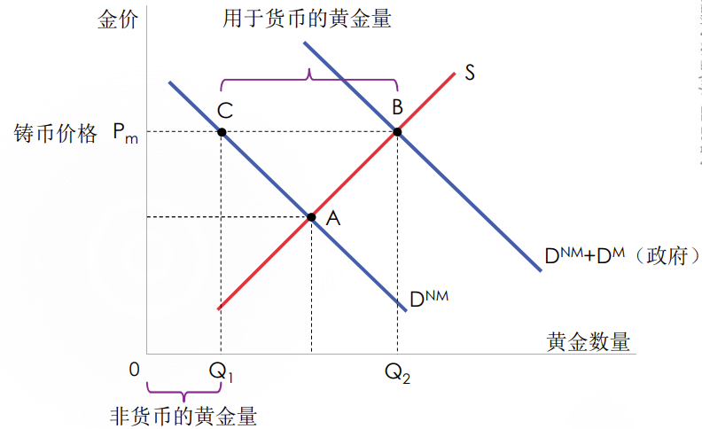

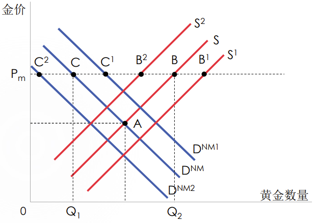

​	如果没有政府铸造货币，那么金价位于A点，而在金本位制下， $P_m$ 高于A点的水平是政府用于铸币或“支持”货币的价格

$P_m$ ：单位币值

$Q_1$ ：非货币的黄金需求量

$Q_2-Q_1$ ：货币的（来自政府的）黄金需求量(即货币量对应的黄金量)

$(Q_2-Q_1)P_m$ ：货币的总实际价值

$\frac{(Q_2-Q_1)P_m}{产品与服务量}$ ：物价水平，因此币值上升物价也上升，币值下降物价也下降。金本位下币值与物价同向变动

### 金本位制的问题

1. 存在不受到政府 管制的通货膨胀和通货紧缩

   1. 穿金戴银的风气会导致通货紧缩，而崇尚节俭的风气会导致通货膨胀
   2. 偶然发现金矿会导致通货膨胀
   3. 央行出于积极参与宏观调控、按经济稳定的要求来维持币值稳定的需要，自然希望终止这样过于“自由”波动的金本位制

2. 汇率固定

   1. 金本位制下的汇率必然是固定汇率，而固定汇率下就难以有独立的货币政策

      ​	各国央行难以实施独立的货币政策，即按本国人民利益、本国经济发展需求来决定货币是该宽松还是紧缩

      ​	前面提到20世纪初美国政府规定一盎司黄金的美元价格为20.67，英国政府规定为4.24英镑，那么美元与英镑的外汇汇兑比价（即汇率）就是 $\frac{20.67}{4.24} = 4.875$ 

   4. 举个例子说明汇率固定的坏处：

      ​	考虑中国在1994-2005年实行固定汇率制度的情况，人民币对美元的汇率定在8.27:1

      ​	如果美国实行“量化宽松”（quantitative easing）即QE政策，使美元利率下调，那么人民币利率也会被迫降低。

      ​	与汇率固定相关的原因是：这种情况下美元相对于人民币的吸引力会降低，人们会倾向于持有或购买人民币。这样会导致人民币升值，美元贬值。为了防止汇率波动过大，中国央行可能会通过降低人民币利率来减少人民币的需求，从而抑制人民币升值的压力。

      ​	中国这种利率下调是被迫的，因此金本位制下难有独立的货币政策。这也是美联储与金本位制相矛盾的原因

3. 金本位制易遭受攻击（投机冲击）

   ​	实践中，有时很难维持黄金市场上金价与法币铸币价之间的相等性。

   ​	当黄金市场的金价高于铸币价时，政府要么投放黄金，将金价压下去，要么民众到政府窗口用纸币兑换黄金，再去黄金市场换纸币，如此往复——总之，政府会面临金库存量下降的压力，1931年英国金本位制正是被这样的投机商击垮的。

## 央行货币政策工具——以美联储为例（重点）

### 公开市场操作（买卖国债券调整货币供给）

1. 公开市场操作：买卖政府债券

2. 央行购买债券就是放出货币（即增加货币供应），而卖出债券就是收回货币（减少货币供应）。主要买卖的债券是国库券（期限不超过一年）

3. 但是央行不能直接向政府买卖（中国和美国都规定央行不能为政府赤字融资）

   1. 央行为政府赤字融资相当于印钞票，会导致货币供应过剩，进而引发通货膨胀和货币贬值
   2. 央行为政府赤字融资会破坏央行的独立性和信誉，影响其执行货币政策的效果和公信力
   3. 央行为政府赤字融资会降低政府的财政纪律和效率，使政府倾向于过度开支和浪费资源
   4. 央行为政府赤字融资会挤占私人部门的投资和消费需求，扰乱市场的资源配置和价格信号

4. 美联储资产负债表

   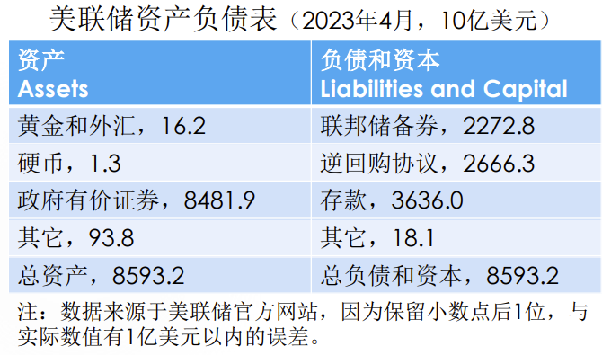

### 法定准备金率

1. 是法定准备金率R（required  reserve ratio）：央行要求所有存款机构必须把存款的一个最低百分比作为准备金放到央行的账户，这一百分比就是法定准备金率

2. 若存款为D，则准备金为DR，这个制度的本意是防范银行挤兑

3. 差别准备金率：美国按存款规模的不同而设定不同的准备金率，而中国按照银行的不同而设定不同的准备金率

4. 部分准备金制度、货币创造和货币乘数：

   货币乘数是总活期存款与原始活期存款的比值

   货币创造量 $\Delta M=\frac{\Delta D}{R}$ 

    $\frac 1 R$ ：一般的货币乘数，是存款准备金率的倒数

5. 高能货币$H=C+DR$

6. 准备金是一种基础货币（monetary base）：又称货币基数，或高能货币（high-power money）

   1元的法定准备金相当于 $\frac 1 R$ 元的货币（**法定准备金与初始存款一样多**）

   因此，法定准备金既是派生出更多货币的基础，又是高能的

7. 流通中的货币也是基础货币和高能货币

   1. 它们不是由银行系统存贷相继而“派生”出来的货币，故而是最基础的
   2. “现金为王”，因为流动性最高，故而是高能的
   3. 我们将通货称为内在货币（inside money），而存款派生的存款称为外在货币（outside  money）

8. 如果我们同时考虑通货和准备金，则货币乘数需要加以修正

   修正的货币乘数=货币供应量M=C+D/基础货币=C+DR，其中基础货币包括准备金和通货

   那么引入通货修正后的货币乘数为：$\frac{\Delta C+\Delta D}{\Delta C+\Delta DR}<\frac 1 R$ 

   $\Delta C$ ：流通的现金

   $\Delta D$ ：准备金（初始存款）

   如果考虑货币扩展过程中的漏损：

   1. 漏损1：人们从银行中取出现金，此时人们持有了更多的现金，那么 $\Delta C$ 增加，货币乘数减小，即人们通过持有现金减小了货币乘数

   2. 漏损2：超额准备金，即商业银行在央行准备金超过了法定准备金的部分，此时货币创造的过程是不完全的

      与漏损2相关的实际情况可能是：在经济不景气、贷款回收风险大的时期， 银行会比较“惜贷”，因而实际生效的准 备金率大于R，也即商业银行准备了超额准备金

9. 总结：

   C：流通的现金（一般为常数）

   X：原始活期存款

   D：总活期存款

   R：法定准备金率

   DR：法定准备金数额
   $$
   DR=\sum\limits_{i=0}^{\infty}XR(1-R)^i=XR\sum\limits_{i=0}^{\infty}(1-R)^i=X
   $$
   那么我们我们可以得出结论：法定准备金量与原始活期存款数额相同

   M=C+D：货币供应量，**通货 + 存款**

   H=C+DR：高能货币、基础货币，**通货 + 准备金**

   使用上述结论可以得出：
   $$
   \Delta H=\Delta C+\Delta DR=\Delta X
   $$
   也即高能货币的变化量与初始活期存款变化量相同

   $m=\frac{C+D}{C+DR}$ ：引入通货修正后的货币乘数

### 基准利率：贴现率和联邦基金利率

1. 贴现率：当商业银行或者其它存款机构在美联储中的准备金低于法定准备金率时向美联储贷款所付的利率——美联储直接控制

2. 联邦基金利率：银行之间相互拆借准备金所形成的市场利率——由准备金的供需决定，美联储间接控制

3. 为了避免支付这些利率，商业银行也可以减少存款量来降低准备金要求，或者减少贷款量来补充准备金，当然，有时候不可避免地需要和其它银行或美联储借准备金

   ​	贴现率通常会比联邦基金利率高一个百分点，这是为了抑制银行对央行的依赖性， 鼓励其转向市场来解决准备金不足的问题

## 利率模型——最基础的利率理论

### 短期货币市场与资本市场

1. 货币需求量和供给量与实际利率𝑟的关系：

   1. 货币需求量：利率是持有货币的机会成本，故利率反映货币的价值，因此货币需求量与利率负相关

   2. 货币供给量：不变，由央行决定。

      ​	但是如果央行决定提高货币供给，那么货币市场的利率下降，可贷资金市场的投资量上升，GDP上升，储蓄曲线右移，并与投资曲线相交于货币市场决定的均衡利率处（如图所示）

      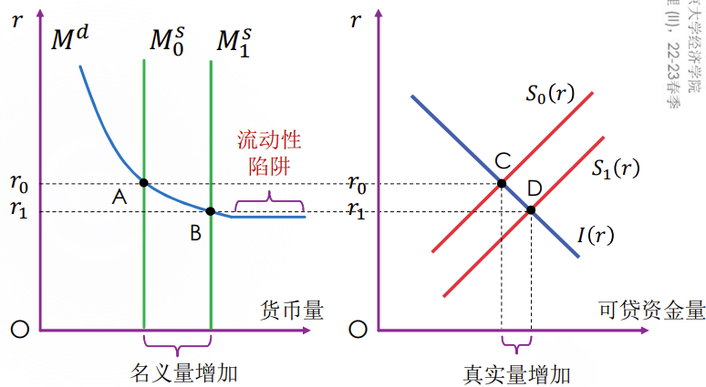

   3. 两个市场的利率一定相等

      ​	如果货币市场和资本市场的利率不一致， 则人们就会跑到利率低的市场去融资

      ​	比如：若银行利率低于债券利率扣除风险溢价，那么人们会跑到货币市场来融资，则抬高了银行利率。最终，套利行为将两个市场的（无风险）利率打平

      ​	注意，私人投资（真实量）的增加不一定等于货币供给量（名义量）的增加（如图所示）

   4. 流动性陷阱

      ​	凯恩斯将货币供给曲线称为“流动性偏好”线， 并指出其可能存在一段水平区间，在水平区间，即“流动性陷阱”区间，无论如何提高货币供给也无法降低利率了。因此在这个区间上无法通过增加货币供给来刺激投资需求、拉动GDP增长。

      ​	但是实际上这时候的利率实际上已经达到了一个较低的水平。

      ​	这是凯恩斯当年对大危机时期无效的货币政策的刻画，并指出应该转向财政政策

### 长期货币市场与资本市场

1. 收入提高或物价上涨都会增加流动性需求

   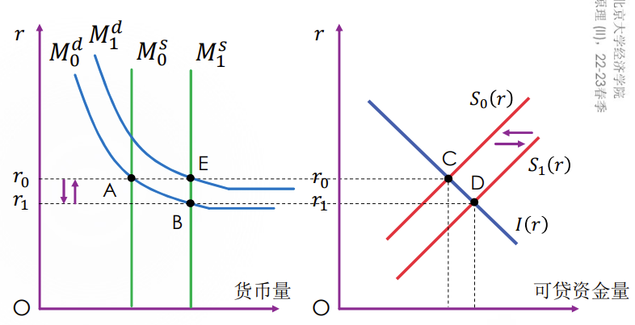

## 货币市场均衡与货币数量论（重点）

### 货币市场的长期均衡

考虑货币供给上升时：

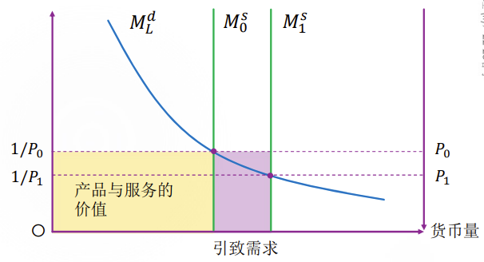

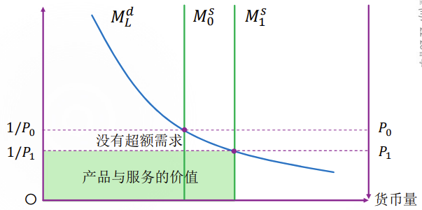

1. 从前面两个图可以看出，最开始物价水平还维持在P，此时，钱到了人们手上就会形成超额的对产品和服务的需求
2. 然而，产品和服务的量在长期取决于生产函数，而不取决于名义的货币量，因而为了平衡供需，物价逐渐上涨
3. 随后，人们对产品与服务的需求再次恢复到恰好等于其价值的情况

考虑货币需求因真实产出而上升时：

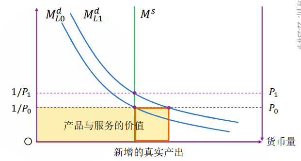

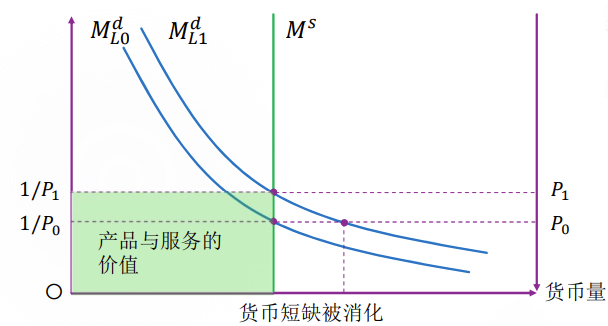

### 古典二分法——休谟

长期货币数量变化只影响物价水平这一观点是货币数量论的核心

1. 所有经济变量应分为两类
   1. 名义变量（nominal variables）：按货币单位来度量的变量，如一美分、一人民币元
   2. 真实变量（real variables）：按实物单位来度量的变量，如一个鸡蛋、一支笔、一件上衣、一条电报
2. 货币量也可以有名义和真实之分
   1. M：名义量
   2. $\frac{M}{P}$：真实量，P是物价指数或平均物价水平
3. 古典二分法认为：
   1. 货币政策、货币制度影响名义变量（无论短期还是长期）
   2. 货币政策、货币制度不影响真实变量（但怀疑短期可能有影响）

### 传统的货币数量论中的两个著名公式

1. 费雪交易方程式： $MV=PY$

   T：选定时期内交易数量，从而PT为该时期内交易的名义总值

   V：货币流通速度，单位时间内的流转速度

   该公式强调货币的“交易媒介”功能

2. 剑桥现金余额公式： $M=kPNy=kPy^{'}$

   y：以不变价格计算的人均国民收入， $y^{'}$：真实GDP

   k：货币量与收入的比值（如货币量是10， 收入是20/年，则币值为0.5年/单位货币）

### 货币数量论

$$
M=\frac{Py^{'}}{V}\ \ OR\ \ P=\frac{MV}{y^{'}} 
$$

1. 无论是费雪交易方程式还是剑桥现金余额公式，都指出𝑀与𝑃之间的正比例关系
2. 这是一个关于货币需求的恒等式，只反映相关关系，而不反映因果关系
3. 当我们提高𝑀时，新的均衡必然由𝑃的调整实现，因此𝑀是因、𝑃是果

### 通货膨胀与铸币税

1. 印钱导致通货膨胀，即货币贬值，纳税人手中的钱降低的实际价值

   

2. 铸币税：政府新发行的货币中的实际价值

   

3. 铸币税与通货膨胀税有区别

   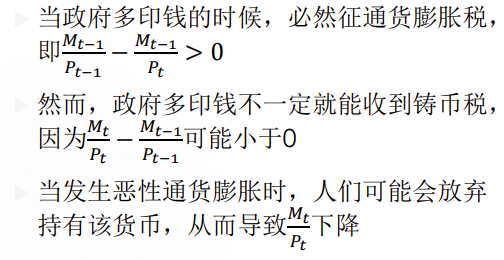

   铸币税是因（动机），而通货膨胀税是果（后果），但后果又可能反噬动机

## 通货膨胀、反通胀与通货紧缩的成本（重点）

### 通货膨胀的成本

1. 根据古典二分法，真实变量（在长期）不会受到通货膨胀的影响，从费雪交易方程式出发，我们也看不出通货膨胀有什么成本

   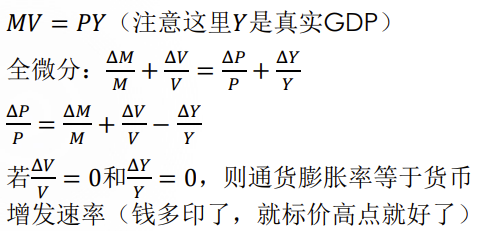

2. 要分析通货膨胀的成本，我们需要跳出前面的（长期）分析框架。前面的分析或多或少隐含“货币中性” （monetary neutrality）的假设，即货币的名义数量对真实经济变量不起作用。但是在短期，货币不再是中性的。

3. 通货膨胀可能有七个方面的（并非互斥的）成本：

   1. 皮鞋成本：提高𝑁（多跑几趟银行）来减少现金持有的交易成本、花额外的精力去搜寻价格更加合适的商品

   2. 菜单成本：改变价格所需要耗费的资源

   3. 价值尺度成本：通货膨胀发生时，货币作为价值尺度的信度就下降了，导致经济决策的效率的下降。

      比如，当美国的通货膨胀率为10%时，一个用美元计价为10万的资产一年后以11万的标价卖出，这1万美元的差价将成为虚幻的利润（phantom profit）虚幻的利润若被征税，将劝退持有者

   4. 资源错配：价值尺度成本的一种可能的表现形式

      不同产品的价格调整频率存在差异，从而导致用货币度量的相对价格发生的变化不来自于供求的相对变化，这种相对价格的变化使各个市场出现供求不等，从而偏离了资源最有效率的配置

   5. 税收扭曲：价值尺度成本的另一种表现形式

      在一个通货膨胀率较高的经济体，相同的税率会导致不同的税后真实利率。这是由于对“虚幻的利润”征税导致的

   6. 混乱与不便

      比如，财务会计在核算公司的收益时，若存在通货膨胀，那么投入与产出可能不可直接比较，尤其是生产周期比较长的公司的收益

   7. 随机财富再分配

      债权人（creditors）和债务人（debtors）无法合理预期通货膨胀时，有一方会得益，而另一方则受损——这是财富从“一方”向 “另一方”的转移（再分配）

### 反通货膨胀的成本

1. 通货膨胀，尤其是高通货膨胀，对经济不利，因此，政府通常会为反通货膨胀 （disinflation）付出努力

2. 政府持续的反通胀努力除了通胀本身的成本以外，还有一个原因：经验表明，当高通胀成为一种“常态”后， 反通胀将变得非常困难。

3. 反通胀的过程往往伴随失业率的上升——菲利普斯曲线说明可能导致失业率的上升

   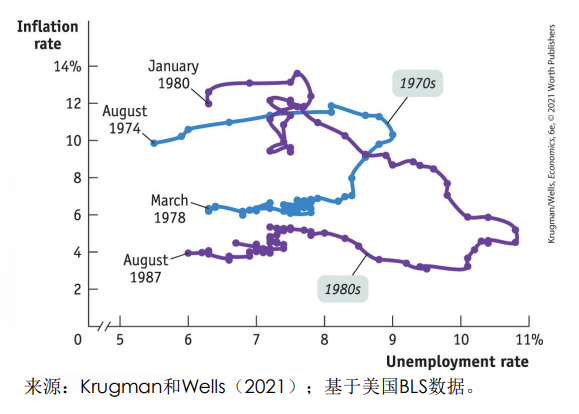

### 通货紧缩的成本

1. 通货紧缩更糟糕
2. 前面讨论的通货膨胀的成本也适用于通货紧缩，只是方向反过来（只要价格改变，就会有皮鞋成本、菜单成本和价值尺度成本等，另外，通货紧缩也可能导致随机财富再分配）
3. 通货紧缩可能反映更深层次的宏观经济问题，失业率进一步上升，生产活动进一步减少（由于名义利率最低只能是0， 通货紧缩可能意味着较大的真实利率，则很少人愿意消费、投资干实事）
