# 第九、十讲 开放宏观经济导论

## 二十世纪以来世界经济的特点

### 第一个特点：动荡-稳定-动荡

### 第二个特点：开放度不断提高

使用 $\frac{M+X}{Y}$ 来衡量开放度，在这个指标下我国开放度高于美国

### 第三个特点：开放度在产业间形成差异与不平衡

### 第四个特点：国际贸易中，服务贸易 （trade in commercial services）的占比上升明显

### 第五个特点：资本流动的规模与方向在世界范围内发生较大变化

## 国际收支平衡表以及国际资本流动

### 我国2021年国际收支平衡表（代表流量）

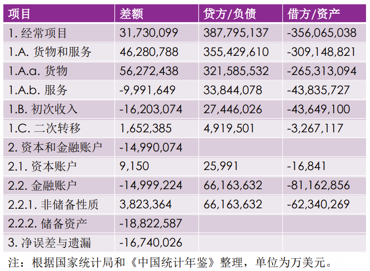

1. 产品和服务：贷是中国给美国提供购买力，从而让美国能够获取中国的产品、服务和资产，外汇成为外国给中国打的欠条；借是外国给中国提供购买力，从而让中国能够获取外国的产品、服务和资产；中国要给外国打欠条（人民币），或减少外汇（把外国给中国打的欠条返还）。贷方就是我国出口，而借方就是我国进口

   **贷方负债，赚外国人的钱，正号，代表外汇增加**

2. 初次收入

   “收益”，是要素收入。**我国的劳动、资本等要素在外国的收益**是贷方，会导致外汇流入我国；外国的劳动、资本等要素在我国的收益是借方，会导致外汇流出我国。可以看到，我国支付给外国要素的额度比外国支付给我国的额度高

3. 二次转移

   “经常转移”，不是政府与政府之间的援助，是已经在外国定居**（不属于中国公民）的中国华侨单方面向国内家属寄钱** （外汇流入、贷方）或中国的外国侨民向他们在母国的亲属汇钱（外汇流出，借方）**中国公民在外打工赚钱寄回家不是转移，属于要素收入**

4. 资本和金融账户

   原先叫“资本账户”，”改为“金融账户”，强调该账户中金融资产的流动性与可靠性，而不止关注工厂与设备等固定资产；后来，美国又将金融账户中与资本有关的成分独立出来，又叫资本账户

5. 资本账户：使用贷方和借方这两个名词

   我国在外建厂、买设备等，并掌握控制权和管理权，这是借方，会导致外汇流出；**外国到我国建厂、买设备等，是贷方，会导致外汇流入**。可以看出，这一项资本流入大于资本流出

6. 非储蓄性质的金融账户

   使用外汇购买外国的金融资产，外汇减少，是负号，即资产

   一方面，外汇流入就意味着外国对我国的负债（欠条）增加；另一方面，我国金融资产被外国持有，则外国可以向我国索取本金和利息（债券） 或利润（股票）等

7. 储备资产的金融账户

   由于差额为负，这里不存在负债，就单纯是资产（或理解为借方），**不花的外汇，存在外国相当于购买外国的金融资产，资本流出，外汇减少，即负号**

   可以看到，我国2021年大幅度增加了外汇储备（-14,673,223万美元，注意这些外汇不是存在我国，而是存在外国，是流出）

8. 总结：

   金融账户：（外国用外汇换我国商品，外国）**负债**；总和为NCO

   其余：（外国获取我国产品）**贷方**；总和为NX，包括经常项目、初次收入、二次转移、资本账户

   因此：进出口总额=经常项目的贷方借方绝对值+资本账户的贷方借方绝对值

### 资本流动与可贷资金市场

1. 同时考虑多个国家的可贷资金市场

2. **中国利率低，美国利率高，资本涌入美国，中国的可贷资金市场需求提高，这是为了向美国投资，从而拉高了中国利率**

   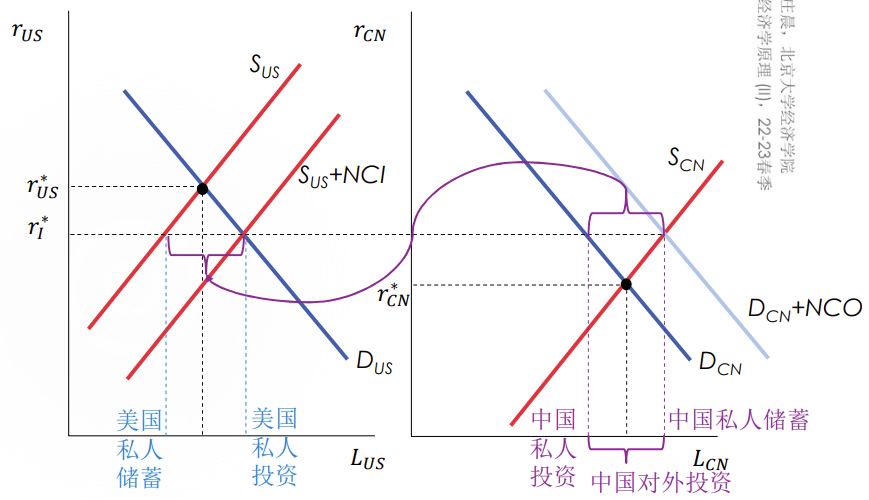

3. NX=NCO是会计等式，不是行为等式

   是NX和NCO（两个市场）同时影响资本流动，而事后核算恰好得到NX=NCO

## 汇率与国际收支平衡

### 外汇市场

1. 外汇市场（foreign exchange market）， 即不同货币进行交易的场所，能够形成汇率（exchange rate）——外汇市场的 价格，即一种货币与另一种货币交易的价格
2. 外汇市场的交易分为两个层次
   1. 批发：由有参与资格的银行、大金融机构、进口商与出口商、被称作“外汇经纪人” 的特许交易员组成（在世界各地都有交易大楼或中心，如今从线下转为线上）
   2. 零售：各家银行的门市部、窗口（与外汇交易中心的价差即为手续费）

### 两种表示汇率的方法

1. 以单位外币可以换到本币的数量来表示**（本课程采用的）**
2. 单位本币的外币交换比率

### 名义与真实汇率

1. 名义汇率（nominal exchange rate）：日常见到的外汇交易中心公布的外汇牌价，记𝐸或𝑒（外币的本币价）

2. 真实汇率（real exchange rate，𝑅𝐸𝑅）：度量外国产品与服务相对本国产品与服务的相对价格，𝑅𝐸𝑅 > 1时，本国产品和服务更具国际竞争力，因为本国的价格更低。

   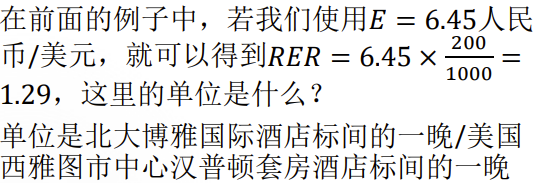

3. 使用CPI来计算RER，只用考虑变化率：

   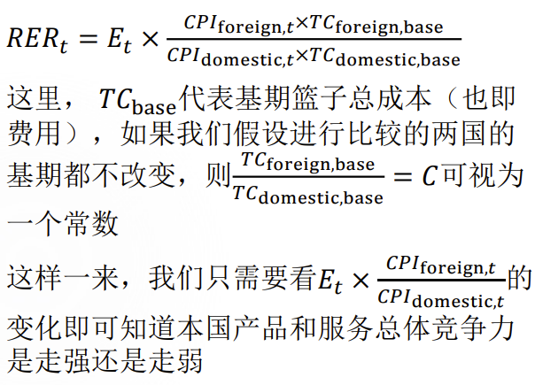

   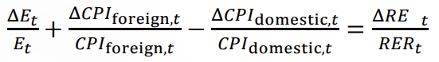

   ​	我们可以通过名义汇率的变化率和两国CPI 的变化率（通货膨胀率）来判断一国产品和服务的国际竞争力的走向，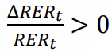**意味着国际竞争力增强**

   如果本国通货膨胀率与名义汇率的变化是同步的，且外国物价不变，那么真实汇率也不变

   如果名义汇率的变化大于本国通货膨胀率，且外国物价不变，那么真实汇率则会提高	

   可见，控制通货膨胀，提高名义汇率，有利于提高本国产品和服务的国际竞争力

### 均衡汇率的决定

1. 名义汇率的均衡是由外汇市场的供求决定的

   该市场决定的汇率是名义汇率

2. 假设物价不变，则真实汇率也发生改变

### 外汇市场的特点

1. 与产品市场不同，外汇市场中一种货币的需求量是另一种货币的供给量
2. 比如，我们对美元的需求量，对外国来说就是人民币的供给量（因为我们用人民币换美元）

### 外汇市场的需求

1. 由于我们采用第一种表示汇率的办法，即 “单位外币的本币交换比率”，因此我们考虑的是“本国对外币的需求”，需要指定一种外币（对我们来说就是美元）

2. 考虑本国对美元的需求

   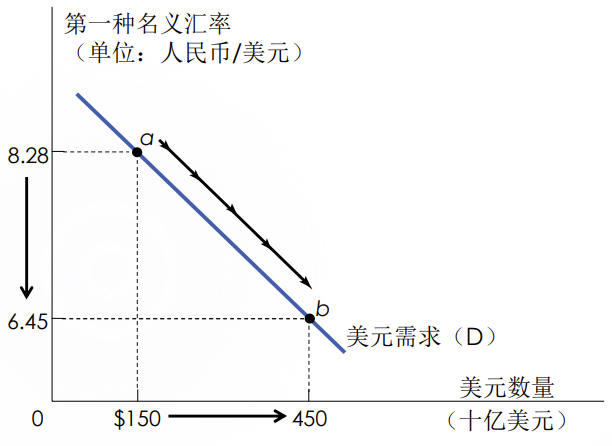

3. 汇率越低， 为什么我国对美元的需求量越高

   1. 主要理由：从贸易的角度说，汇率降低，我国产品和服务的国际竞争力降低，相比之下美国的产品竞争力提高，进口增加，导致我国对兑换美元的需求量增加
   2. 从投机的角度说，汇率较低，是逢低加仓美元的好时机（可能是次要理由）

4. 考虑美国对人民币的需求

   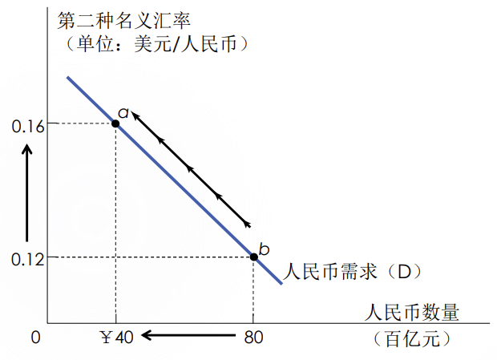

5. 汇率越高，为什么美国对人民币的需求量越低

   1. 从贸易的角度说，中国的产品和服务的国 际竞争力降低，美国兑换人民币支付进口 自中国的产品和服务的需求量降低（中国 出口减少）
   2. 从投机的角度说，人民币处于高位，美国逢高减少人民币持仓的机会来了

6. 两种汇率的表示互为倒数， 视角也不同：

   1. 第一种汇率的表示考虑的是本国对外币的需求，因此站在本国的角度考虑问题
   2. 第二种汇率的表示考虑的是外国对本币的需求，因此站在外国的角度考虑问题
   3. 无论站在哪个角度，我们看的都是对外汇（另一种货币）的需求

### 外汇市场的供给

1. 采用第一种汇率 “单位外币的本币交换比率”，是外币市场，“外国对外币的供给”

2. 考虑美国对美元的供给：**美国对人民币的需求**

   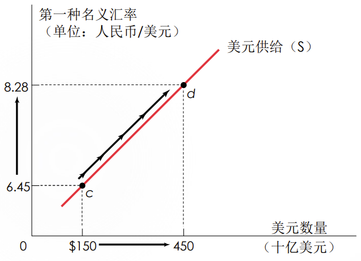

3. 第一种汇率越高，为什么美国对美元的供给量越高

   1. 从贸易的角度说，汇率越高，我国产品和服务的国际竞争力提高，出口增加，导致美国对兑换人民币的需求量增加，即导致美元供给量提高（克鲁格曼的理由）
   2. 从投机的角度说，汇率较高，美国将美元换为其它外币资产的好时机就到了（可能是次要理由）

4. 曼昆：净供给，贸易顺差

   如果中国对美国有顺差，中国的美元外汇是很充足的，因此中国的美元需求完全被央行cover，对应的，中国的人民币供给同样取决于央行放出多少

5. 克鲁格曼：外汇流向，贸易倾斜，贸易顺差增加或逆差减少

   是变化方向 

### 理解均衡汇率（与国际收支平衡表的关系）

1. 表面：货币外汇供求相等，无套利

2. 偏离平衡点的汇率通过收支平衡回归：均衡汇率需要使 “经常项目”和“资本与金融项目”抵消

   如果中国的“资本与金融项目”有赤字（存在美元需求，外汇流出），我国就需要用外币支付，从而提高对外币的需求，这就使得外币汇率提高（显然**对外币需求高，外币升值，本币贬值**），而这又会促使出口增加、进口减少，从而使 “经常项目”产生盈余（提高美元供给），当这个盈余不能抵消赤字时，这个机制就会继续下去

3. 曼昆的外汇供给是“净供给”，不取决于（真实）汇率

   1. 中国NX = NCO > 0时

      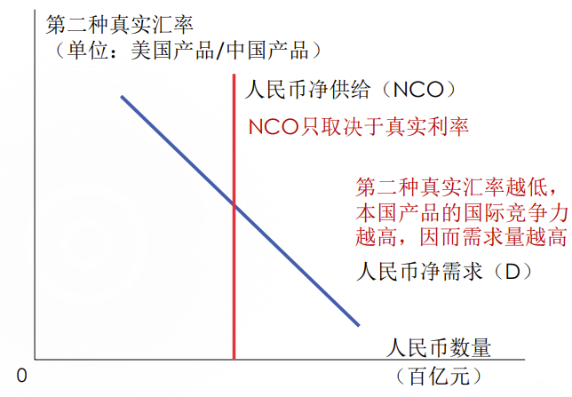

   2. 中国𝑁𝑋 < 0时

      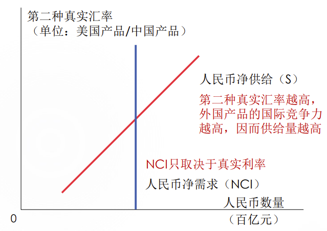

### 购买力平价汇率理论

1. 购买力平价（purchasing-power parity） 理论即PPP理论：长期内决定汇率的因素是物价水平的比率，即一单位货币无论在哪个国家必定能买到相同数量的物品，RER=1

2. 为什么即使PPP理论成立，仍然存在国际贸易

   1. 国内需求太少

   2. 国际贸易成本高，必须加价，这说明PPP理论不一定成立

3. 现实中，名义汇率是围绕着购买力平价波动的：

   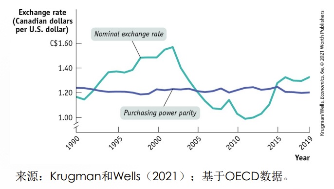

4. 为什么生活中我们见到的名义汇率总是与PPP偏离？

   1. “一物一价”的基础是国际竞争充分、完全，然而在现实中无摩擦、无阻碍的贸易和流通难以做到
   2. “一物”过于理想化：美国的肯德基吮指原味鸡和中国的肯德基吮指原味鸡一样吗？若做不到完美的“一物”，或许“一价”也是奢求

### 利率平价汇率理论

1. PPP汇率理论是长期理论，那中期（一般指1-1.5年）呢？利率平价（interest-rate parity）理论，即IRP理论

2. 

   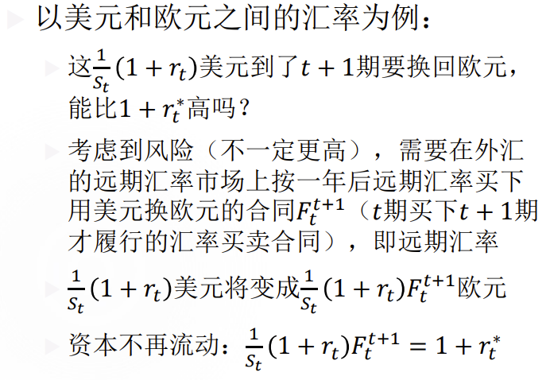

   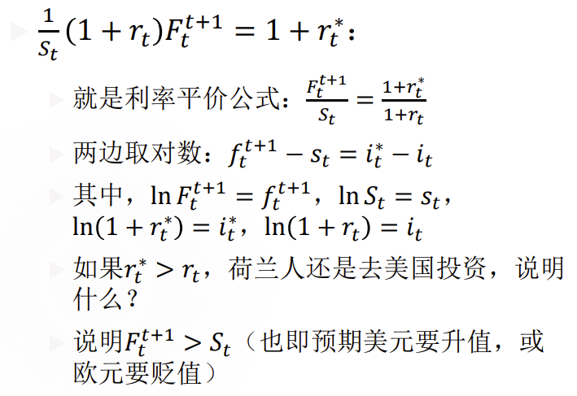

## 汇率政策与制度

### 浮动汇率（前面讨论的）

1. 浮动汇率下，央行的货币政策会影响汇率——美国、加拿大、英国

   美联储提高美国利率，导致美元升值

2. 有管理的浮动汇率下，央行可以直接对外汇市场干预——我国

   需要人民币升值，人民银行抛售美元，外国需要拿人民币换抛售的美元，从而对人民币需求提高，人民币升值

   需要人民币贬值，人民银行购入美元，人民币供给增加，人民币贬值

### 固定汇率

1. 固定汇率制度是盯住由央行或中央政府决定的汇率，并在外汇市场上通过央行直接干预维持某一汇率的制度

2. 固定汇率的机理

   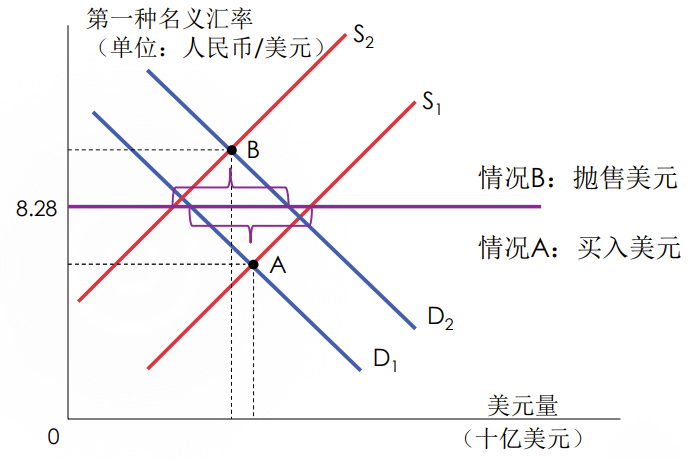

   A：需要人民币贬值——**中国需要降低利率**

   B：需要人民币升值——**中国需要提高利率**

3. 固定汇率有什么好处

   1. 促进国际贸易和国际投资活动
   2. 有利于抑制国内通货膨胀
   3. 防止外汇投机，稳定外汇市场
   4. 防止各国之间不正当的竞争危害世界经济

4. 固定汇率有什么弊端

   1. 容易输入国外（尤其是盯住国）的通胀
   2. 货币政策丧失独立性
   3. 容易出现内外均衡冲突

### 影响汇率的政策（总结）

1. （外币）外汇市场干预

   需要人民币升值，人民银行抛售美元，外国需要拿人民币换抛售的美元，从而对人民币需求提高，人民币升值

   需要人民币贬值，人民银行购入美元，人民币供给增加，人民币贬值

2. 货币政策

   需要人民币升值，人民银行提高利率，资本涌入中国，对人民币需求提高，人民币升值

   需要人民币贬值，人民银行降低利率，资本流出中国，对人民币需求减少，人民币贬值

3. （本币）外汇管制

   需要人民币升值，政府提高人民币供给，放松（外国人）对人民币的兑换，人民币升值

   需要人民币贬值，政府建设人民币供给，限制（外国人）对人民币的兑换，人民币贬值