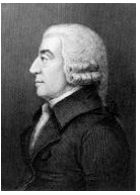

# 第一讲 起源、比较、原理和税制

## 宏观经济学的发展历史和关键人物

1. 18世纪晚期到20世纪30年代，经济学本无微观（micro）、宏观（macro）之分

2. 亚当·斯密

   

   1. 是“古典经济学之父”，著有《国富论》
   2. 提出劳动价值论
   3. 提出自由市场经济

3. 约翰·梅纳德·凯恩斯

   1. 是“宏观经济学之父”，著有《就业、利息和货币通论》，被认为是宏观经济学的“开山之作”
   2. 1940年提出GDP（国内生产总值，Gross Domestic Product），与GNP相比考虑了政府支出

4. 宏观经济学为三类问题而生：

   1. 经济增长（economic growth）
   2. 失业（unemployment）问题
   3. 通货膨胀（inflation）和通货紧缩（deflation）问题

## 经济学基本（十大、十二大）原理

## 生产可能性曲线相关概念，如比较优势、 机会成本、贸易带来的好处等

## 各种类型的税的基本概念

## 个人所得税的计算（包括平均和边际税率）

1. 速算扣除额
2. 应税收入不等于总收入

## 如何分配才“公平”？受益原则和支付能力原则

1. 受益原则（benefits principle）：将纳税人从政府公共支出中受益的多少作为税收负担分配的标准

2. 支付能力原则（ability-to-pay principle）：根据纳税人所能承受的负担来征税

   支付能力原则引申出两个对“公平”的理解：

   1. 纵向公平（vertical equity）

      1. 支付能力更强的人应纳更多的税

      2. 争论：“更多”是多少

      3. 累退税率是否违背纵向公平？

         不违背。累退税率不是累退税额，依然满足挣得多交得多

   2. 横向公平（horizontal equity）

      1. 有相似支付能力的人应纳等量税收
      2. “相似”如何判断，同一个收入等级（甚至有相同收入）的家庭未必有相似的支付能力

