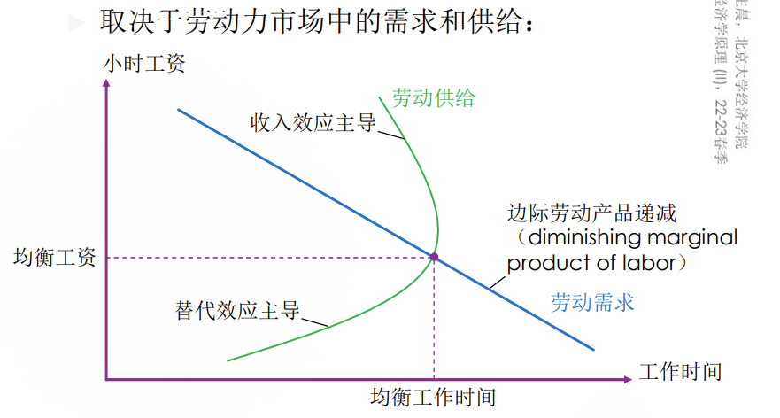
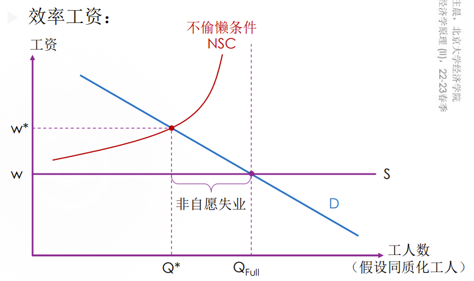
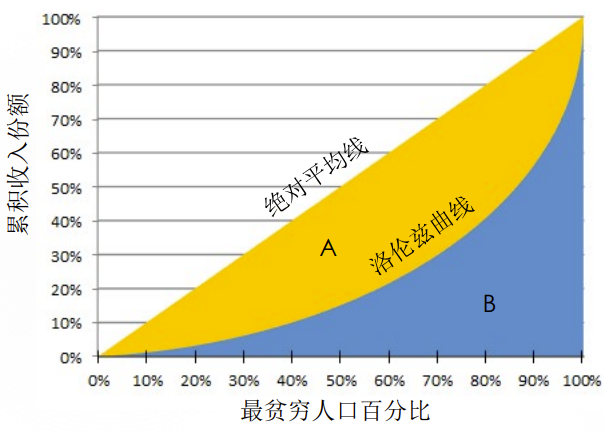

# 第二讲 收入与歧视、不平等与贫困

## 新古典分配理论与劳动力市场的供需模型

## 影响均衡工资的因素

1. 补偿性工资差别
   1. 不同工作的非货币特征影响劳动供给
   2. 前提假设
      1. 工人追求效用最大化而不是工资最大化
      2. 工人了解对他们重要的工作特征信息
      3. 工人具有可流动性，有一系列可供选择的工作机会
2. 人力资本
   1. 体现在劳动者身上的一种资本，如劳动者的教育文化水平、知识技能、健康状况
   2. 需求：人力资本越高，边际劳动产品 （生产率）越高
   3. 供给：人力资本投资的成本获得补偿
3. 信号
4. 天赋、努力和机遇
5. 超级明星现象
   1. 市场具备两个特征：
      1. 市场中每一个消费者都希望享受最佳生产者 提供的产品
      2. 制造这种产品的技术使得最佳生产者能够以 较低成本将该产品提供给每一个顾客
6. 特殊市场结构
   1. 买方垄断
   2. 卖方垄断

## 工资高于完全竞争情况下的均衡的原因及对市场效率的影响

1. 最低工资
2. 工会，即工人联合会
3. 效率工资
   1. 高工资能提高员工的生产率
   2. 偷懒可能会被发现，并被开除，但是高工资意味着被解雇的代价增大，从而能激励员工认真工作
   3. 

## 歧视的衡量与来源

## 贫困与不平等的衡量

1. 基尼系数

   1. 洛伦兹曲线（Lorenz curve）：一国或地区内，将人从最贫穷到最富有排列，累积的人口百分比与累积收入份额之间的关系

   2. 如果将洛伦兹曲线与绝对平均线之间的面积记为A， 将洛伦兹曲线以下、横轴之上的面积记为B，则基尼系数= 𝐴/(𝐴 + 𝐵)  

      

   3. 取值在0到1之间，越接近0代表收入越平等

   4. 缺陷：

      1. 对样本可靠性较依赖/敏感
      2. 无法区分不同类型/结构的收入不平等
      3. 不能通过简单叠加或加权平均得到区域或世界基尼系数

2. 库兹涅兹曲线

   1. 横坐标：经济发展指标（人均GDP）
   2. 纵坐标：分配不平等指标（Gini Index）
   3. 呈倒U形

## 功利主义、自由主义和自由至上主义

1. 功利主义（utilitarianism）
   1. 政府应选择最大化社会中所有人的总效用（total utility）的政策。
   2. 应用：
      1. 根据边际效用递减法则，政府应将富人的收入再分配给穷人，使得收入更平等
      2. 不会导致完全收入平等
2. 自由主义（liberalism）
   1. 政府应选择“无知之幕”（veil of ignorance）背后的公正旁观者认为公平的政策
   2. 应用：
      1. 最大最小原则（maximin criterion）：政府应该最大限度改善社会中状况最糟的人的福利
      2. 不会导致完全收入平等，否则总收入下降
3. 自由至上主义（libertarianism）
   1. 政府应惩罚犯罪，执行自愿协议，而不应该再分配收入
   2. 收入分配的过程公平，那么收入分配的结果也是公平的——不管它有多么不均
   3. “无知之幕”背后真正的公正旁观者更应关注过程公平，保证“能者多得”
   4. 一旦规则建立且无人破坏，政府无需再干预