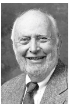
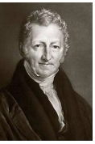
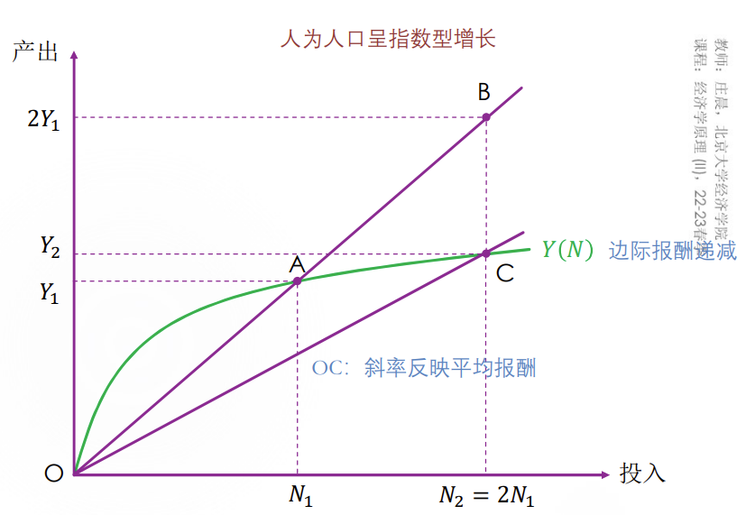
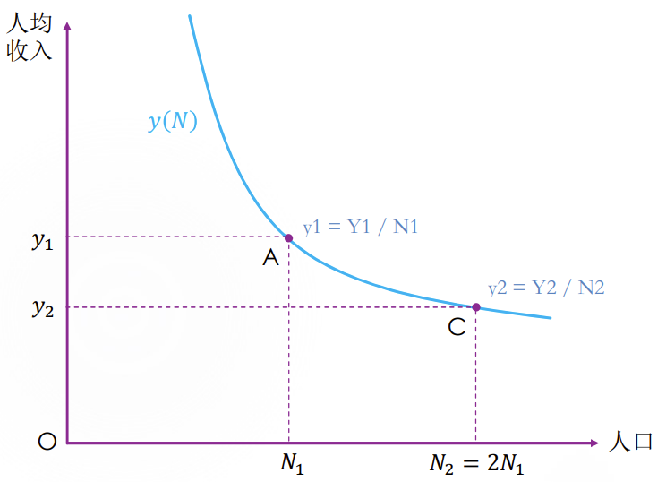
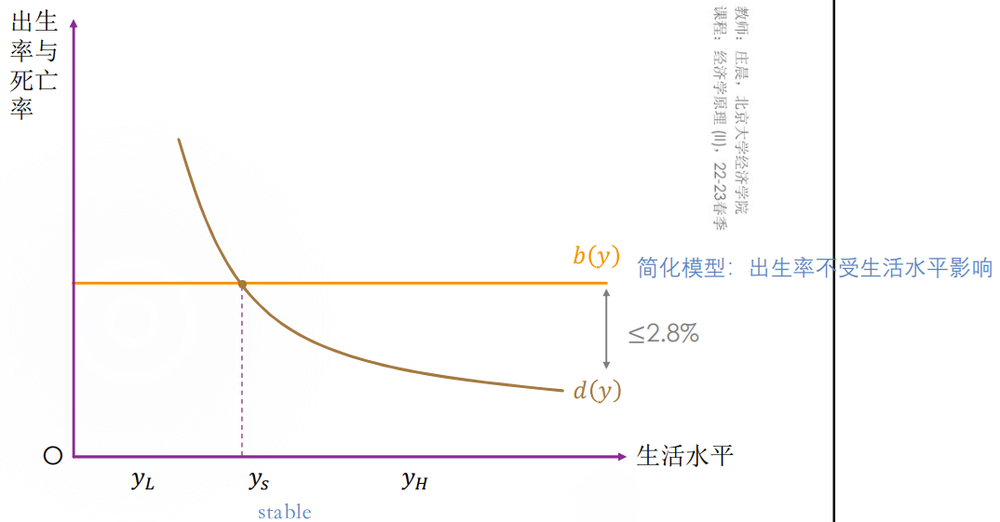
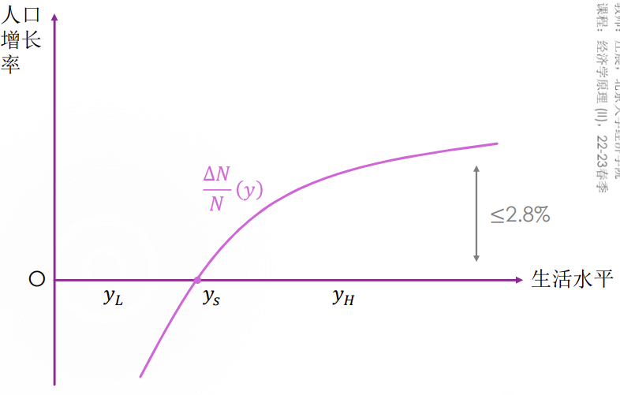
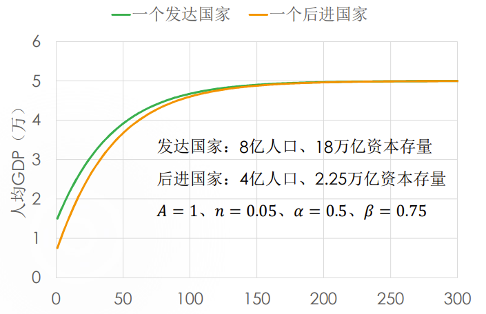

# 第四讲 生产与增长

## 数量指数度量经济增长

使用 $\frac{Y_{t+1}}{Y_t}$ 这个数量指数来度量相邻两期的增长率，但是 $Y_t$ 的计算类似名义与真实GDP的计算，有不同的计算方法

**这是GDP的计算，用自己的Q，用基期的P；CPI的计算用相同的篮子，用篮子的Q，用自己的P**

1. 拉氏 $=\left(\frac{\sum{P_0Q_{t+1}}}{\sum{P_0Q_t}}-1\right)\times100\%$ 其中 $Y_t$ 的计算用基期的价格，通常取 $t$ 期价格
2. 帕氏 $=\left(\frac{\sum{P_{t+1}Q_{t+1}}}{\sum{P_{t+1}Q_t}}-1\right)\times100\%$ 其中 $Y_t$ 的计算用 $t+1$ 期价格
3. 费雪 $=\left(\sqrt{\frac{\sum{P_0Q_{t+1}}}{\sum{P_0Q_t}}\times\frac{\sum{P_{t+1}Q_{t+1}}}{\sum{P_{t+1}Q_t}}}-1\right)\times100\%=\left(\sqrt{\frac{\sum{P_tQ_{t+1}}}{\sum{P_tQ_t}}\times\frac{\sum{P_{t+1}Q_{t+1}}}{\sum{P_{t+1}Q_t}}}-1\right)\times100\%$ 

## 费雪环比经济指数度量经济增长

$t$ 为基期的增长指数：
$$
F_{t+1,t}=\sqrt{\frac{\sum{P_tQ_{t+1}}}{\sum{P_tQ_t}}\times\frac{\sum{P_{t+1}Q_{t+1}}}{\sum{P_{t+1}Q_t}}}\times100
$$
转化为以 0 为基期的增长指数：
$$
F_{t,0}=\underbrace{\left(\frac{F_{t,t-1}}{100}\cdot\frac{F_{t-1,t-2}}{100}\cdot...\cdot\frac{F_{1,0}}{100}\right)}_{链式}\times100
$$

## 70法则

取对数，使用 $ln2\approx0.7$ 与 $ln(x+1)\approx x$ 即可

## 经济增长的影响因素和重要思想人物

经济增长的源泉？本质是问生产函数的形式

自变量的变化：

1. 劳动投入L

   用总劳动时数衡量，取决于工作年龄的人口、就业人口占工作年龄人口的比率、每个工人的平均劳动时间

   是改革开放后，我国高速的经济增长的原因

2. 实物资本K

   不是钱本身，而是生产过程的阶段性产物，也是用来生产最终产品的设备和结构

3. 人力资本H

   人本身积累的技能和知识，它与𝐾有共性

4. 自然资源N

   与𝐾和𝐿都不同，是天然存在的，虽然参与了生产过程，但一般不被纳入生产函数

5. 技术A

   𝐴与𝐻既有区别又有联系，𝐴强调社会文明，而𝐻强调个人文明

生产函数形式的变化：

1. 道格拉斯·诺思（Douglass North）：制度、制度变迁是经济增长的原因

   

2. 诺思的好友——科斯：思想市场（market for ideas）的发展将使经济增长以知识为动力、更可持续

   

   > 开放、自由的思想市场，不能阻止错误思想或邪恶观念的产生，但历史已经表明，就这一方面，压抑思想市场会遭至更坏的结果。一个运作良好的思想市场，培育宽容，这 是一副有效的对偏见和自负的解毒剂。 
   >
   > 在一个开放的社会，错误的思想很少能侵蚀社会的根基， 威胁社会稳定。思想市场的发展，将使中国经济的发展以知识为动力，更具可持续性。而更重要的是，通过与多样性的现代世界相互作用和融合，这能使中国复兴和改造其丰富的文化传统。假以时日，中国将成为商品生产和思想 创造的全球中心。你们中的一些人，或许将有机会看到这 一天的到来。
   >
   > ​																							——Ronald Harry Coase

## 马尔萨斯陷阱的人物、思想和模型——经济在什么情况下无法持续增长？

1. 马尔萨斯（Thomas Malthus，1766-1834） 

   

   是能与亚当·斯密、大卫·李嘉图齐名的古典经济学家，其1798年匿名发表的《人口原理》对后世产生深远影响

   他认同“中庸”之道（the middle way），认为经济发展必须按照一定的比例关系，不能极端做事。

2. 经济会持久地得到增长吗？

   马尔萨斯的回答是否定的，也给出了当时确凿的证据

以下图形说明了非平衡态时人口增长率是如何使人口数量回到平衡态的

1. 可以将马尔萨斯模型中的 $y_0$ 理解为满足人口稳定的最低物质条件

   当今我国与“OS线”比较相关的概念是 “粮食安全线”或“耕地红线”

2. 这个均衡水平是收入较低的水平，因此是一个“陷阱”，一旦陷进去可能难以自拔。要想摆脱贫困，需要借助外力，这成为许多扶贫政策的理论基础

3. 两个可能的提高经济总量的处方：

   1. 提高生产效率，使得生产函数上移， 从而使得生产函数与OS线的交点向右上方移动
   2. 改善贫困地区的公共设施，降低能维持人口稳定的最低生活水平 $y_0$，使OS线的斜率降低（变平缓），其与生产函数的交点向右上方移动

4. 然而，只要生产函数的形式不变，经济总归是落入某种“陷阱”

## 索罗增长模型——经济在什么情况下可以持续增长？

1. 索罗（Robert Solow，1924-）

   

   1. 1987年获得诺贝尔经济学奖
   2. 于1956和1957年发表的两篇论文成为了经济增长理论的经典参考文献
   3. 1956年，斯旺（Trevor Winchester Swan）也发表了类似的模型，故索罗模型又被称为索罗-斯旺模型（Solow-Swan model）

2. 新古典与古典经济学

   1. 新古典经济学继承了古典经济学对市场 机制肯定的传统
   2. 新古典还看到了工业经济中资本积累、 技术进步对经济增长的作用，并将人口增长、储蓄、资本积累和经济增长同时放在市场机制中考察
   3. 相比马尔萨斯人口增长率为零、经济水平低的市场均衡，新古典提出了人口增长率 和经济增长率都为正的均衡

## 经济增长的收敛性——经济将走向两极分化还是共同富裕？

1. 新古典的索罗增长模型为我们提供绝对收敛的一个演绎

   

2. 条件收敛：𝐴、𝑛、𝛼、𝛽在各个国家不同

   1. 否认人均GDP会趋同
   2. 但是不否认人均GDP的差距会趋于稳定

3. 无论是绝对还是条件收敛，都需要借助外在的储蓄率和技术条件，因为 s 和 A为外生变量

   1. 这些外在条件相同，则绝对收敛
   2. 这些外在条件不同，则条件收敛

4. 巴罗的观点

   

   巴罗（Robert J. Barro，1944）是当今最有影响力、最有希望获得下一个诺贝尔经济学奖的宏观经济学家之一

   他是“条件收敛”的代表人物，尽管方法 与“绝对收敛”无本质差别，但也有一些新的总结和发现：

   1. 巴罗研究了18个OECD国家人均 GDP从1960-2000年的变化

      发现一些起初较穷的国家（如葡萄牙、西班牙、 爱尔兰、希腊）较快地在追赶富国。

      这是因为：这些经济体的起点不同，但较为同质（如储蓄率、人口增长率等差不多），因而会收敛、趋近某一个人均收入水平

   2. 研究美国 1880-2000年各个州的人均收入情况

      发现一国内部不同地区的趋同也可以 用“条件”收敛解释

   3. 考虑“收敛速度”的问题，如为什么有的国家收敛得快，有的慢

      他发现，储蓄率、科技水平（𝐴）和初始的 劳动投入𝐿଴对收敛速度没什么影响  但是，资本平均产出 $\frac{y}{k}$ 递减得慢，则收敛也慢一些

5. 新（内生）增长理论不相信收敛

   1. 如果人均收入一直增长，则可以不收敛

      AK 模型的消费方：
      $$
      \frac{c_{t+1}}{c_t}=[\beta(1+R)]^{\sigma}
      $$
      当 $R>r$ 时，人均收入可以一直增长

   2. 储蓄会影响人均资本增长率，因而也影响人均收入增长率

      AK 模型的生产方：
      $$
      \frac{k_{t+1}}{k_t}=s(1+R)
      $$
      人均资本增长率由社会储蓄率决定

6. 我们为什么要关注收敛问题？

   1. 想知道世界各国是收敛的还是发散的，想知道中国是否可以赶超美国
   2. 想知道中国各省是收敛还是发散的，有关社会和谐

## 内生变量

* 内生变量与外生变量：  
  * 内生变量：数值由系统内的函数关系决定
  * 外生变量：由系统以外的条件来决定

1. $G(x,y,z)=0,\forall x>0$ 

   内生：$y,z$

   外生：$x$

2. $Q_d=a-bP\ \ \ \ Q_s=c+dP$

   内生：$Q,P$

   外生：$a,b,c,d$

3. 马尔萨斯陷阱中人均产量𝑦、人口增长率𝑛和人口规模N

   内生：除了外生的

   外生：出生率、死亡率与人均产量的关系，边际递减的生产函数

4. 索罗模型中，𝑦、𝑘、𝑛、𝑖、 𝑠、𝑐、𝐴、𝛼等变量

   内生：考虑人均资本累积方程，内生的为 $k,y$

   外生：其余均是外生变量

## 内生增长理论——如何将储蓄率和技术进步内生化？

**AK模型：**

内生增长理论就是将储蓄率和技术进步（**AK模型实际上没有内生化技术进步**）作为内生变量的增长理论，强调不依赖 “外力”推动即可实现经济持续增长。

1. 消费方：

   1. 消费的欧拉方程：
      $$
      u^{'}(c_t)=u^{'}(c_{t+1})(1+R)\beta
      $$
      $R=A-\delta$ 为社会净回报率

      $\beta$ 是主观折现因子，一般等于 $\frac{1}{1+r}$ ，但是不一定等于

      在这个约束下，消费者愿意储蓄一单位货币在下一期消费

   2. 当期消费的效用：
      $$
      u(c_t)=\frac{c_t^{1-\frac{1}{\sigma}}}{1-\frac{1}{\sigma}}
      $$
      $\sigma$ 是一个正数，为跨期替代弹性， $\sigma$ 越大，越容易储蓄在下一期花费

   两个式子联立得到：
   $$
   \frac{c_{t+1}}{c_t}=[\beta(1+R)]^{\sigma}
   $$
   通过这个式子我们还可以得出，如果需要促进消费增长，那么需要 $\beta(1+R)>1$ ，那么 $R>r$ ，即社会的净回报率比利率高

2. 生产方：

   1. 资本数量的约束：
      $$
      k_{t+1}=(1+R)k_t-c_t
      $$
      
   2. 直觉猜测最优消费是线性的总资产：
      $$
      c_t=(1-s)(1+R)k_t
      $$
   
   两个式子联立得到：
   $$
   \frac{k_{t+1}}{k_t}=s(1+R)
   $$
   
3. 综合：

   联立消费方与生产方的最终式：
   $$
   [\beta(1+R)]^{\sigma}=\frac{c_{t+1}}{c_t}=\frac{k_{t+1}}{k_t}=s(1+R)
   $$
   最终得出
   $$
   s=\beta^\sigma(1+R)^{\sigma-1}
   $$
   由此我们内生化了储蓄率 $s$

4. 一定存在的约束 $0<s<1$ ，对 $\sigma$ 进行讨论

   1.  $\sigma=1$

      $s=\beta<1$

      消费者对于现在和未来没有偏好差异

   2.  $\sigma\le1$ 

      想要 $s<1$ 只需要 $R>r$ ：
      $$
      s=\beta^\sigma(1+R)^{\sigma-1}<\beta^\sigma(1+r)^{\sigma-1}=\beta<1
      $$
      
3.  $\sigma>1$ 
   
   为了保证效用不是无穷大，需要给 $R$ 设一个上限，即给 $A$ 设一个上限

## 两部门内生增长模型

1. 一个部门负责生产Y
2. 另一个部门负责生产劳动效率A（给定一个 具体的关系式）
3. 把 $N\times A$ 称为效率劳动
4. 新的OS线：维持𝑘不变的水平