# 第五讲 储蓄、投资、金融体系、金融学基本工具

## 边际消费倾向与边际储蓄倾向

1. MPC，边际消费倾向（marginal propensity to consume）

   每多一单位可支配收入（Y-T），消费多多少单位

   但是 MPC 不一定是常数，往往是可支配收入的函数，且往往随可支配收入递减

2. MPS，边际储蓄倾向（marginal propensity to save）

3.  $MPC+MPS=1$ 

## 私人储蓄、公共储蓄、国内储蓄、净资本流出、净资本流入与私人（国内）投资的关系

$$
\underbrace{\underbrace{(Y-C-T)}_{Private\ Saving,\ S_1}+\underbrace{(T-G)}_{Public\ Saving,\ S_2}+\underbrace{NCI}_{Net\ Capital\ Inflow}}_{Total\ Saving,\ S_{total}}=\underbrace{I+\underbrace{NCO}_{Net\ Capital\ Outflow}}_{Total\ Investment,\ I_{total}}
$$

* $NX>0$ 时

  以 $NCO$ 为主，钱从国外流入本国，本国增加对外投资（资本流出）

* $NX<0$ 时

  以 $NCI$ 为主，钱从本国流向国外，国外增加对内投资（资本流入）

## 金融市场与金融中介的关键概念和思想——储蓄和投资相结合的机制是什么？

### 实体经济与虚拟经济

* 实体经济：
  1. GDP、消费、储蓄、投资
  2. 就业、进出口

* 虚拟经济（对实体经济未来的看法）：
  1. 股票、债券
  2. 期货、期权
  3. 证券市场其它金融衍生品
* 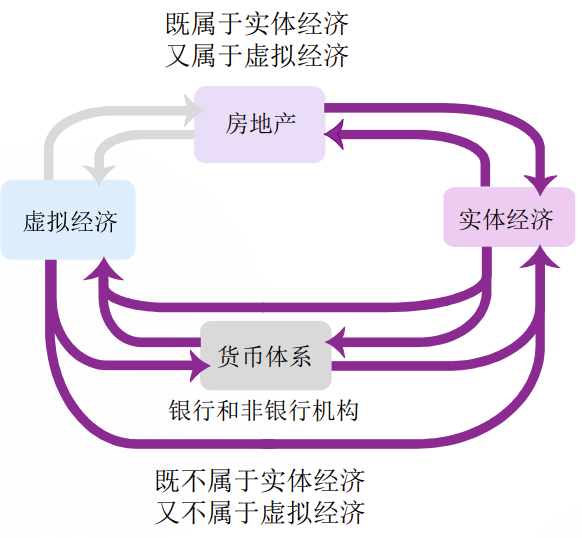

* 为什么房地产既是实体经济，又是虚拟经济？
  1. 购买新房属于GDP的一部分（投资）
  2. 购买后，房子的价值如股票一般波动，而其价值不是实体经济中的产品与服务价值， 而是虚拟经济中的估值或未来价值（这些部分不算入GDP）
* 金融体系
  * 金融体系：虚拟经济+货币体系
  * 如果一国有货币体系而没有虚拟经济，则只有货币（名义）经济和真实经济之分

### 金融市场

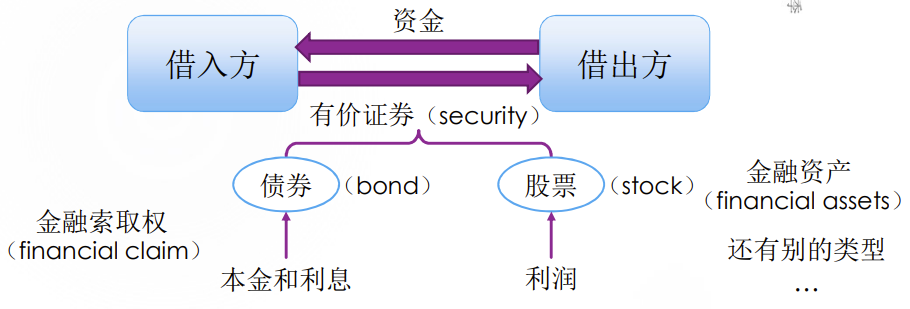

1. 可能的定义：匹配有资金但无投资机会的储蓄者与有投资项目但无资金的投资者的市场
2. 按照有价证券的形式分为股票市场和债券市场
3. 按照匹配机制分为直接融资和间接融资
   1. 直接融资：通过金融市场将资金的供应方与需求方相匹配的机制
   2. 间接融资（indirect financing）： 金融中介是储蓄者与投资者不能直接接触时所借助的中间融资机构，金融中介从储蓄者那儿获取资金，然后为投资者提供资金

#### 股票市场

1. 股本融资：出售股票来筹资，而股票代表企业的所有权

2. 上市：企业的资产所有权在股票市场上出售发行

3. IPO（首次公开发行股票，initial public offerings）：一家企业第一次将它的股份向公众出售

4. 一级市场：使得未上市公司完成上市

5. 二级市场：证券交易市场，已经发行的股票按时价进行转让、买卖和流通的市场

   1. 包括交易所市场和场外交易市场（OTC）
   2. 是“一级市场”的出口，保证有价证券的流动性（变现）
   3. 二级市场服务于一级市场，但若没有二级市场，有时一级市场也无法出现
   4. 股票在二级市场上涨价了，上市公司是否有收益取决于公司是否持有自己的股票

6. 股价：股票在股票市场上的价格

   1. A股股票的涨跌幅限制是10%，但ST和*ST的股票涨跌幅限制是5%（涨停板与跌停板均以前一个交易日的收盘价为基准）

7. 红利（dividend）：上市公司分配利润时给到股东手上的利润

8. 留利（retained profit）：没有支付给股东的利润，用于增加企业的投资

9. 股息收益（dividend yield）：是红利与（派息日）股价的比率，一般在2-5%比较健康

10. 市盈率（price earnings ratio）简称PER 或P/E：是股价与每股盈利（earnings  per share）的比率

    1. $PE=\frac{P}{EPS}$  $EPS=\frac{红利+留利}{流通在外的总股数}$ 
    2. 美国 $S\&P500$ 指数的PE均值在20-25之间， 一般认为PE低于20的个股未来前景较差， 高于25的个股未来前景较好  
    3. P/E较高（或低）也可能意味着股价被高估（低估），可能存在套利机会  
    4. 我国股票P/E在15-20之间被视为正常

11. 买卖价差（bid-ask spread）：要价减去出价

    1. 做市商（market maker）单位交易赚取的收益，反映股市交易成本

    2. 订单深度图（order-book depth  chart）

       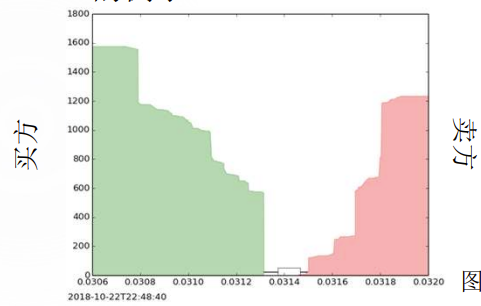

#### 债券市场

1. 债券：一张借据（I owe you）， 即IOU，上面规定了本金、到期日、利息息票（coupon）

2. 债务融资：公司通过出售债券来筹资的行为

3. 利率的决定因素：

   1. 期限：到期日越远，风险越大，对借出方耐心的要求也越高，因而利率也越高
   2. 信用等级：公开信用等级评定结果是公司 或机构发债的先决条件，而信用评级更高 的公司风险更小，利率也就更低
   3. 税收待遇：若利息收入不计入个人所得税税基之中，则发行机构可以适当降低利率

4. 二级市场价格的决定因素：
   $$
   P_b=\frac{x_1}{1+r}+\frac{x_2}{(1+r)^2}+...+\frac{x_T}{(1+r)^T}+\frac{F}{(1+r)^T}
   $$
   其中：

   $x_t$ ：第𝑡年支付的息票额

   $F$：面值

   $T$：现在到到期日间的年份

   $r$：不是债券上的利率，是当下通行的利率

#### 债务融资与股本融资的区别

1. 风险和收益不同：债券相比股票是低风险、低回报的金融索取权凭证
2. 借出方对借入方的监督成本不同： 股票持有人的金融索取权取决于上市企业的运作绩效，因而要花大量的时间和精力 搜集和披露信息

#### 金融中介：共同基金（mutual funds）

1. 向公众出售股份，并用收入购买各种股票、债券或资产组合（portfolio）的机构
2. 按资产组合的要素分为：股票型、 债券型、混合型基金等
3. 按资金赎回方式分为：开放式和封闭式
   1. 开放式允许每个交易日都向基金机构买卖基金股份，卖回给基金即赎回（redeem）
   2. 封闭期内不可赎回，但可在公开市场转手
4. 存在的合理性：规模经济（economies of scale）或规模利益（scale merit）
   1. 资金管理的边际成本低，使得平均 成本降低
   2. 通过合理分工、聘请专业人士继续 降低边际和平均成本
   3. 通过分散投资，合理配置风险
5. 特点
   1. 证券形式单一，只有“股份”
   2. 负债（liabilities）是基民持有的股份， 没有优先级和劣后级之分，是同质的股份（区别于私募基金（private funds））
   3. 没有挤兑风险：资产与负债同向、 同幅变化，因而净资产不随基金资产价值变化，即使资产价值可以趋于零

#### 金融中介：银行（banks）

1. 基本功能
   1. 成为储蓄者与投资者的中介，实现间接融资
   2. 充当支付媒介，实现清算、结算
2. 特点
   1. 存在挤兑风险：资产与负债并非是同向、同幅变化的
   2. 证券形式多样，如存款凭证、股票

## 可贷资金市场的供需模型

1. 预算赤字

   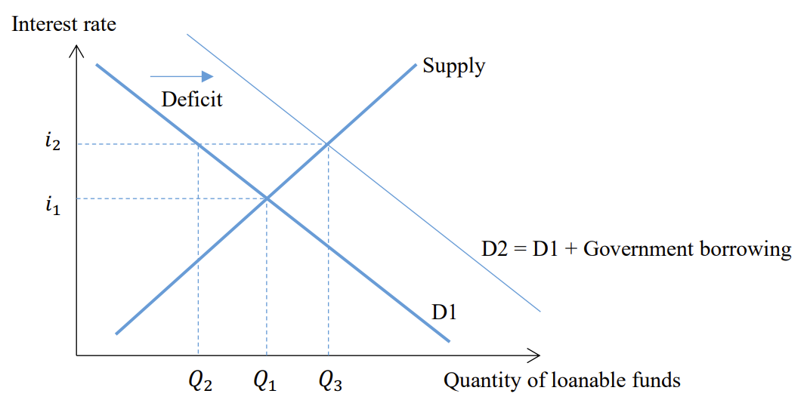

2. 预算盈余

   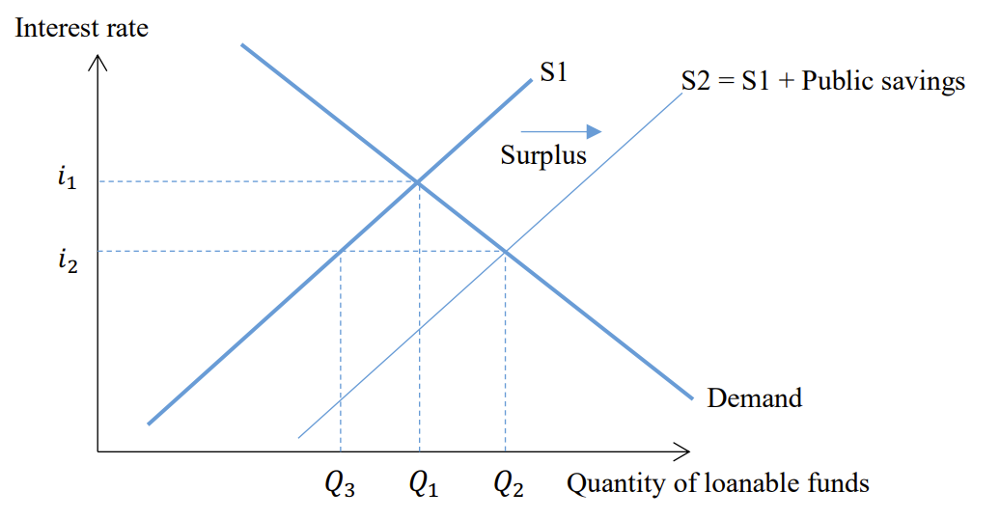

3. 贸易顺差（NCO）

   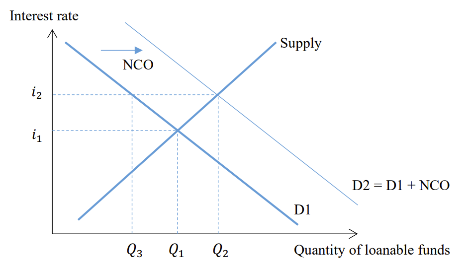

4. 贸易逆差（NCI）

   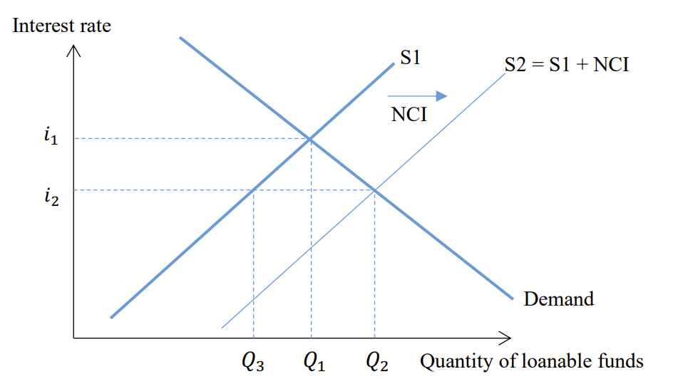

5. 预算赤字的减少

   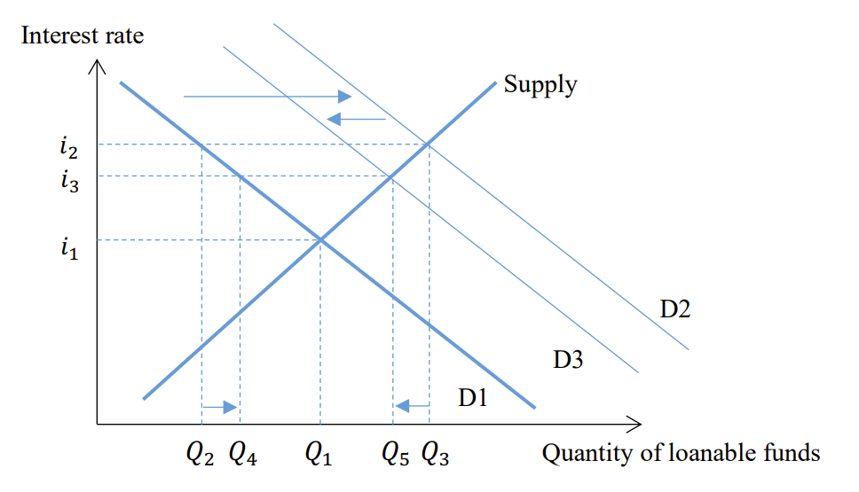

## 金融经济学的基本概念、计算（包括期望、标准差、现值、风险溢价等）和思想

### 金融资产

1. 金融资产包括：

   1. 货币：最普遍的金融索取权凭证
   2. 储蓄账户：本金和利息的索取权，包括活期与定期账户
   3. 政府债券：国库券、国债、地方债
   4. 股票和企业债券
   5. 金融衍生品：价值依附于基础金融资产的价值

2. 房产是金融资产吗？

   不是，房产计算在GDP的I中，是实体经济的一部分

### 金融经济学的基本计算

1. 金融资产的收益

   1. 收益率：收益与本金的比率
   2. 期望收益

2. 金融资产的风险

   1. 系统风险用标准差衡量

   2. 一般而言，风险越高的资产，期望收益也就越高

      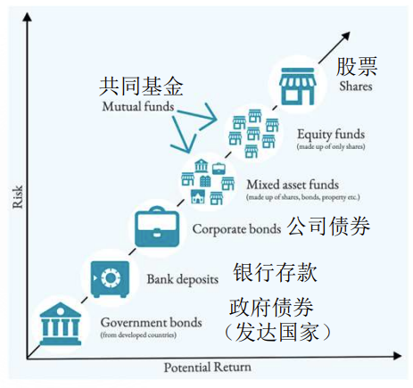

3. 风险厌恶

   1. 风险溢价

      

   2. 函数形式：上凸函数

      当 𝜎 更大时边际效用对消费的弹性 $\frac{1}{\sigma}$ 就更小，风险厌恶程度更小，更愿意考虑有风险的未来消费。
      
      由于 $\frac{1}{\sigma}$ 是一个常数，AK模型的效用函数为“常相对风险厌恶（CRRA）”效用函数

4. 风险中性和风险偏好

   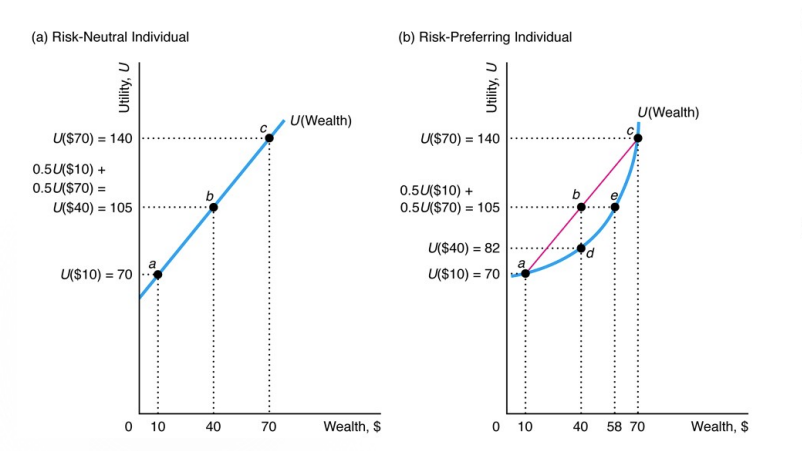

### 保险与道德风险

1. 道德风险
   1. 事前（ex ante）道德风险：事故之前，防止损失的行为减少（如不接种疫苗）
   2. 事后（ex post）道德风险：事故之后，减少损失的行为减少（如使用昂贵药）
2. 医疗费用的快速增长：
   1. 人口老龄化导致需求增加
   2. 经济增长导致需求增加
   3. 医保扩张导致的道德风险

### 保险与逆向选择

信息优势方（参保人）倾向于使信息劣势方（保险公司）受损从而导致市场效率降低的情况

这是一个“劣币驱逐良币”的过程，也即一个恶性循环，最后可能会导致市场瓦解 （market unraveling）

### 道德风险与逆向选择

1. 两者都是由信息不对称（information  asymmetry）导致的
   1. 道德风险是对个人加入合同后行为的信息存在不对称
   2. 逆向选择是对合同吸引的人的类型的信息存在不对称

## 证券与资产组合

### 成长型股票定价

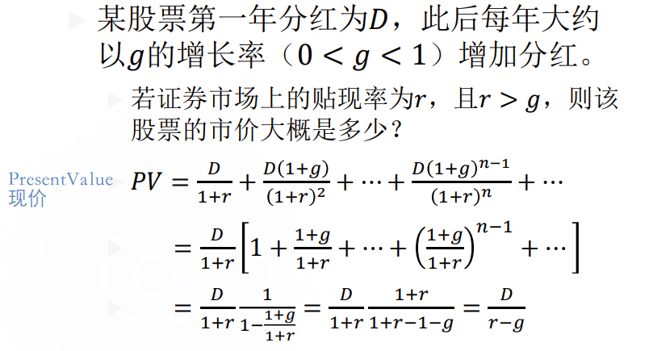

### 年金支出的现值

年金：一种证券，从现在开始，每年向保险公司支付𝑝，持续𝑛年；第𝑛 + 1年起，可以每年领到一笔钱，直至去世——这是对未来退休后固定收入的投资

年金支出流的现值：

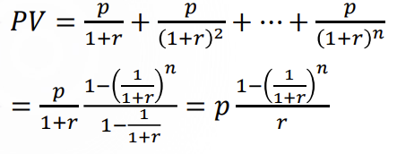

### 系统风险与企业特有风险

1. 系统风险（systematic risk）：

   市场风险，比如新冠疫情，影响整个行业的风险，躲也躲不掉，无法通过风险分摊抵消

2. 企业特有风险（specific risk）：

   非系统风险，与企业自身的特征（如治理结构、运行方式）有关。根据资产组合理论，这一风险可以通过多 样化组合冲销

3. 总风险=系统风险+企业特有风险

   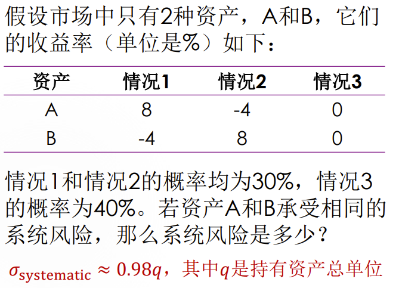

   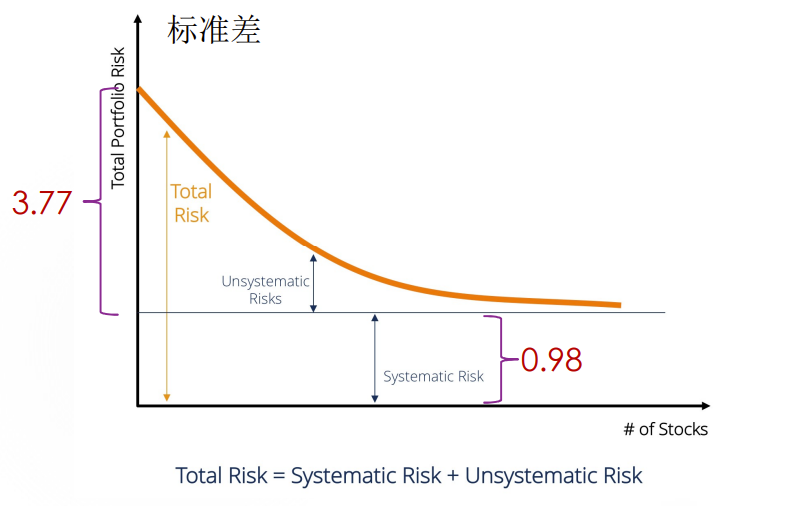

## 有效市场假说与资产泡沫

### 有效市场

1. 获得2013年诺贝尔经济学奖的尤金·法玛 （Eugene F. Fama，1939-）指出“一个市场中有大量的追求利润最大化的人在相互竞争，而每个人都试图预测个别证券的未来市场价值，在这个市场中，重要的当前信息对于所有参与者来说都几乎是公开的、免费可得的”

   

2. 三层含义

   1. 平均来说，在有效市场中，竞争会使得有关证券内在价值的信息迅速反映在证券的瞬时价格上
   2. 股市中的价格已经反映了当天所有新的信息，股价说明了一切
   3. 用过去股价预测未来股价是不可能的，因为明天的新信息是不确定的，今天已知的（确定的）信息已经反映在今天的股价之中了

